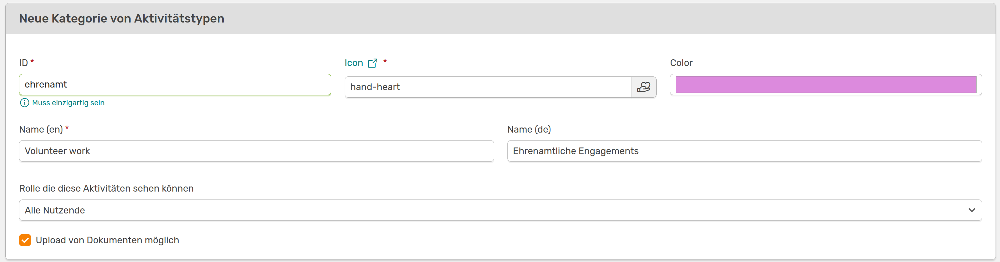
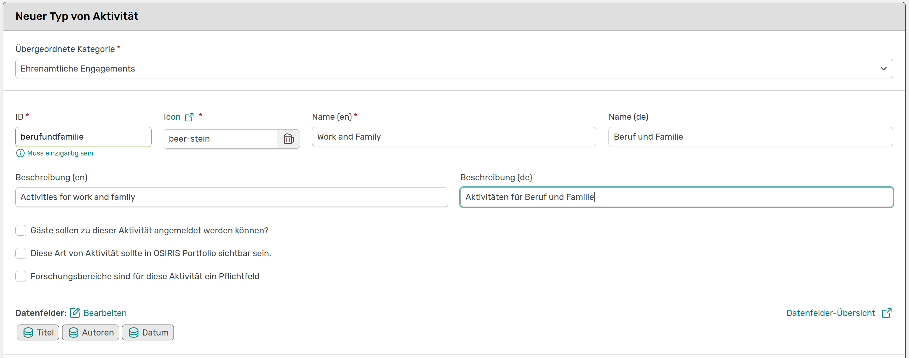
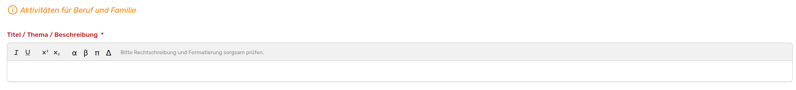
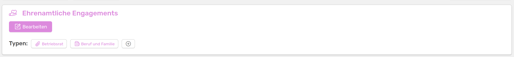
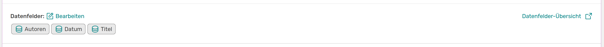
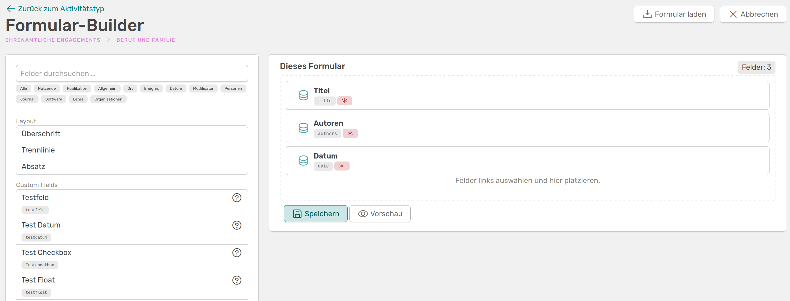
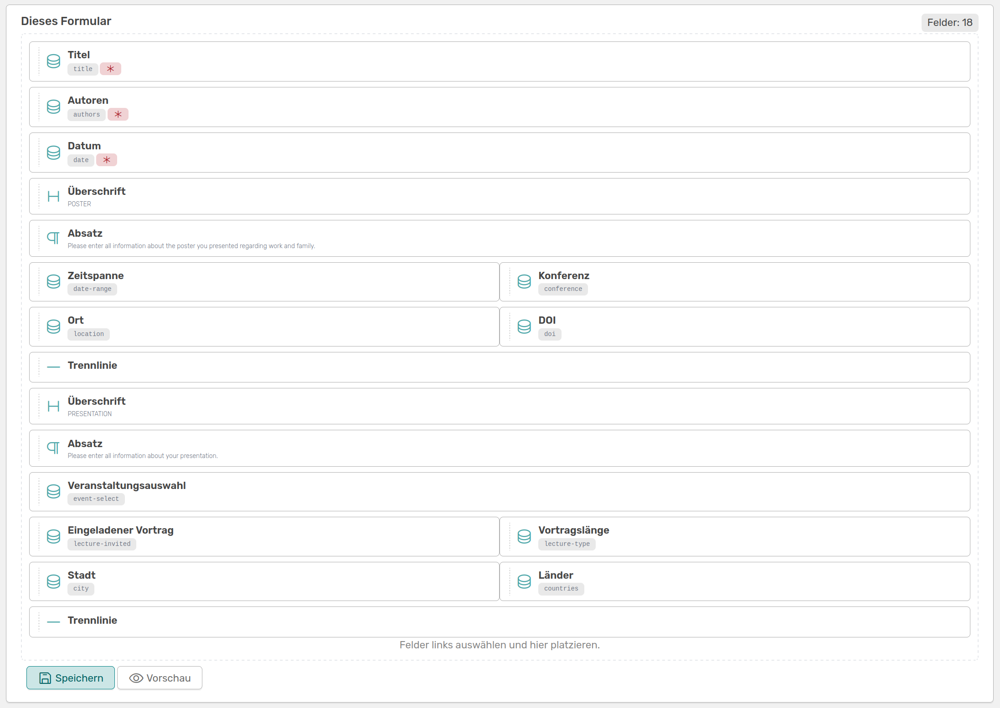
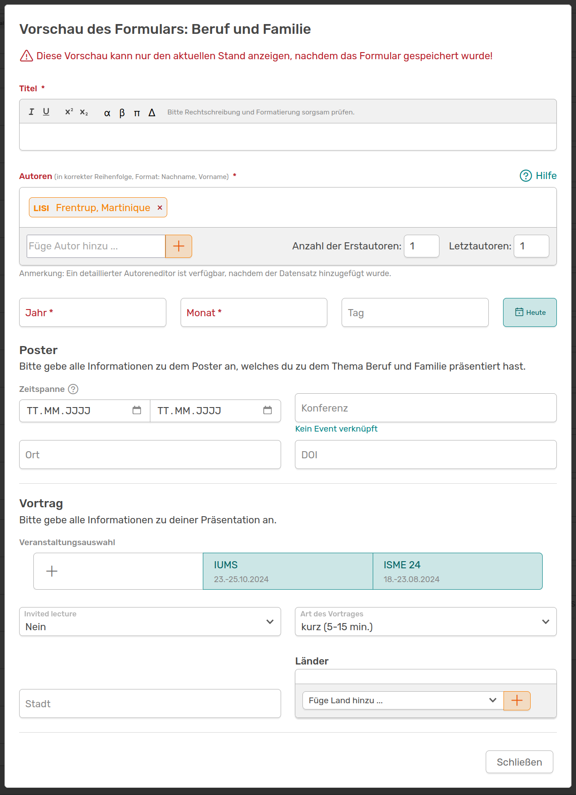
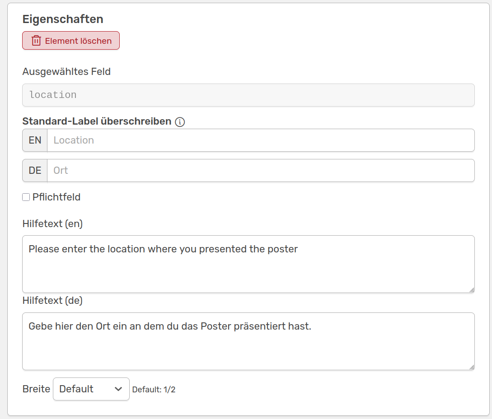
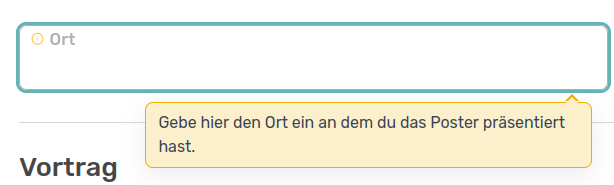

# Aktivitäten verwalten

Die Aktivitäten in OSIRIS sollen im besten Fall alles abdecken, womit sich Forschende in eurer Einrichtung befassen. Die **Kategorien** helfen dabei, die Aktivitäten sinnvoll einzuteilen und mit Überbegriffen wie *Publikationen*, *Vorträge* oder *Lehre* zu versehen. Innerhalb einer Kategorie können individuelle **Typen** erstellt werden, die dann die Vorlage einer Aktivität abbilden. Hierunter fallen zum Beispiel *Journal Article*, *Buchkapitel* oder *Preprint*.   
Standardmäßig findest du in OSIRIS folgende Kategorien mit ihren Typen:

- Publikationen
??? example "Typen von Publikationen" 
    - Journal Article
    - Non-refereed
    - Buch
    - Buchkapitel
    - Preprint
    - Abschlussarbeit
    - Weitere Publikationen

- Vorträge
??? example "Typen von Vorträgen" 
    - Vortrag

- Reviews & Editorials
??? example "Typen von Reviews & Editorials" 
    - Peer-Review
    - Editorenschaft
    - Review einer Abschlussarbeit
    - Sonstiges Review

- Poster
??? example "Typen von Postern" 
    - Poster

- Studierende & Gäste
??? example "Typen von Studierende & Gäste" 
    - Studenten
    - Abschlussarbeiten
    - Gäste

- Lehre
??? example "Typen von Lehre" 
    - Lehre

- Software & Daten
??? example "Typen von Software & Daten" 
    - Software & Daten

- Awards
??? example "Typen von Awards" 
    - Award

Die Kategorien sind mit einer Farbe markiert, die sich auch in der Auflistung der Typen wiederspiegelt. Du kannst die bestehenden Kategorien und Typen bearbeiten: Unter anderem Farbe und Icons können gewechselt, IDs, Namen und Beschreibungen geändert sowie Datenfelder angepasst werden. Du kannst auch neue Kategorien erstellen und Typen zu bestehenden oder neuen Kategorien hinzufügen.

## Neue Kategorie erstellen

Unter Inhalte &#8594 Aktivitäten kannst du eine neue Kategorie hinzufügen.

///caption
Seite um eine neue Kategorie zu erstellen
///

Zunächst musst du eine einzigartige ID wählen. mit einem Klick auf *muss einzigartig sein* siehst du eine Liste aller vergebenen IDs. Mit einem Klick auf *Icon* kannst du dir ein passendes Icon für deine neue Kategorie aussuchen, indem du den entsprechenden Text einfach in das Feld kopierst.   
Du kannst auf dieser Seite auch einstellen, welche Rollen in OSIRIS die eingetragenen Aktivitäten, die in diese Kategorie fallen, sehen können. Dies ist zum Beispiel nützlich für vertrauliche Einträge. Jeder Nutzende kann für diese Kategorie Einträge generieren und die eigenen sehen, die Einträge anderer Nutzender in dieser Kategorie aber nicht. Werden in eurem Institut beispielsweise Patente in OSIRIS eingetragen, soll vielleicht jede Person in der Lage sein ein Patent einzutragen und dies auch weiterhin im eigenen Verlauf zu sehen, andere Patent-Einträge werden aber nicht angezeigt.

## Neuen Typen erstellen

Du kannst Kategorien neue Typen hinzufügen. Auch hier brauchst du eine einzigartige ID und kannst dir ein Icon aussuchen. Die Farbe des Typen passt sich an die Kategorie an. Diese kannst du auch noch spontan während des Erstellens des neuen Typens ändern. Die von dir gewählte Beschreibung wird den Nutzenden bei Erstellen von diesem Typen Aktivität als Infokästchen angezeigt und sollte beschreiben, für welche Einträge diese Vorlage geeignet ist. 

///caption
Seite um einen neuen Typ Aktivität zu erstellen
///
---

///caption
So wird die von dir gewählte Beschreibung dann in der Vorlage der Aktivität aus.
///

Sei dir bewusst, dass bei der Wahl *Diese Art von Aktivität sollte in OSIRIS Portfolio sichtbar sein* alle unter diesem Typen eingetragenen Aktivitäten über die Website nach außen hin sichtbar sind. Nachdem du gespeichert hast sollte dein neu erstellter Typ von Aktivität in der Auflistung der Kategorie erscheinen und steht jedem Nutzenden für einen entsprechenden Eintrag zur Verfügung.

///caption
Die neu erstellte Kategorie **ehrenamtliche Engagements** mit den neu erstellten Typen **Betriebsrat** und **Beruf und Familie**.
///

<!-- md:version 1.5.1 -->

## Formular-Builder

Mit dem neuen Formular-Builder kannst du die Vorlagen für Aktivitäten noch flexibler gestalten. Du gelangst mit einem Klick auf *bearbeiten* neben den Datenfeldern zu dem Builder.

///caption
Mit einem Klick auf bearbeiten gelangst du zu dem Formular-Builder.
///

Der Formular-Builder ist in zwei Teile eingeteilt: Links die Felder und Layout-Optionen, die du deinem Formular hinzufügen kannst und rechts alle Felder, die du deinem Formular hinzugefügt hast. Hier siehst du direkt die Standard-Felder *Titel*, *Autoren* und *Datum*, welche bei jeder Aktivität angegeben werden müssen. Du kannst die Anordnung der Felder ändern indem du sie am linken Rand festhältst und zum gewünschten Platz ziehst.  
Links siehst du ein Suchfeld um alle vorhandenen Datenfelder zu durchsuchen sowie Filteroptionen nach Themen. Zudem siehst du die Layout-Optionen *Überschrift*, *Trennlinie* und *Absatz*, die du deinem Formular beliebig hinzufügen kannst.  
Die Auflistung der Datenfelder beginnt mit den von dir erstellten benutzerdefinierten Feldern. Infos zu den Datenfeldern bekommst du mit einem Klick auf das Fragezeichen rechts.  

///caption
Der Formular-Builder in OSIRIS mit dem du die Aktivitäten-Vorlage individuell gestalten kannst.
///

Du kannst dir dein erstelltes Formular immer mit einem Klick auf *Vorschau* anzeigen lassen - denke daran vorher immer zu speichern!  
Oben rechts siehst du einen Button, der es dir ermöglicht schon bestehende Formulare aus OSIRIS zu laden und diese nach deinen Vorstellungen weiter anzupassen.  
:warning: Dein bestehendes Formular wird durch die Auswahl einer Vorlage überschrieben - allerdings erst final wenn du speicherst.

///caption
Nach der Auswahl der Vorlage **Poster** wurden dieser noch weitere Felder zur Dokumentation eines Vortrags hinzugefügt. Um die beiden Infos gut voneinander unterscheiden zu können wurden die Layout-Elemente verwendet und Überschriften, Beschreibungen und Trennlinien eingefügt.
///

///caption
Nachdem alles gespeichert wurde kannst du dir eine Vorschau deines Formulars ansehen. 
///

In der Vorschau siehst du wie deine Formular-Bausteine durch OSIRIS umgesetzt wurden und wie die Nutzenden die Vorlage bei einem neuen Eintrag einer Aktivität sehen werden.  
Jedes Feld kann mit einem Klick bearbeitet, als Pflichtfeld markiert oder auch gelöscht werden. Bei manchen Feldern kannst du eine Hilfe für die Nutzenden hinzufügen, die sie sehen wenn sie in das Feld klicken.

---

///caption
Oben siehst du das **Eigenschaften** Feld für das Datenfeld "location". Hier kannst du einen Hilfetext hinzufügen, den die Nutzenden wie im unteren Bild gezeigt beim Ausfüllen des Formulars sehen.  
///

Die Eigenschaften-Felder unterscheiden sich je nach Datenfeld, beinhalten aber immer den **löschen**-Button. Zudem kannst du hier die Breite des Datenfeldes nach deinen Vorstellungen anpassen.  
Nachdem du alle Änderungen gespeichert hast können Nutzende die geänderte Vorlage direkt bei den Aktivitäten finden.