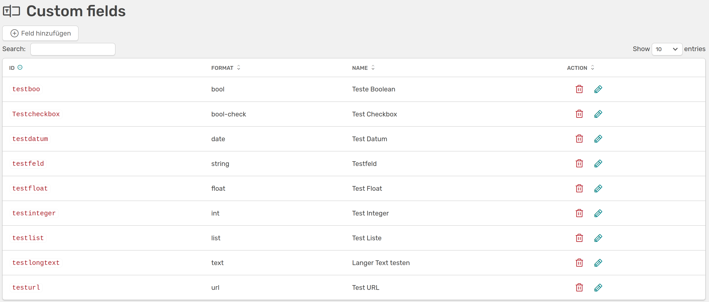
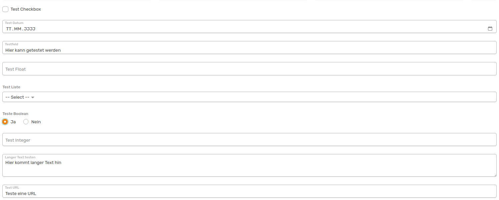

# Custom fields

[:simple-youtube: To video](https://youtu.be/FxK_zLE9Cso){.md-button}

On this page you can add fields in OSIRIS that are missing in the description of an activity, a project or in the personal data. When you create a new type of activity or edit an existing one, you can select these fields from a drop-down menu under *Data fields*.

///caption
Example of custom fields
///

When creating a new field, you must first select an ID for the field, which, unlike the rest, cannot be changed. Here it is important that you choose a unique and unambiguous name that contains **no spaces or dots**. The name you choose for your field will be used as the heading for the field in the template.
You can choose one of the formats listed here for the field:

- **Text fields**: With the *Text* and *Long Text* formats, you can create fields in which users can insert as much text as they want when creating an activity. These fields are suitable for descriptions of the activity, for example.

- Number fields**: If you select the *Integer* format, a field for whole numbers is created. A decimal number can be entered with *Float*.

- **List**: With the *List* option, you can create a list of options that can be selected when creating an activity. You can also set here whether multiple selection is possible or not.

- Date**: This allows you to create a date field - the date can then be inserted in the form using a calendar function.

- Boolean**: You can use Boolean formatting to insert two different data fields: A *checkbox* or the option to choose between *yes/no*.

- URL**: Users can use the URL field to enter a website when creating an activity.

///caption
This is what the custom fields look like when they have been added to an activity. You can see that the selected name at the top is used as the name for the field.
///

///caption
Users can make a multiple selection in the list via dropdown if you have allowed this.
///

You can change the order of the data fields using the [form builder](/admins/content/activities/#form-builder). Here you will find your customised fields along with all other available data fields and can create individual templates for activities.