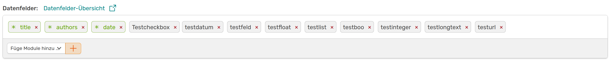

# Benutzerdefinierte Felder

Auf dieser Seite kannst du in OSIRIS Felder hinzufügen, die dir bei der Beschreibung einer Aktivität, eines Projekts oder auch bei den Personendaten fehlen. Wenn du einen neuen Typ von Aktivität erstellst oder einen bestehenden bearbeitest, kannst du diese Felder unter *Datenfelder* aus einem Dropdown Menü auswählen. 

///caption
Beispiel für benutzerdefinierte Felder
///

Bei dem Erstellen eines neuen Feldes musst du zunächst eine ID für das Feld wählen, welche im Gegensatz zum Rest nicht mehr geändert werden kann. Hier ist es wichtig, das du einen einzigartigen und eindeutigen Namen wählst, der **keine Leerzeichen oder Punkte** beinhaltet. Der Name, den du für dein Feld wählst, wird in der Vorlage als Überschrift für das Feld genutzt.
Für das Feld kannst du eine der hier aufgelisteten Formate wählen:

- **Textfelder**: Mit den Formaten *Text* und *Long Text* kannst du Felder erstellen, in denen Nutzende bei Erstellen einer Aktivität beliebig viel Text einfügen können. Diese Felder eignen sich zum Beispiel für Beschreibungen der Aktivität.

- **Zahlenfelder**: Wählst du das Format *Integer* wird ein Feld für ganze Zahlen erstellt. Mit *Float* kann eine Dezimalzahl eingetragen werden.

- **Liste**: Mit der Option *List* kannst du eine Liste an Optionen erstellen, die bei der Erstellung einer Aktivität ausgewählt werden können. Du kannst hier auch einstellen, ob eine Mehrfachauswahl möglich ist oder nicht. 

- **Date**: Hiermit kannst du ein Datumsfeld erstellen -  das Datum kann dann im Formular über eine Kalender-Funktion eingefügt werden.

- **Boolean**: Über die Boolean-Formatierung kannst du zwei verschiedene Datenfelder einfügen: Eine *Checkbox* oder die Option zwischen *ja/nein* zu wählen.

- **URL**: Über das URL Feld können Nutzende bei dem Erstellen einer Aktivität eine Website hinterlegen.

///caption
So sehen die Custom Fields aus, wenn sie einer Aktivität hinzugefügt wurden. Du siehst, dass der gewählte Name oben als Bezeichnung für das Feld verwendet wird. Um in der Liste mehrere Optionen zu wählen müssen die Nutzenden die STRG-Taste gedrückt halten.
///

Du kannst die Reihenfolge der Felder bei dem Erstellen der Aktivitäten-Vorlage über Drag-and-Drop der Datenfelder bestimmen.

///caption
Die Reihenfolge der Felder bestimmt die Auflistung der Felder in der Vorlage.
///

Es wird empfohlen eher mehr benutzerdefinierte Felder anzulegen als zu versuchen, zu viele Informationen mit einem Feld abzufragen. 