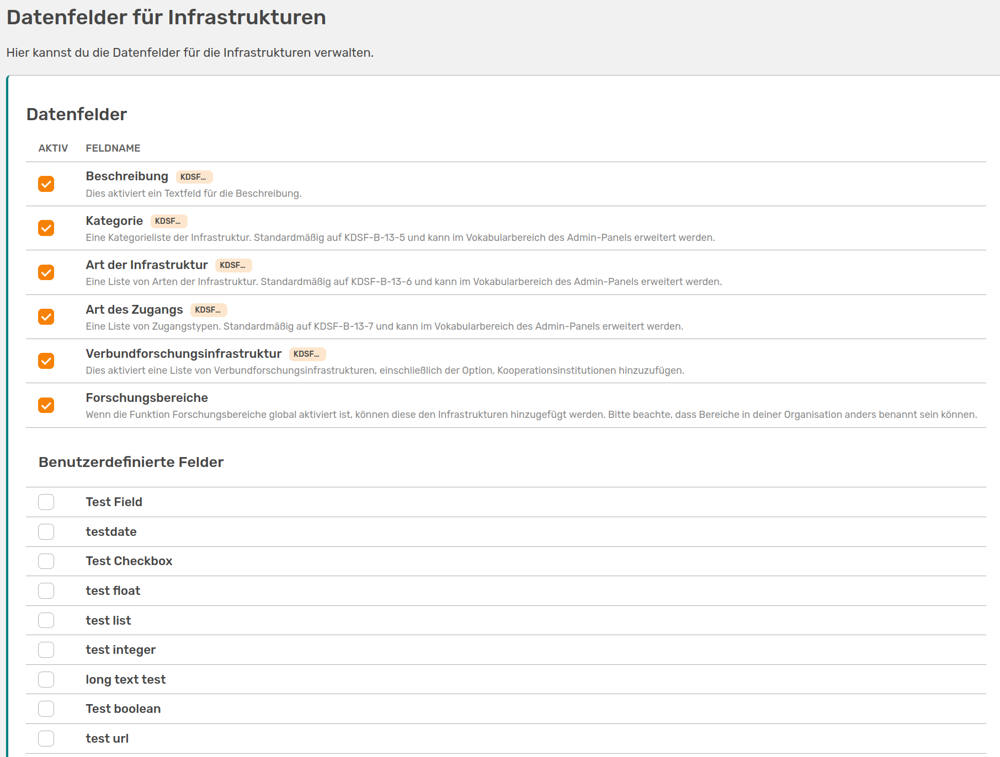
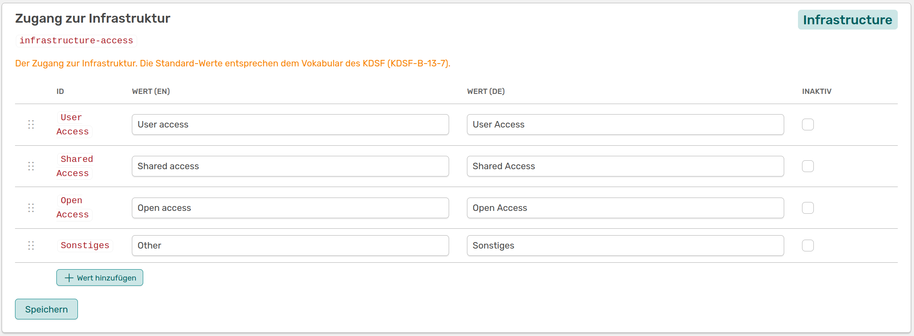

# Infrastrukturen

<!-- md:version 1.4.1 -->
<!-- md:feature -->

Forschungsinfrastrukturen sind, wie Projekte, eine eigene Entität in OSIRIS, die zentral eingeschaltet werden muss. 

## Forschungsinfrastrukturen einschalten

Um Forschungsinfrastrukturen in OSIRIS zu aktivieren, musst du zuerst die entsprechenden Einstellungen im Admin-Bereich vornehmen. Gehe dazu in Einstellungen &#8594 Funktionen und aktiviere die Option "Forschungsinfrastrukturen". Du kannst hier auch die Bezeichnung des Bereichs in OSIRIS anpassen. Dementsprechend wird der Name in der linken Leiste angepasst.

## Datenfelder konfigurieren
<!-- md:version 1.5.0 --> 

Infrastrukturen sind in OSIRIS standardmäßig aufgebaut und enthalten Datenfelder, die vom KDSF vorgegeben sind. Du kannst die vorgegebenen Felder unter Inhalte &#8594 Infrastrukturen inaktivieren. 

///caption
Auf der Seite **Datenfelder für Infrastrukturen** kannst du vorgegebene Felder inaktivieren und benutzerdefinierte Felder aktivieren 
///

Auf dieser Seite findest du auch deine [benutzerdefinierten Felder](/admins/content/custom-fields/), die du hier dem Formular für Infrastrukturen hinzufügen kannst.  

Es gibt zudem die Möglichkeit die Auswahl der Werte in den Dropdowns anzupassen. Dafür kannst du auf der [Vokabular-Seite](/admins/content/vocabulary/) Werte ändern oder auch hinzufügen.

///caption
Auswahl der Werte die für das Feld **Zugang zur Infrastruktur** momentan zur Verfügung stehen, sowie die Option Werte hinzuzufügen. Du kannst die vorhandenen Werte auch ändern
///

Die vorhandenen Werte entsprechen dem Vokabular des KDSF und werden standardmäßig verwendet. 
