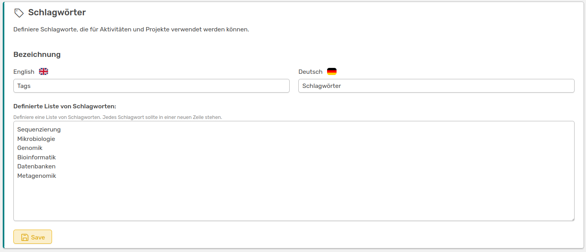
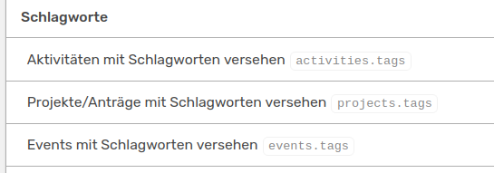

# Verschlagwortung von Einträgen

OSIRIS bietet dir die Möglichkeit Projekte, Events und Aktivitäten mit Schlagwörtern zu versehen, um diese thematisch besser erfassen zu können. Dies ist eine optionale Funktion und kann im Admin-Bereich unter **Einstellungen &#8594 Funktionen &#8594 Schlagwörter** eingeschaltet werden.  

Neben diesen thematischen Schlagwörtern gibt es in OSIRIS auch noch die Option personenbezogene Schlagwörter zu erstellen. Weiteres dazu findest du [hier](https://wiki.osiris-app.de/admins/content/persons/).

Wenn die Funktion eingeschaltet ist, findest du einen Button **Schlagwörter** im Admin-Panel unter **Inhalte &#8594 Benutzerdefinierte Daten**.

///caption
Hier kannst du beliebig viele Schlagwörter zur Verlinkung von Aktivitäten, Projekten und Events definieren
///

Um Aktivitäten, Projekte und Events mit den Schlagwörtern verknüpfen zu können, musst du unter [Rollen und Rechte](https://wiki.osiris-app.de/admins/roles/) die jeweiligen Rechte freigeben.

///caption
Rechte, um Schlagwörter mit Aktivitäten, Events und Projekte verlinken zu können
///

[Hier](https://wiki.osiris-app.de/users/content/keywords/) findest du die Anleitung zu den Verlinkungen der Schlagwörter. 

