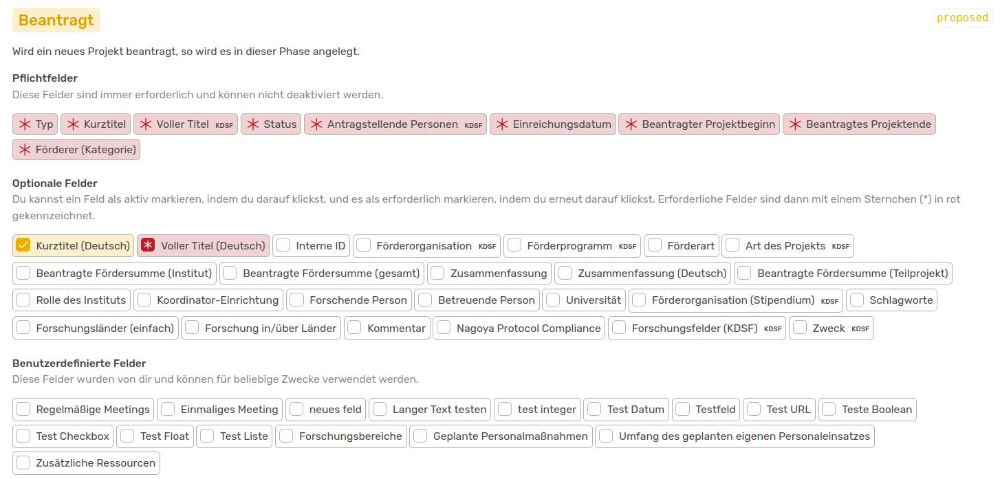
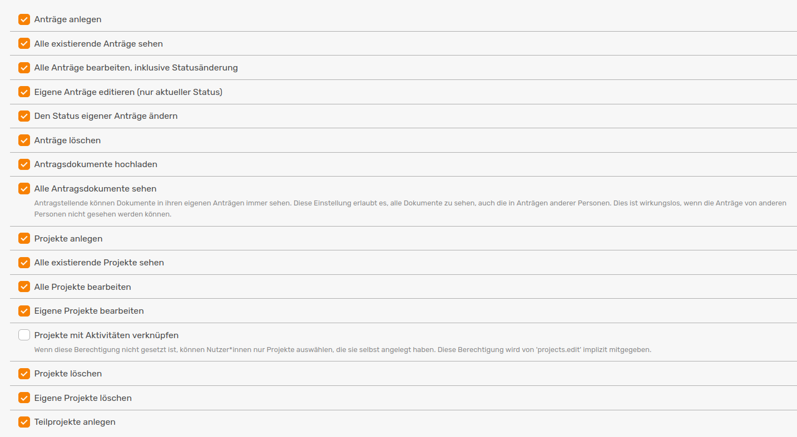

<!-- md:version 1.2.2 --> 
<!-- md:feature -->

# Projekte verwalten

Mit der **Projekt**-Funktion bietet OSIRIS die Möglichkeit, jeden Schritt eines beantragten Projektes am Institut im Auge zu behalten und zu verwalten. Auf dieser Seite werden die Einstellungen erklärt, die du bezüglich der Projekt-Funktion im Admin-Bereich vornehmen kannst. Erklärungen zur Anwendung findest du [hier](https://wiki.osiris-app.de/users/projects/).

Projekte sind eine optionale Funktion und müssen im Admin-Bereich unter **Einstellungen &#8594 Funktionen** eingeschaltet werden. Folgend erscheint der Button *Projekte* im Menü links unter *Daten*.

Unter **Inhalte &#8594 Projekte** können verschiedene Kategorien von Projekten angelegt und bestehende bearbeitet werden.

## Erstellen einer neuen Projekt-Kategorie

Im Admin-Bereich ist es dir möglich, verschiedene Kategorien von Projekten anzulegen. Dies kann besonders nützlich sein, wenn es an eurem Institut neben Drittmittel-Projekten noch andere Arten von Projekten gibt, die ihr mit OSIRIS erfassen möchtet.  

///caption
Button, um eine neue Projekt-Kategorie anzulegen
///

Wie bei [Aktivitäts-Kategorien](https://wiki.osiris-app.de/admins/content/activities/#neue-kategorie-erstellen) musst du auch hier folgende Angaben machen:

- **einzigartige ID:** Wähle eine ID für deine Projekt-Kategorie, die einzigartig ist
- **Icon:** Über den Link gelangst du zu einer Seite, auf der du dir ein passendes Icon zu deiner Kategorie aussuchen kannst. Du musst nur den Code in das Feld kopieren
- **Farbe:** Wähle eine Farbe für deine Kategorie
- **Name:** Gebe deiner Projekt-Kategorie einen eindeutigen und kurzen Namen

Neben den Pflichtangaben kannst du für deine neue Kategorie noch viele verschiedene Einstellungen vornehmen.

///caption
Hier hast du die Möglichkeit verschiedene Einstellungen für deine neue Projekt-Kategorie vorzunehmen
///

- **Deaktivieren:** Du hast die Option, diese Projekt-Kategorie zu deaktivieren. Deaktivierte Projekt-Kategorien bleiben für vergangene Aktivitäten erhalten, es können aber keine neuen hinzugefügt werden. 
- **Teilprojekte:** Hier kannst du bestimmen, ob Nutzende Teilprojekte zu dieser Kategorie von Projekten hinzufügen dürfen. Teilprojekte sind Projekte, die mit einem Hauptprojekt verknüpft sind und in der Projektübersicht angezeigt werden.
- **Anträge:** Ein Projekt kann entweder direkt angelegt werden oder durchläuft zuerst eine Antragsphase. Je nach Art des Projekts ist es sinnvoll, neue Projekte nur als Antrag aufzunehmen oder die Anträge komplett wegzulassen. Der Button *Anträge* erscheint bei Auswahl links im Menü direkt über dem *Projekt* Button. 
- **Benachrichtigungen:** Hier kannst du einstellen welche Rolle von Nutzenden oder welche individuellen Nutzenden beim Erstellen eines neuen Projekts bzw. Antrags oder bei Änderungen informiert werden müssen. Um dies via E-Mail zu machen, müssen die [E-Mail Einstellungen](https://wiki.osiris-app.de/admins/email/) korrekt eingerichtet und funktionsfähig sein.

Nachdem du deine Einstellungen gespeichert hast, wirst du zu den Phasen deines Projekts weitergeleitet. Die Anzahl der unterschiedlichen Phasen hängt davon ab, ob du die Anträge-Funktion aktiviert hast. Falls dies der Fall ist, wird dein Projekt in vier Phasen aufgeteilt. Wenn du die Funktion deaktivierst, wird dir nur eine Projekt-Phase angezeigt.

///caption
Die vier Phasen deines Projekts mit Antrags-Funktion
///

Für jede Phase hat OSIRIS Pflichtfelder definiert, die nicht deaktiviert werden können. Je nach Phase hast du weitere Felder zur Auswahl, die du dem auszufüllendem Formular hinzufügen kannst. Mit einem Doppelklick kannst du auch diese zu Pflichtfeldern machen - sie werden dann mit einem roten Stern markiert.

///caption
Auswahl der Felder, die du dem Formular hinzufügen kannst, hier beispielsweise das Feld **Kurztitel** in gelb (optional) und **Voller Titel** in rot (Pflichtfeld)
///

Wie du siehst, werden dir in den Phasen *Beantragt, Bewilligt und Projekt* auch die [benutzerdefinierten Felder](https://wiki.osiris-app.de/admins/content/custom-fields/) zur Auswahl angezeigt. Du kannst also für Projekte auch eigene Felder definieren.  

## Vokabular

Viele der vorgegebenen Felder findest du in den auszufüllenden Formularen als Dropdown-Auswahl wieder. Um die Auswahl zu bearbeiten, kannst du das [Vokabular](https://wiki.osiris-app.de/admins/content/vocabulary/) für das jeweilige Feld anpassen. Die Standard-Werte entsprechen oft dem KDSF-Vokabular und sollten nicht geändert werden. 

:exclamation: Aus technischen Gründen ist es nicht möglich Werte zu löschen. Du kannst sie aber inaktivieren, damit sie nicht mehr im Dropdown angezeigt werden. 

## Nutzer-Rechte

Für **Projekte und Anträge** gibt es eine Vielzahl von Rechten, die du individuell an Nutzerrollen vergeben kannst. Dabei wird zwischen Rechten für Anträge und Projekte, sowie für eigens erstellte Einträge oder alle vorhandenen Einträge unterschieden. 

///caption
Übersicht über die Rechte für Projekte und Anträge, die du den individuellen Nutzerrollen in OSIRIS zuteilen kannst
///

Hier solltest du vor allem darauf achten, die Rechte zum **löschen** nur an ausgewählte Rollen zu vergeben. Zudem sollte abgestimmt werden, ob alle Nutzenden einen Überblick über alle laufenden Anträge und Projekte haben sollten oder ob die Sicht der Einträge beschränkt werden soll. 