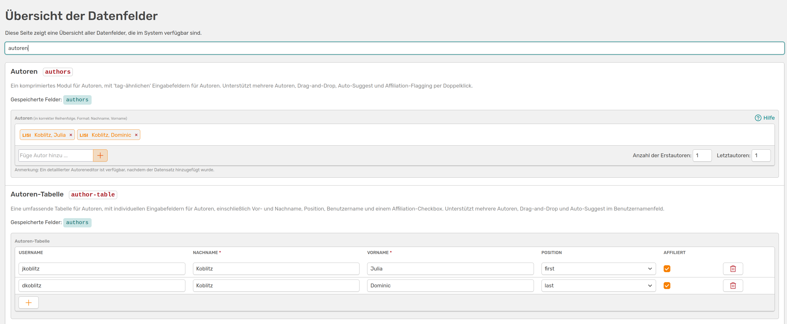

# Auxiliary tools

!!! warning "Page under construction"
    This page is still under construction. We ask for your patience.

## Data fields overview

Here you will find all the data fields available to you in OSIRIS. You will be given a brief explanation and a preview of what the field looks like. You can also use the search function to filter for specific fields.

///caption
Overview of the data fields, filtered by **author**. All data fields that display information on authors are displayed
///

This overview only contains the data fields specified by OSIRIS, not your user-defined fields.

## Template construction kit