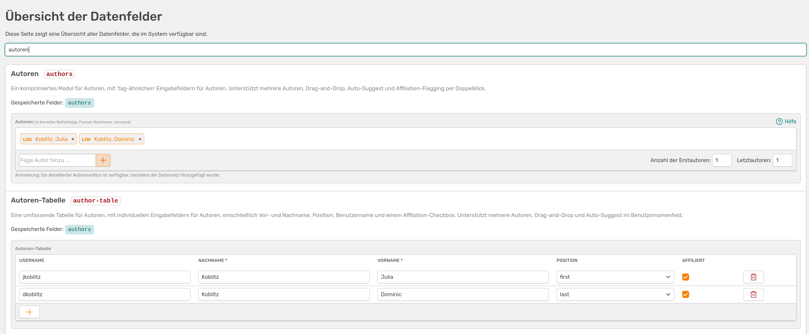

# Hilfswerkzeuge

!!! warning "Seite im Aufbau"
    Diese Seite befindet sich noch im Aufbau. Wir bitten um Geduld.

## Datenfelder-Übersicht

Hier findest du alle Datenfelder, die dir in OSIRIS zur Verfügung stehen. Es wird dir eine kurze Erklärung gegeben und eine Vorschau, wie das Feld aussieht. Zudem kannst du mit der Suche nach bestimmten Feldern filtern.

///caption
Übersicht der Datenfelder, gefiltert nach **Autoren**. Es werden dir alle Datenfelder angezeigt, die Infos zu Autoren ausgeben
///

Diese Übersicht enthält nur die von OSIRIS vorgegebenen Datenfelder, nicht deine benutzerdefinierten Felder.

## Template Baukasten