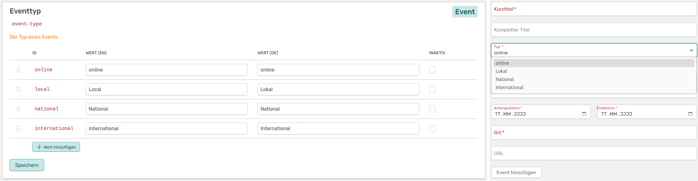
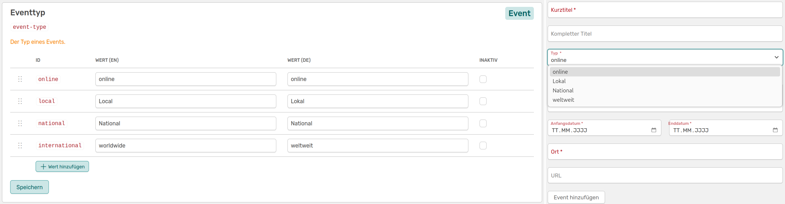

# Vokabular bearbeiten

Auf der **Vokabular** Seite findest du eine Liste der Wörter, oder hier auch Werte genannt, die in den unterschiedlichen Dropdown Menüs in OSIRIS verwendet werden. 

///caption
Das Event-Vokabular auf der Vokabular-Seite und das Dropdown-Menü, welches bei der Erstellung eines Events ausgefüllt werden muss
///

Du kannst die Werte ändern, sodass Nutzende andere Wörter zum auswählen im Dropdown Menü haben.

///caption
Hier wurde im Vokabular "international" durch "weltweit" ersetzt. Die Auswahl im Dropdown Menü passt sich entsprechend an
///

Der Wert wird für **alle** Events geändert: Bereits erstellte Events, für die im Feld "Typ" international ausgewählt wurde, haben jetzt den Wert "weltweit" dort stehen. 

:exclamation: Aus technischen Gründen ist es nicht möglich Werte zu löschen. Du kannst sie aber inaktivieren, damit sie nicht mehr im Dropdown angezeigt werden. 

Wenn dir Wörter für eine Kategorie fehlen, kannst du neue Werte hinzufügen. Dafür musst du zunächst eine einzigartige ID erstellen, die nicht mehr geändert werden kann, die Werte kannst du weiterhin flexibel ändern.  
Durch Drag-and-Drop an der linken Seite kannst du die Reihenfolge der Werte im Dropdown Menü anpassen. 
