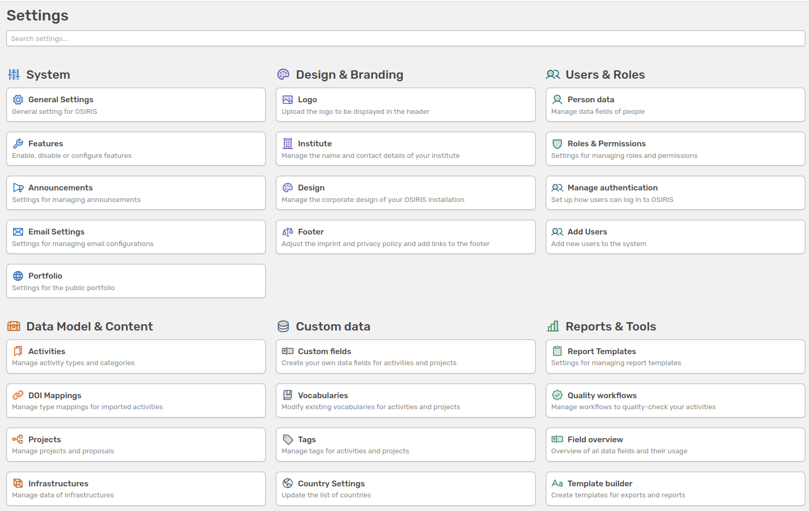

# Guide for content administrators

OSIRIS is a research information system that can be implemented and managed independently by any institute - without the need for external support. However, it is still important to maintain a clear structure among users in order to effectively maintain the system and tailor it to specific needs.

For this purpose, OSIRIS includes the role of the admin. This role can be taken on by one or more individuals who are primarily responsible for managing the system and who have a good overview of the needs of different departments (e.g., controlling, HR, and research staff).

The admin role is central, as it is the only role that can influence the permissions of all other roles, modify core system settings, adjust the layout, and manage activity types and categories - unless these permissions are explicitly delegated to other roles. These individual settings are configured via the admin interface.

<!-- md:version 2.0 -->

///caption
The newly organized admin interface is available starting from version 2.0
///

The following sections provide explanations of all settings and configuration options that admins can manage by default.