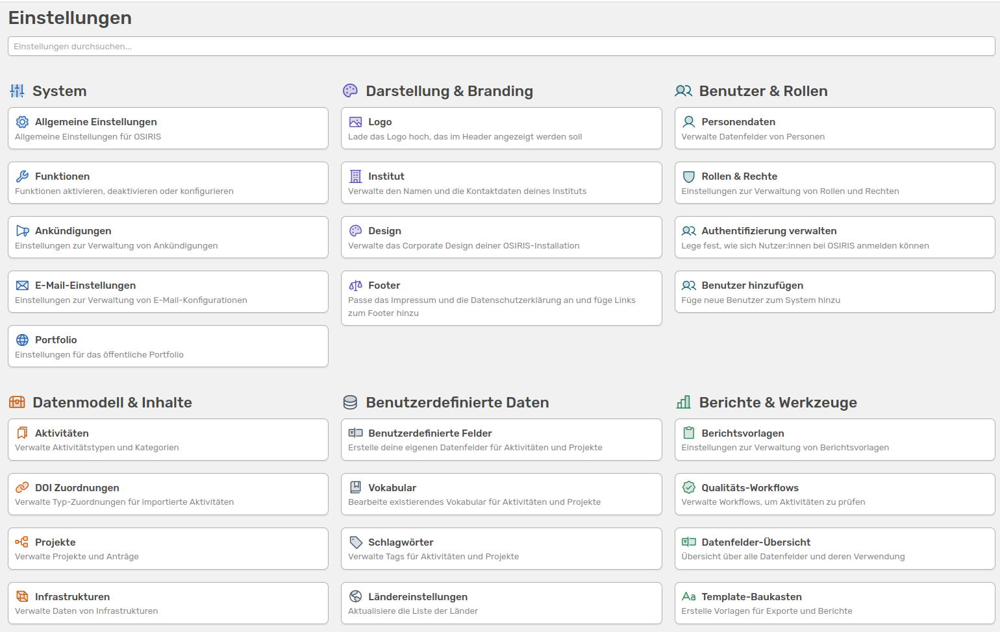

# Anleitung für Inhalt-Administratoren

OSIRIS ist ein Forschungsinformationssystem, das an jedem Institut eigenständig – also ohne externe Unterstützung – eingesetzt und verwaltet werden kann. Dennoch ist es wichtig, eine klare Struktur unter den Nutzenden zu etablieren, um das System effektiv zu pflegen und individuell anzupassen.

Zu diesem Zweck gibt es in OSIRIS die Rolle des Admins. Diese Rolle kann von einer oder mehreren Personen übernommen werden, die sich primär um die Verwaltung des Systems kümmern und gleichzeitig einen guten Überblick über die Anforderungen der verschiedenen Abteilungen (z. B. Controlling, HR, Wissenschaft) besitzen.

Die Admin-Rolle ist zentral, da nur sie die Berechtigungen anderer Rollen beeinflussen, grundlegende Systemeinstellungen ändern, das Layout anpassen sowie Aktivitätstypen und Kategorien verwalten kann - sofern diese Rechte nicht gezielt an andere Rollen delegiert werden. Diese individuellen Einstellungen werden über das Admin-Interface vorgenommen.

<!-- md:version 2.0 -->

///caption
Das neu organisierte Admin-Interface steht euch ab Version 2.0 zur Verfügung
///

In den folgenden Abschnitten werden alle Einstellungen und Konfigurationsmöglichkeiten erläutert, die standardmäßig von Admins vorgenommen werden können.