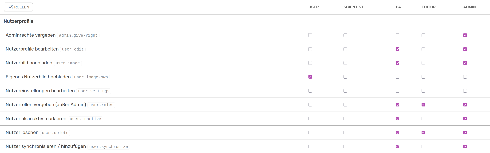

# Roles and rights

[:simple-youtube: To the video](https://youtu.be/6sP_tpNLKws){.md-button}

OSIRIS offers a moderately complex roles and rights model that gives users a high degree of flexibility. By default, there are five roles in OSIRIS, each with different rights. Every person logging in automatically has all the rights of a **user**. A person can also have several roles. When logging in for the first time, you can specify whether you are a scientist. If you tick this box, you automatically have all the rights of a **Scientist** and also all the rights of a **User**.

///caption
Section of the rights panel in the legacy view, to be found in the admin view under "Roles and rights"
///

The right *Upload own user picture* is only set here for users, as it automatically applies to all other roles.
The creation of activities is not regulated by the rights and can be carried out by any user.

## Add new role

In addition to the five standard roles, other roles can also be added. This is possible for every user who has access to the admin panel. The newly added role initially has no rights.

///caption
Widget to create a new role or delete an existing one
///

The PA role is the only one of the standard roles that can be deleted.

## Assign role to user

The only role that can be taken on by users themselves is that of **Scientist**. According to the default settings, further roles can only be assigned by the administration and the PA, whereby the role of admin can only be assigned by an administrator. This can be done in various ways. Firstly, you can view and edit a list of users and their roles via the **Distribute roles** button at the top left of the Roles & Rights page. Secondly, you can go to the user's profile page, select Edit profile and adjust the role under **Account**.

///caption
Assigning roles in the user profile
///

The assignment of roles is also regulated in the rights. You can assign roles the right **Assign user roles (except admin)** and allow other roles to assign **Admin rights**.

