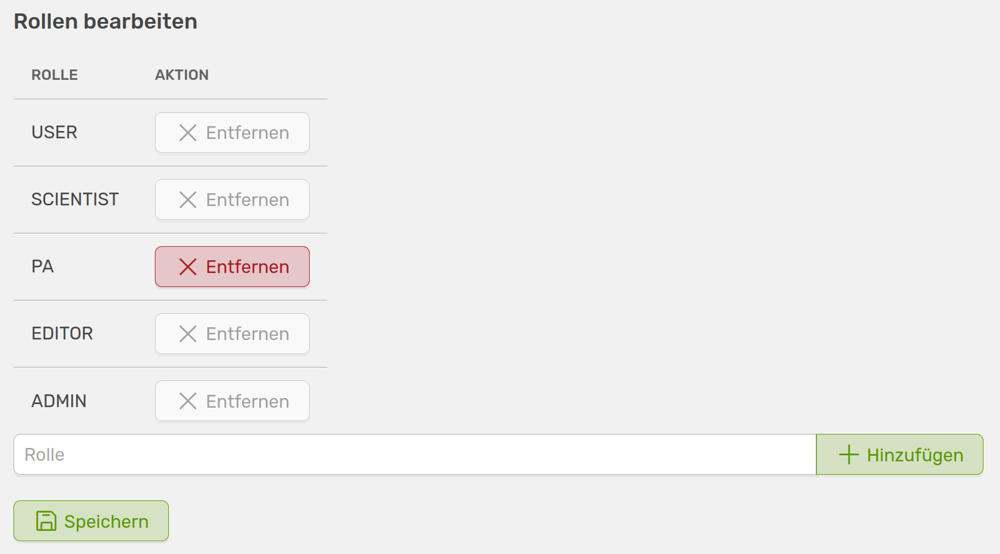
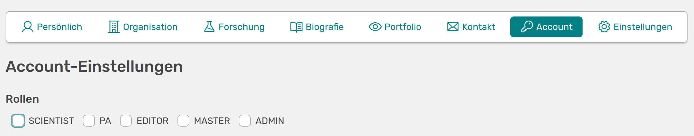

# Rollen und Rechte

[:simple-youtube: Zum Video](https://youtu.be/6sP_tpNLKws){.md-button}

OSIRIS bietet ein mittelkomplexes Rollen und Rechtemodell, welches den Nutzenden eine hohe Flexibilität ermöglicht. Standardmäßig gibt es in OSIRIS fünf Rollen, die mit unterschiedlichen Rechten ausgestattet sind. Jede sich anmeldende Person hat automatisch alle Rechte eines **Users**. Eine Person kann auch mehrere Rollen haben. Bei einer Neuanmeldung kann angegeben werden, ob man Wissenschaftler:in ist. Wird der Haken gesetzt, bekommt man automatisch alle Rechte eines **Scientists** und hat zudem alle Rechte eines **Users**.

///caption
Ausschnitt des Rechte-Panels in der Legacy-Ansicht, zu finden in der Admin-Ansicht unter "Rollen und Rechte"
///  

Das Recht *Eigenes Nutzerbild hochladen* ist hier nur für User gesetzt, da es damit automatisch auch für alle anderen Rollen gilt.
Das Erstellen von Aktivitäten wird nicht über die Rechte geregelt und kann von jedem Nutzenden durchgeführt werden. 

## Neue Rolle hinzufügen

Neben den fünf Standard-Rollen können auch weitere hinzugefügt werden. Dies ist für jeden Nutzenden möglich, der Zugriff auf das Admin-Panel hat. Die neu hinzugefügte Rolle hat anfangs keine Rechte.

///caption
Widget um eine neue Rolle zu erstellen oder bestehende zu löschen
///

Die PA-Rolle ist die einzige der Standard-Rollen, die gelöscht werden kann. 

## Rolle an Nutzende vergeben

Die einzige Rolle, die durch Nutzende selbst eingenommen werden kann, ist die des **Scientists**. Laut der Standardeinstellungen können weitere Rollen nur von der Administration und der PA vergeben werden, wobei die des Admins nur durch einen Administrator bestimmt werden kann. Dies kann auf verschiedene Weisen passieren. Zum einen könnt ihr eine Liste der Nutzenden und ihrer Rollen über den Button **Rollen verteilen** links oben auf der Rollen & Rechte Seite einsehen, und diese bearbeiten. Zum anderen könnt ihr auf die Profilseiten der Nutzenden gehen, Profil bearbeiten auswählen und dort unter **Account** die Rolle anpassen.

///caption
Vergabe der Rollen im Nutzenden-Profil
///

Die Vergabe der Rollen ist auch in den Rechten geregelt. Ihr könnt Rollen das Recht **Nutzerrollen vergeben (außer Admin)** zuordnen, sowie anderen Rollen erlauben **Adminrechte** zu vergeben. 

