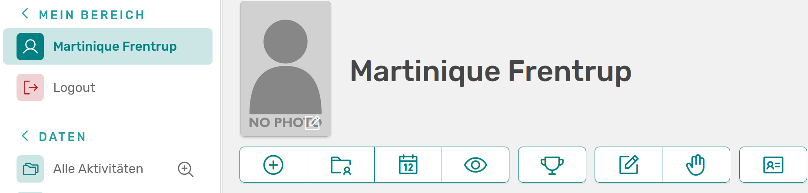
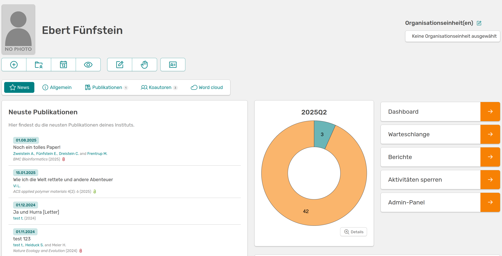

# Standard roles

There are five predefined roles in OSIRIS that are assigned certain rights when the programme is installed. These can be customised as required. The roles and their default rights are described below.

## User

Every person logging in automatically has the rights of a user. However, these are limited to uploading their own user picture. Activities can still be created. Rights that are set for users are automatically released for all roles.

## Scientist

The Scientist role is the only role that can be claimed by a registering person. This role adds the buttons *My year* and *My activities* to the start page. As a scientist, the central task is to document all relevant activities via OSIRIS and enter them accordingly.

---

///caption
Home page of a user and a scientist with the extra buttons "My year" and "My activities"
///

As a scientist, the user is asked to check and approve their own activities at the end of each quarter.
Scientists also have the right to add events and guests. They can create, edit and delete their own projects.

## PA (Personnel department)

Employees in the HR department can use OSIRIS primarily to manage the college. They have the rights to edit *user profiles*, upload user images, assign user roles (except admin) and deactivate users or create new ones. Guests* can be registered, edited and viewed and *research areas* can be created, edited and deleted. The HR department also has the right to create and edit organisational units.

## Editor

The role of editor is usually taken on by employees from Controlling and is intended to facilitate an overview of all activities in the institute. An editor has all available rights for *activities* (can even view the raw data here) and *metrics and reports*, but again none to create or edit *user profiles*. The start page of an editor is extended by a panel for the quarterly overview, in which the approvals of the scientists can be seen at a glance.

---

///caption
Start page of a scientist and the extended view of an editor with the quarterly overview
///

## Admin

The role of admin should be assumed by the person/persons at the institute who will mainly administer OSIRIS. By default, an admin has all rights except for editing user settings, which is not assigned to any role. An admin panel is added to the left-hand side, allowing many other settings to be edited, including *roles and rights*.
