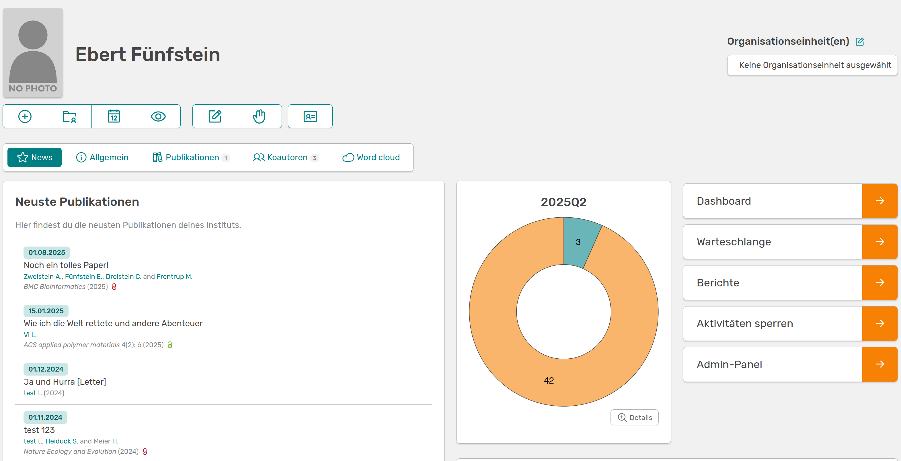

# Standard-Rollen

In OSIRIS gibt es fünf vordefinierte Rollen, die bei einer Neuinstallation des Programms mit bestimmten Rechten ausgestattet sind. Diese können beliebig angepasst werden. Im Folgenden werden die Rollen mit ihren Standard-Rechten beschrieben.

## User

Jede sich anmeldende Person hat automatisch die Rechte eines Users. Diese sind allerdings auf das Hochladen des eigenen Nutzerbildes beschränkt. Aktivitäten können trotzdem erstellt werden. Rechte, die für User gesetzt werden sind automatisch für alle Rollen freigegeben.

## Scientist

Die Rolle des Scientists ist die einzige Rolle, die von einer sich registrierenden Person selbst beansprucht werden kann. Durch diese Rolle erweitert sich die Startseite um die Schaltflächen *Mein Jahr* und *Meine Aktivitäten*. Als Wissenschaftler:in ist die zentrale Aufgabe alle relevanten Aktivitäten über OSIRIS zu dokumentieren und entsprechend einzutragen. 

---

///caption
Startseite eines Users und eines Scientists mit den extra Schaltflächen "Mein Jahr" und "Meine Aktivitäten"
///

Als Scientist wird der Nutzende am Ende jedes Quartals aufgefordert die eigenen Aktivitäten zu überprüfen und freizugeben.
Zudem haben Scientists das Recht Events und Gäste hinzuzufügen. Es können eigene Projekte erstellt, bearbeitet und gelöscht werden. 

## PA (Personalabteilung)

Mitarbeitende der Personalabteilung können OSIRIS vor allem zur Verwaltung des Kollegiums nutzen. Sie haben die Rechte *Nutzerprofile* zu bearbeiten, Nutzerbilder hochzuladen, Nutzerrollen zu vergeben (außer Admin) und Nutzer zu inaktivieren oder auch neue zu erstellen. Es können *Gäste* angemeldet, bearbeitet und eingesehen werden sowie *Forschungsbereiche* erstellt, bearbeitet und gelöscht werden. Die Personalabteilung hat weiterhin das Recht Organisationseinheiten zu erstellen und zu bearbeiten.

## Editor

Die Rolle des Editors wird meist von Mitarbeitenden aus dem Controlling eingenommen und soll die Übersicht über alle Aktivitäten im Institut erleichtern. Ein Editor hat alle verfügbaren Rechte bei *Aktivitäten* (kann hier sogar die Rohdaten einsehen) und *Metriken und Berichte*, wiederum aber keine um *Nutzerprofile* zu erstellen oder zu bearbeiten. Die Startseite eines Editors wird um ein Panel zur Quartalsübersicht erweitert, indem die Freigaben der Wissenschaftler:innen auf einen Blick zu sehen sind. 

---

///caption
Startseite eines Scientists und die erweiterte Ansicht eines Editors um die Quartalsübersicht
///

## Admin

Die Rolle des Admins sollte die Person/die Personen am Institut übernehmen, die OSIRIS hauptsächlich verwalten werden. Ein Admin hat per Standard alle Rechte, bis auf das der Bearbeitung der Nutzereinstellugen, welches allerdings an keine Rolle vergeben ist. Die linke Seite wird um ein Admin-Panel erweitert, wodurch viele weitere Einstellungen, unter anderem *Rollen und Rechte* bearbeitet werden können. 
