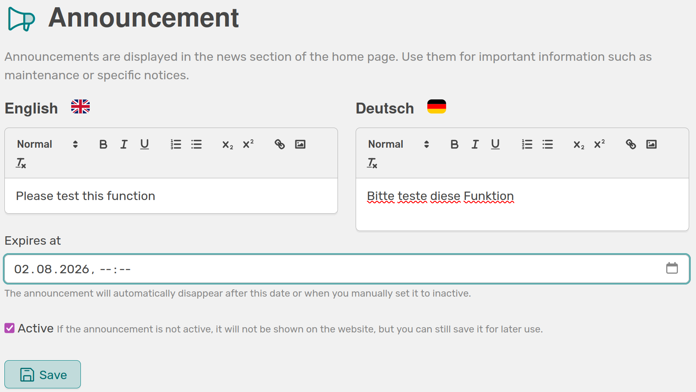

# Announcements

<!-- md:version 2.0 -->

The announcement feature enables administrators to create central announcements. These are displayed in the news section of all users’ personal profiles.

///caption
Here you can enter German and English text for an internal announcement and define an expiration date for the message
///

Announcements can be used for various purposes, including:

- Notifications about maintenance work
- Information on new features
- Organizational communications

The feature allows the creation of free-text announcements in both German and English, as well as the definition of an optional expiration date. Announcements can be manually activated and deactivated and are automatically hidden once the defined period has expired.

///caption
This is how your text is displayed to users in OSIRIS, depending on their selected language
///

Users have the option to temporarily close announcements or permanently hide them. If the content of an announcement is updated, it will be displayed again to ensure that changes are noticed.

This feature provides a simple and centralized way to inform users directly within OSIRIS.