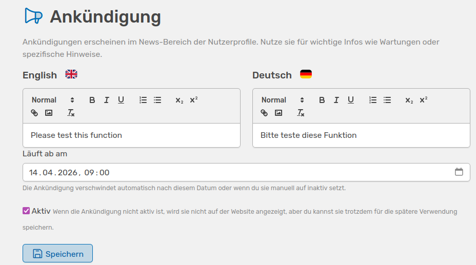

# Ankündigungen

<!-- md:version 2.0 -->

Mit der Ankündigungs-Funktion wird es Administrator:innen ermöglicht, zentrale Ankündigungen zu erstellen. Diese werden im News-Bereich der persönlichen Profile aller Nutzer:innen angezeigt.

///caption
Hier kannst du deutsche und englische Texte für eine interne Ankündigung eingeben und ein Ablaufdatum für die Nachricht setzen
///

Ankündigungen können unter anderem für folgende Zwecke genutzt werden:

- Hinweise auf Wartungsarbeiten
- Informationen zu neuen Funktionen
- Organisatorische Mitteilungen

Die Funktion ermöglicht die Erstellung von Freitext-Ankündigungen in deutscher und englischer Sprache sowie die Festlegung eines optionalen Ablaufdatums. Ankündigungen können manuell aktiviert und deaktiviert werden und werden nach Ablauf des definierten Zeitraums automatisch ausgeblendet.

///caption
So wird dein Text den Nutzenden in OSIRIS angezeigt, je nachdem welche Sprache sie eingestellt haben
///

Nutzer:innen haben die Möglichkeit, Ankündigungen temporär zu schließen oder dauerhaft auszublenden. Bei einer Aktualisierung des Inhalts wird die jeweilige Ankündigung erneut angezeigt, um sicherzustellen, dass Änderungen wahrgenommen werden.

Die Funktion stellt somit eine zentrale Möglichkeit zur Verfügung, um Nutzer:innen direkt innerhalb von OSIRIS zu informieren.
