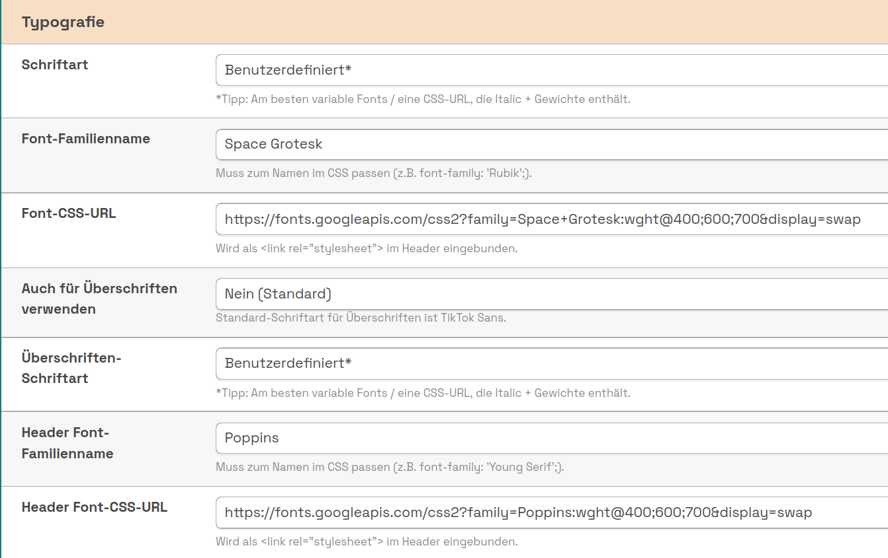
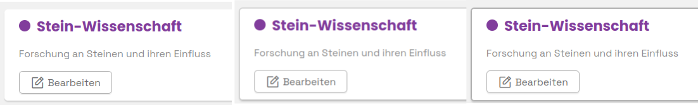

# Designeinstellungen

<!-- md:version 1.8.0 -->

OSIRIS bietet dir mit dem Update 1.8.0 die Möglichkeit, das Erscheinungsbild noch detaillierter an eure Corporate Identity anzupassen. 

## Farben

Unter **Farben** kannst du eine Primär- und Sekundärfarbe, passend zu eurem Institut auswählen. Die primäre Farbe wird für die Hauptelemente, die sekundäre für die hervorgehobenen Elemente der Website verwendet.

## Typografie

Über diese Funktion könnt ihr sowohl für die Überschriften als auch für den normalen Text eigene Schriftarten definieren.

///caption
Hier könnt ihr verschiedene Schriftarten definieren, indem ihr eine CSS-URL und den passenden Font-Familiennamen eingebt.
///

Im Dropdown-Menü der **Schriftart** findet ihr auch eine kleine Auswahl an Schriftarten.

## Darstellung von Elementen

Hier könnt ihr die verschiedensten Elemente in OSIRIS anpassen. 

///caption
Boxen in OSIRIS ohne, mit normalem und mit dickem Rahmen.
///

Die Boxen sind in Dicke und Farbe des Rahmens, sowie der Abrundung anpassbar. Zudem könnt ihr die Box mit einem Schatten hinterlegen.

Links könnt ihr mit einem Unterstrich hervorheben und Tabellen gestreift darstellen lassen.

///caption
Auch die Icons könnt ihr anpassen - ob im originalem Stil, gefüllt oder zweifarbig.
///

Neben den Icons könnt ihr auch die Kopfzeile anpassen und das OSIRIS-Logo in verschiedenen Farben anzeigen lassen.  Über die Funktion *Navbar Höhe* wird die Höhe der oberen Navigationsleiste angepasst, die die Logos enthält. Wenn "keine Navbar" ausgewählt ist, werden die Logos in den Footer verschoben. 