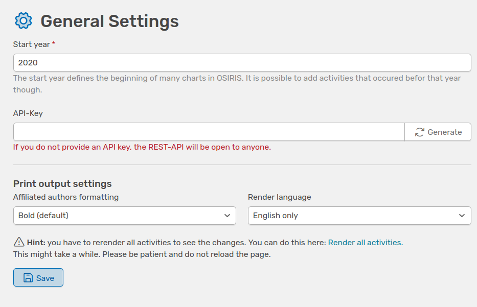

# General settings

On this page, you can set the **Start year**. OSIRIS uses this year as the basis for creating most illustrations and only includes contributions that were added during or after this year. You can add activities that took place before this year, but these will not be included in the illustrations.

///caption
Interface to change general settings in OSIRIS
///

You will also find the **API-Key** here, or you can generate one to protect access to all data available in the database.

You can also determine how the **affiliated authors** are formatted in the activities. The default setting is **bold**.

