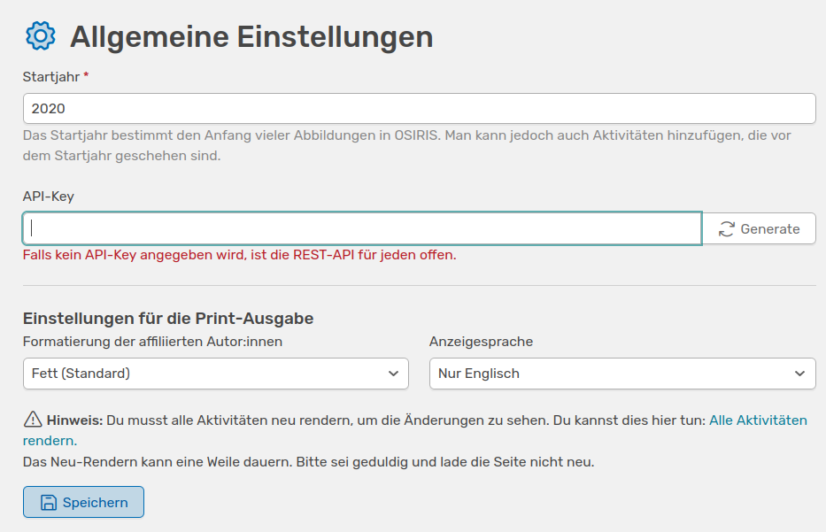

# Allgemeine Einstellungen

Auf dieser Seite kannst du unter anderem das **Startjahr** festsetzen. An diesem Jahr orientiert sich OSIRIS bei der Erstellung von Abbildungen und bezieht nur Beiträge mit ein, die während oder nach diesem Jahr hinzugefügt wurden. Es können zwar Aktivitäten hinzugefügt werden, die vor diesem Jahr stattgefunden haben, diese werden aber nicht  mit in die Abbildungen einbezogen.

///caption
Interface um allgemeine Einstellungen in OSIRIS vorzunehmen
///

Du findest hier auch den **API-Key**, bzw. kannst einen generieren, um den Zugriff auf all in der Datenbank verfügbaren Daten zu schützen.

Du kannst auf dieser Seite auch bestimmen, wie die **affiliierten Autor:innen** in den Aktivitäten formatiert werden. Standardmäßig ist **fett** eingestellt.

