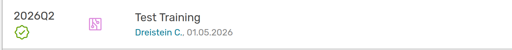
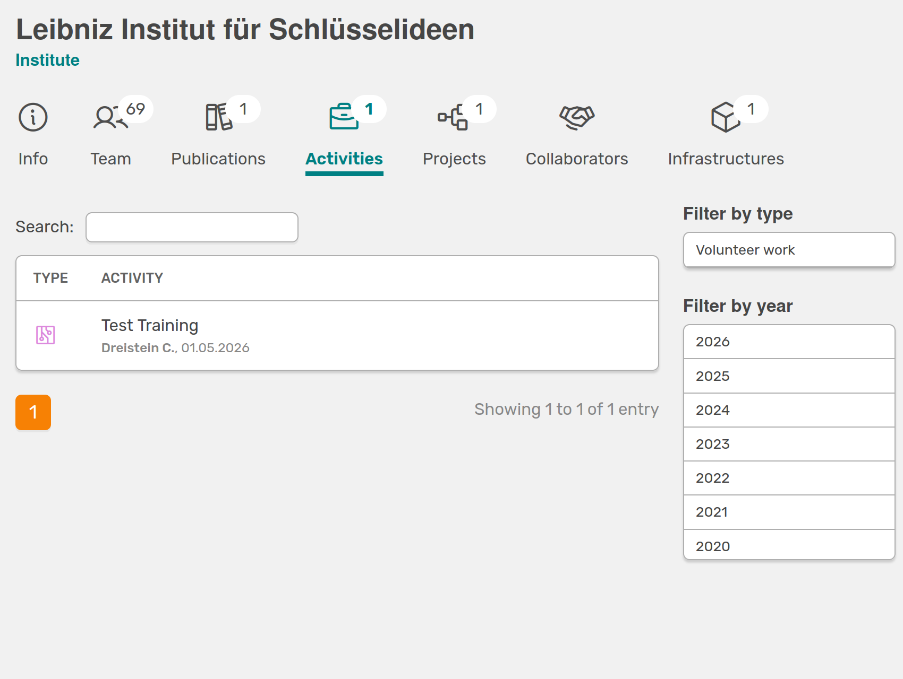

# Portfolio Settings

!!! note "Only for OSIRIS Portfolio users"
    This site includes important information if your institutes uses OSIRIS Portfolio. If this is not the case, you can find further information about our Portfolio extension [here](https://osiris-app.de/portfolio#!).
 
On this page, you can configure important settings for the visibility of activities on your public portfolio page, as well as specify the portfolio URL and API key.

## Portfolio-URL
When specifying the portfolio URL, it is important to enter the complete URL (e.g., https://portfolio.institute.edu). OSIRIS uses this URL to create links from various locations within your internal OSIRIS instance to the external portfolio. If no URL is provided, the portfolio will attempt to use relative links instead.

## Portfolio Workflow Visibility

You can create a workflow for your activities. Depending on whether you have configured a workflow, you can choose when activities should be displayed in the portfolio. To make this work, the option "This type of activity should be visible in the OSIRIS Portfolio" must be enabled for the corresponding activity type in the settings.

- Only approved activities: Only activities that have an assigned workflow and have successfully completed it will be displayed.

///caption
The green arrow next to the activity indicates that the workflow has been completed successfully.
///

///caption
Only the activity marked with a green arrow, indicating a successfully completed workflow, is displayed.
///

- Approved activities and activities without workflow: Activities with a workflow are displayed only after the workflow has been completed. Activities without a workflow are also displayed when this option is selected.
- All activities: All activities for which visibility has been enabled in the activity type settings will be displayed.

## Portfolio-API Key
The portfolio API key is used to authenticate the portfolio API. If you do not provide an API key, the portfolio API will be open to anyone. 

## Generally visible activity types
This section provides an overview of all activity types for which portfolio visibility has been enabled in the settings. If you want to change this for a specific activity type, you can click directly to the corresponding settings page and disable the option.