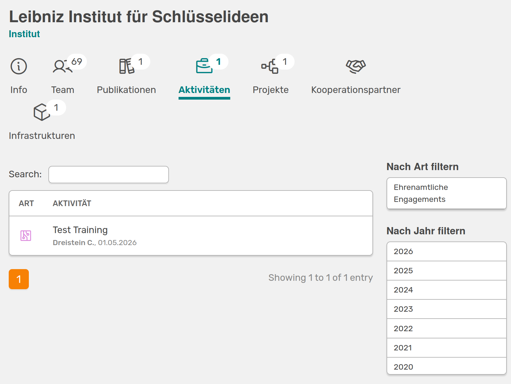

# Portfolio Einstellungen

!!! note "Nur für OSIRIS Portfolio Nutzende"
    Diese Seite enthält wichtige Informationen, wenn euer Institut OSIRIS POrtfolio nutzt. Wenn dies nicht der Fall ist, könnt ihr [hier](https://osiris-app.de/portfolio#!) weitere Informationen zu der Erweiterung finden.  
 
Auf dieser Seite kannst du wichtige Einstellungen zur Sichtbarkeit der Aktivitäten auf eurer öffentlich zugänigen Portfolio Seite vornehmen und die URL und API Key angeben.

## Portfolio-URL
Bei der Angabe der Portfolio-URL ist es wichtig, dass die vollständige URL angegeben wird (z.B. https://portfolio.institute.de). Diese wird von OSIRIS genutzt, um von verschiedenen Stellen in eurem internen OSIRIS auf das externe Portfolio zu verlinken. Falls keine URL angegeben wird, versucht das Portfolio relative Links zu verwenden. 

## Sichtbarkeit im Portfolio-Workflow

Du kannst für deine Aktivitäten einen Workflow erstellen. Je nachdem ob du dies gemacht hast, kannst du hier die Einstellung vornehmen, wann Aktivitäten im Portfolio angezeigt werden. Dafür muss für den jeweiligen Aktivitätstypen in den Einstellungen die Option "Diese Art von Aktivität sollte in OSIRIS Portfolio sichtbar sein" ausgewählt werden.  

- Nur genehmigte Aktivitäten: Es werden nur Aktivitäten angezeigt, für die es einen Workflow gibt und die diesen erfolgreich durchlaufen haben.

///caption
Der grüne Pfeil links neben der Aktivität zeigt an, dass der Workflow erfolgreich durchlaufen wurde.
///

///caption
Nur die Aktivität mit grünem Pfeil, also erfolgreich durchlaufenem Workflow, wird angezeigt.
///

- Genehmigte Aktivitäten und Aktivitäten ohne Workflow: Aktivitäten, die einen Workflow durchlaufen, werden nur angezeigt, wenn dieser abgeschlossen ist. Alle anderen Aktivitäten ohne einen Workflow werden bei dieser Option auch angezeigt.

- Alle Aktivitäten: Es werden alle Aktivitäten, für die die Sichtbarkeit in den Aktivitätseinstellungen freigegeben ist, angezeigt.

## Portfolio-API-Schlüssel

Der Portfolio-API-Schlüssel wird verwendet, um die Portfolio-API zu authentifizieren. Falls kein API-Schlüssel angegeben wird, ist die Portfolio-API für jeden offen. 

## Allgemein sichtbare Aktivitätstypen

Hier bekommst du eine Übersicht über alle Aktivitätstypen, bei denen die Sichtbarkeit im Portfolio in den Einstellungen aktiviert wurde. Wenn du dies für einen Typen ändern möchtest, kannst du mit einem Klick direkt zu den Einstellungen gelangen und die Box deaktivieren. 

