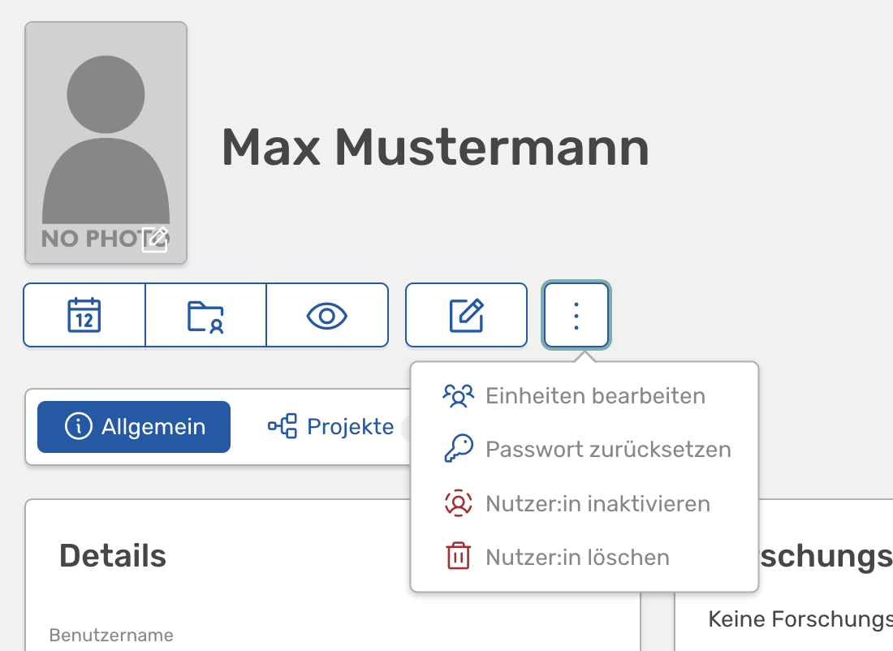
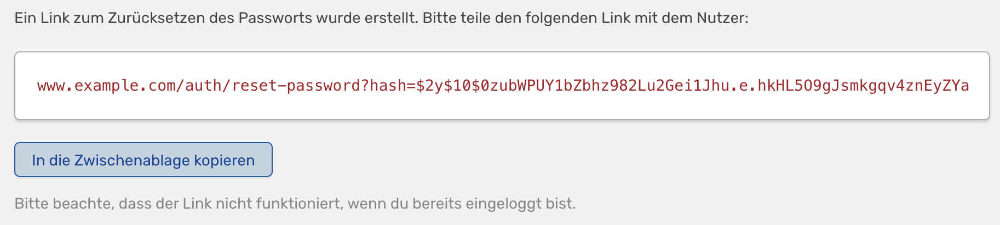

# Passwort einer Person zurücksetzen

<!-- md:version 1.5.2 -->
<!-- md:auth AUTH -->
<!-- md:feature -->

In den Rechten und Rollen kann man Rechte vergeben, um das Passwort einer Person zurückzusetzen. Dann taucht in der erweiterten Liste der Funktionen bei einem Nutzenden (mit den drei Punkten) die Funktion "Passwort zurücksetzen" auf:

{width="500px"}

Auf der nachfolgenden Seite muss man dann einmal bestätigen, dass man das Passwort tatsächlich zurücksetzen möchte.

Daraufhin erhält man einen Link, den man an die Person weitergeben kann, die ihr Passwort zurücksetzen möchte. Man kann über einen Knopf den Link in die Zwischenablage kopieren.

!!! tip 
    Bitte beachte, dass der Link nicht funktioniert, wenn du bereits eingeloggt bist. Du wirst dann einfach ohne weiteren Kommentar auf deine persönliche Profilseite weitergeleitet. Der Link funktioniert nur, wenn du nicht eingeloggt bist.

