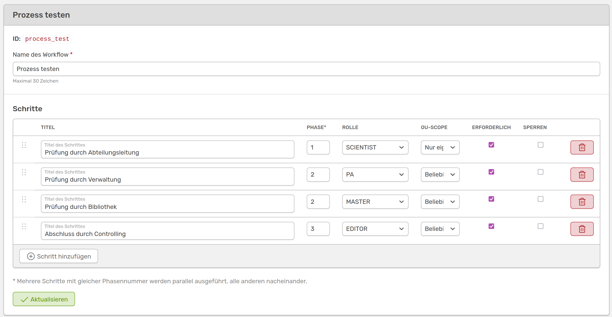

# Erstellen eines Workflows

Um einen neuen Workflow zu erstellen, gehst du im Admin-Menü auf **Inhalte &#8594 Qualitäts-Workflows**. Mit einem Klick auf **:heavy_plus_sign: Workflow hinzufügen** öffnet sich ein Formular, in dem du deinem Workflow eine einzigartige ID und einen Namen geben musst. Bitte beachte, dass die **ID** nur aus Kleinbuchstaben, Zahlen und Unter- oder Bindestrichen bestehen darf (z.B. *publication-approval*). Der **Name** des Workflows kann frei gewählt werden, da er aber in den Fortschrittsleisten angezeigt wird, sollte er möglichst kurz und prägnant sein. Um weitere Konfigurationen vorzunehmen, musst du zunächst speichern. Dadurch öffnet sich ein Formular, in dem du deinem Workflow Schritte hinzufügen kannst.

///caption
Formular um einen Workflow zu erstellen
///

Über **:heavy_plus_sign: Schritt hinzufügen** kannst du deinen Workflow um beliebig viele Schritte erweitern. Folgende Angaben sind notwendig:

- **Titel:** Name des Prüfschritts (z.B. „Prüfung durch Abteilungsleitung“)
- **Phase:** Mehrere Schritte mit gleichem Index werden parallel ausgeführt. Sollen alle Schritte nacheinander ablaufen, vergib aufsteigende Indizes (1, 2, 3...)
- **Rolle:** Welche Benutzerrolle diesen Schritt bearbeiten darf (z.B. Scientist, PA etc.)
- **OU-Scope:** Checkbox aktivieren, wenn der Schritt nur intern in einer Organisationseinheit freigegeben werden darf
- **Erforderlich:** Markiert den Schritt als Pflicht um den Status *verified* erreichen zu können.
- **Sperren:** Optional – verhindert weitere Änderungen der Aktivität nach Abschluss dieses Schritts

Über das Tonnen-Symbol rechts kannst du einzelne Schritte löschen, über die Punkte links per Drag&Drop die Reihenfolge ändern.  

Speichere deine Änderungen mit einem Klick auf **Aktualisieren**.

In dem gezeigten Beispiel würde der Workflow also so ablaufen:

- **1. Schritt:** Personen mit der Rolle **Scientist** in deiner Organisationseinheit werden dazu aufgefordert die Aktivität zu bestätigen
- **2. Schritt:** Personen mit der Rolle **PA** und mit der Rolle **Master** können die Aktivität parallel bestätigen. Erst wenn beide bestätigt haben geht es zum nächsten Schritt. Die Rollen müssen nicht deiner Organisationseinheit zugehörig sein
- **3.Schritt:** Personen mit der Rolle **Editor** werden zur Bestätigung der Aktivität aufgefordert, auch hier wieder ohne Zugehörigkeit deiner Einheit

Erst wenn alle Rollen die Aktivität bestätigt haben wechselt der Status auf *verified*.