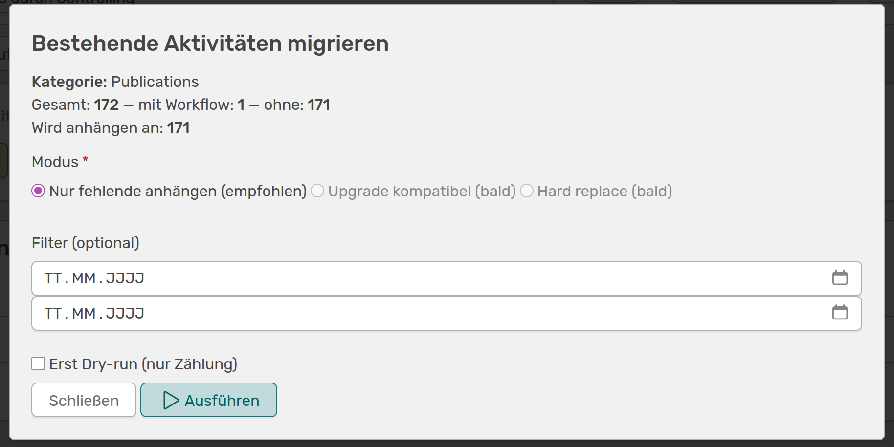

---
tags:
- Aktivitäten
- Workflows
---

# Workflows zu Aktivitätskategorien hinzufügen

Deinen neu erstellten Workflow kannst du jetzt auf eine oder mehrere Aktivitätskategorien anwenden. Dafür musst du die Kategorie bearbeiten. Gehe dafür im Admin-Menü auf **Inhalte &#8594 Aktivitäten** und wähle deine gewünschte Kategorie aus. 

///caption
Um den Workflow auf Aktivitäten anwenden zu können musst du die Kategorie bearbeiten und den entsprechenden Workflow über ein Dropdown-Menü auswählen
///

Unter **Qualitätsworkflow** kannst du einen der vorhandenen Workflows auswählen. Nachdem du gespeichert hast, wird dieser Workflow automatisch auf **alle neu erstellten Aktivitäten** dieser Kategorie angewendet.

## Migration von bestehenden Aktivitäten

Die Anwendung deines Workflows auf schon bestehende Aktivitäten in der Kategorie kannst du unter **Inhalte &#8594 Qualitätsworkflows** einstellen. Dafür wählst du deinen Workflow aus. Im unteren Bereich findest du die Liste der verknüpften Aktivitätskategorien. Wenn du rechts auf den Pfeil klickst, öffnet sich ein Widget.

///caption
Über dieses Formular kannst du deinen Workflow auf bestehende Aktivitäten anwenden
///

In dem Fenster wird dir die Anzahl der gefundenen Aktivitäten angezeigt, die der ausgewählten Kategorie zugehörig sind, und wie viele davon schon mit dem Workflow ausgestattet sind. Der Modus kann aktuell noch nicht geändert werden und hängt nur fehlende Aktivitäten an den Workflow an. Du kannst hier auch einen Filter einstellen und zum Beispiel angeben, dass nur Publikationen aus den letzten sechs Monaten in Betracht gezogen werden sollen. Bevor du den Workflow auf alle Aktivitäten anwendest, kannst du hier auch noch einen **Dry-run** machen und zählen, wie viele Einträge dies betreffen würde. Wenn du dir sicher bist, kannst du die Migration durchführen, OSIRIS zeigt dir mit einem grünen Feld an, wenn alles geklappt hat.
