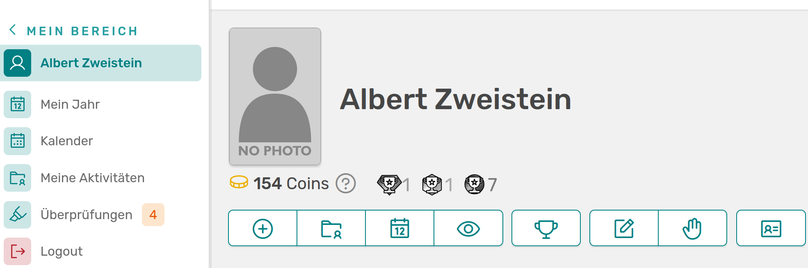
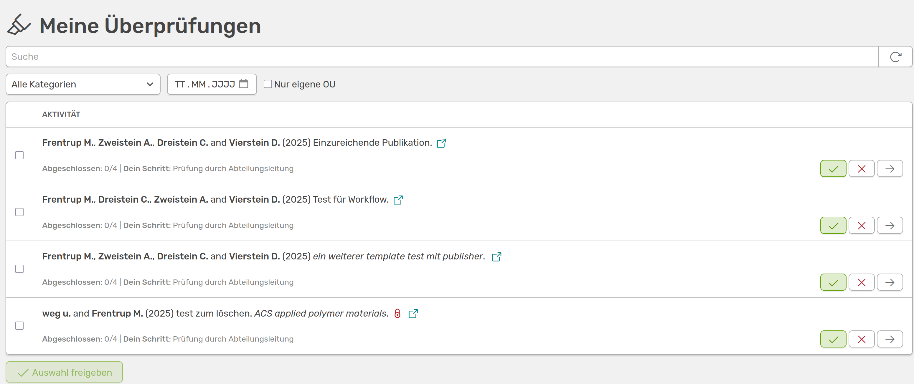
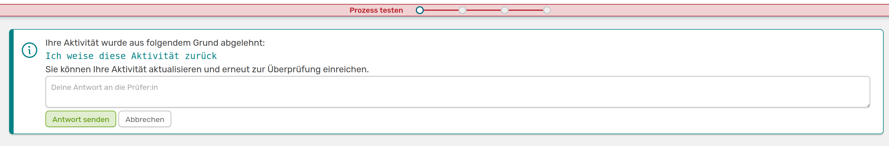
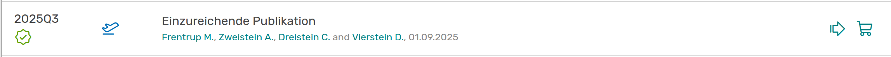

# Ablauf des Workflows

Sobald du deinen Workflow eingerichtet und ihn auf Aktivitäten angewendet hast, werden betroffenen Personen unter **Überprüfungen** links im Menü die Anzahl der Aktivitäten angezeigt, für die eine Aktion von ihnen notwendig ist.

///caption
Im Menü links wird dir angezeigt, ob dir momentan Aktivitäten in einem Workflow zugeteilt sind, die du überprüfen musst
///

In unserem Beispiel wurde der erste Schritt der Rolle **Scientist** zugeordnet, begrenzt auf Aktivitäten aus der eigenen Organisationseinheit. Dementsprechend werden der Person auch nicht alle zu überprüfenden Publikationen zur Überprüfung angezeigt, sondern nur solche, die der Einheit zugeordnet sind.

///caption
Anzeige der Überprüfungen
///

Unter jeder Aktivität siehst du den Fortschritt des Workflows anhand der abgeschlossenen Schritte und den von der Person auszuführenden Schritt. Um die Einträgen freizugeben, kann man entweder einzeln über den grünen Haken rechts **bestätigen**, oder alle auswählen und im unteren Bereich *Auswahl freigeben* nutzen. Wenn man auf das rote Kreuz zum **zurückweisen** klickt, wird man dazu aufgefordert einen Kommentar zu hinterlassen. Über den Pfeil gelangt man zur detaillierten Ansicht der Aktivität.

## Zurückweisen einer Aktivität

Wenn die Person auf das rote Kreuz klickt und einen Kommentar hinterlässt, hat sie den aktuellen Schritt des Workflows zurückgewiesen. Dies wird zum einen in der Auflistung aller Aktivitäten über ein Symbol unter der Quartalsangabe und zum anderen in der Status-Leiste in der erweiterten Aktivitätsansicht angezeigt.

---

///caption
Anzeige der Zurückweisung zum einen in der Auflistung aller Aktivitäten und zum anderen in der erweiterten Aktivitätsansicht - hier wird den Autoren der Aktivität auch der Kommentar angezeigt
///

Zudem bekommen alle Autoren dieser Aktivität eine Warnmeldung:

///caption
Warnung der Ablehnung mit Kommentar für die Autoren
///

Die Autoren können hier direkt auf den Kommentar antworten und den Schritt an die zuständige Person zurückgeben. Sie können die Aktivität aber auch bearbeiten und sie dann wieder in den Prozess geben. Die Person erhält wieder eine Meldung unter Überprüfungen und kann die Aktivität freigeben oder sich nochmal im Detail ansehen. In der erweiterten Ansicht der Aktivität kann man auf die Status-Leiste klicken, um eine detaillierte Ansicht des Prozesses zu sehen.

///caption
Seite mit dem aktuellen Status des Workflows und der Möglichkeit, den zugeordneten Schritt zu bestätigen. Hier werden auch die abgegebenen Kommentare zu diesem Prüfschritt angezeigt
///

Wenn die zuständige Person die Aktivität jetzt freigeben möchte, kann sie dies hier direkt machen und alle Kommentare zu diesem Schritt löschen. Wenn der Schritt erneut zurückgewiesen werden soll, wird die Person erneut aufgefordert einen Kommentar abzugeben.

## Freigeben eines Schrittes

Über den grünen Haken wird der aktuelle Schritt für diese Aktivität freigegeben und der Prozess geht zum nächsten Schritt über. Der erste Schritt wird in der Status-Leiste mit einem grünen Haken markiert.

///caption
Anzeige des akzeptierten Schrittes und Markierung der nächsten Schritte (blau)
///

Da die nächsten beiden Schritte die gleichen Indezes bekommen haben, laufen sie parallel ab und sind hier direkt beide markiert. Da diese Schritte einer anderen Rolle als *Scientist* zugeordnet wurden, kann die Person keinen der weiteren Schritt freigeben. Die Personen mit den jeweiligen Rollen bekommen nun die gleiche Meldung bei **Überprüfungen** und können erneut die Aktivität ablehnen oder freigeben.

## Abschluss des Workflows

Wenn alle Schritte bestätigt wurden, wird die Aktivität als **freigegeben** markiert.

---

///caption
Anzeige einer freigegebenen Aktivität in der Auflistung aller Aktivitäten und in der erweiterten Aktivitäts-Ansicht
///

## Workflows zurücksetzen oder entfernen

Du kannst Workflows jederzeit für einzelne Aktivitäten, für eine ganze Kategorie oder für alle Aktivitäten im Workflow Menü zurücksetzen.  
Für einzelne Aktivitäten klickst du dafür in der erweiterten Ansicht azf die Status-Leiste. Dort wird dir ein roter Button mit **Workflow zurücksetzen** angezeigt.  

 Um die Aktion für mehrere Aktivitäten durchzuführen gehst du im Admin-Bereich auf **Inhalte &#8594 Qualitätsworkflows**, wo du im unteren Bereich **Angewendete Workflows bearbeiten** findest.

///caption
In diesem Bereich kannst du Workflows für alle Aktivitäten oder gewählte Kategorien zurücksetzen oder entfernen
///

Im Dropdown-Menü **Aktion** kannst du wählen zwischen:

- Alle Workflows auf den ersten Schritt **zurücksetzen**: Alle betroffenen Aktivitäten werden in der Listenansicht mit einem weißen Kreis markiert und die Status-Leiste in der erweiterten Ansicht wird zurückgesetzt

- Alle Workflows **entfernen**: Die Markierungen in der Listenansicht und die Statusleiste in der erweiterten Aktivitäts-Ansicht werden entfernt

Im Dropdown-Menü **Aktivitäts-Kategorie** kannst du wählen, ob du die Aktion für alle Aktivitäten oder nur für eine bestimmte Kategorie durchführen möchtest. Wenn du auf **Aktion durchführen** klickst wirst du noch nochmal um eine Bestätigung gebeten, bevor OSIRIS diesen Schritt ausführt. 