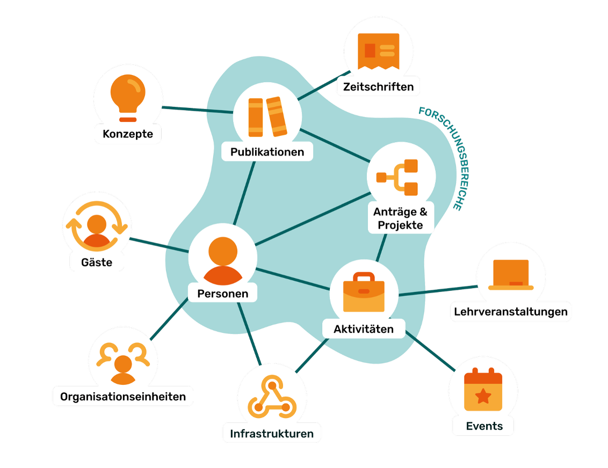

# Überblick über die Features

!!! warning "Seite im Aufbau"
    Diese Seite befindet sich noch im Aufbau. Wir bitten um Geduld.

Hier findest du eine Übersicht über die Entitäten, die in OSIRIS verwaltet werden können und wie sie miteinander verknüpft sind. Diese Entitäten bilden die Grundlage für die Erfassung, Verwaltung und Auswertung von Forschungsaktivitäten.

