# Überblick über die Features von OSIRIS


## 📝 **Kern-Idee**

OSIRIS, das steht für open, smart & intuitive research information system, und die ersten drei Worte spiegeln schon ganz gut die Philosophie wieder. OSIRIS ist so **offen** wie möglich – das gilt sowohl für den Quellcode als auch für die Lizenz. OSIRIS ist so **smart** wie möglich – es nimmt euch wo es geht Arbeit ab und automatisiert, was möglich ist, aber ohne die Nutzenden zu bevormunden. OSIRIS ist auch so **intuitiv** wie es nun mal geht – sicher, das liegt oftmals im Auge des Betrachters… doch OSIRIS gibt sich die größte Mühe mit einem aufgeräumten und modernen Interface, gutem UX Design und vielen Accessibility-Funktionen diesen Ansprüchen zu genügen.

Zur Kostenlosen Demo geht es [**hier**](https://www.osiris-demo.de/user/login).

### Die wichtigsten Kern-Aspekte:

- OSIRIS ist ein **Selbstmeldesystem** und eignet sich am besten für Institute ohne eigene Bibliothek oder Personal, das sich dediziert um die Pflege der Forschungsaktivitäten kümmert.
- OSIRIS funktioniert “out-of-the-box”, um es auszuprobieren, es kann aber auch **viel konfiguriert** werden, z.B. können eigene Aktivitätstypen erstellt werden, Funktionen deaktiviert und Rollen konfiguriert werden.
- OSIRIS legt besonderen **Fokus auf die Forschenden**: auf eigenen Profilseiten werden alle Daten aggregiert und dargestellt, die eigene Forschung lässt sich auswerten und der eigene CV herunterladen.
- OSIRIS lässt sich bedingt auch als Repositorium nutzen: es lassen sich Dateien zu Aktivitäten hinterlegen, um tatsächlich als Repositorium zu dienen ist OSIRIS aber (noch) nicht ausgelegt.
- OSIRIS bietet ein Addon an, mit denen die Forschung auf einer externen Seite dargestellt werden kann (Portfolio)
- OSIRIS wird sehr aktiv weiterentwickelt, nicht zuletzt weil es auch das jüngste Mitglied der CRIS-Familie ist.

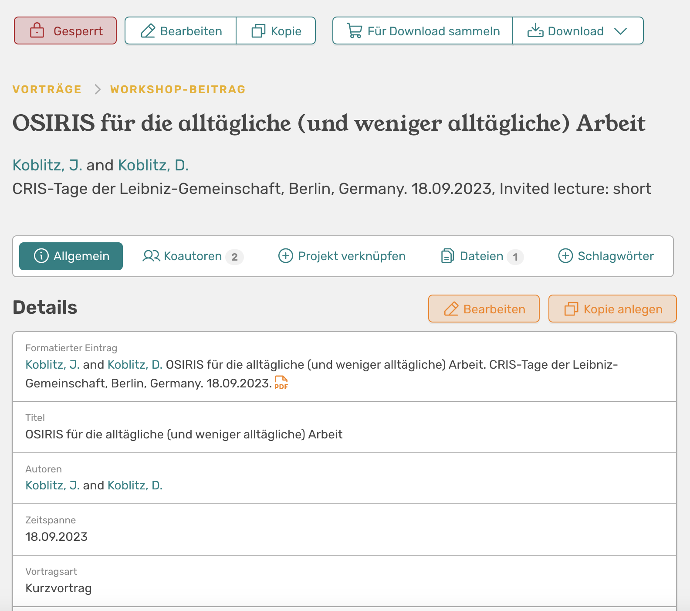

---

## 🗃️ **Separat erfassbare Datentypen**

Hier findest du eine Übersicht über die Entitäten, die in OSIRIS verwaltet werden können und wie sie miteinander verknüpft sind. Diese Entitäten bilden die Grundlage für die Erfassung, Verwaltung und Auswertung von Forschungsaktivitäten.


- **Mitarbeitende Personen**
    - Biographien
    - Position im Unternehmen
    - Zugehörigkeit zu Organisationseinheiten
    - Verschiedene externe IDs und Links
- **Organisationseinheiten**
    - Hierarchischer Aufbau bis runter auf Team-Ebene möglich
    - Eigene Definition der Ebenen

- **Forschungsaktivitäten** (**frei konfigurierbar**, unterstützt auch Verlaufsdaten; hier sind die Standard-Werte):
    - Publikationen (Journal Article, Non-refereed, Buch, Buchkapitel, Preprint, Abschlussarbeit, Weitere Publikationen)
    - Poster
    - Vorträge
    - Gutachten und Editorenschaften
    - Lehre (Lehrveranstaltungen, Abschlussarbeiten)
    - Software & Daten
    - Preise
  
    
    /// caption
    Die Seite “**Aktivität hinzufügen**” ist das Herzstück von OSIRIS. Forschende können ihre Daten manuell oder automatisch via DOI- oder Pubmed-Import hinzufügen. Sowohl die Kategorien (Publikationen, Poster, usw.), als auch die Aktivitätstypen (Journal Article, Non-refereed, usw.) können individualisiert werden, genau wie der Beschreibungstext (in orange) und die Formularfelder. Mehr dazu im Abschnitt Anpassbarkeit.
    ///

- **Journale**
    - Werden über API automatisch eingepflegt, wenn verknüpfte Aktivität eingetragen wird
    - Impact Faktoren können (zurzeit) händisch eingetragen werden
- **Lehrveranstaltungen**
    - Über Modulnummern indiziert
    - Mit Aktivitäten verknüpfbar
- **Schlagworte**
    - ⚠️ Im Moment sehr rudimentär und auf jeden Fall ausbaufähig
    - Es gibt allerdings auch KI-gestützte Verschlagwortung, sogenannte Konzepte. Die befinden sich zurzeit jedoch noch in der Beta.
- **Events** (ab `v1.3.7`)
    - Events können im Voraus angelegt werden
    - Personen können im Voraus Interesse oder die Teilnahme an Konferenzen bekunden
    - Bei in der Vergangenheit liegenden Konferenzen können Beiträge sehr einfach hinzugefügt werden
- **Forschungsbereiche** (ab Version `v1.4.0`)
    - Forschungsbereiche können zentral angelegt werden
    - Forschungsbereiche können zu Personen, Aktivitäten und Projekten hinzugefügt werden
    - Es kann zentral nach Forschungsbereichen aggregiert, gefiltert und exportiert werden
- **Infrastrukturen** (ab `v1.4.2`)
    - Forschungsinfrastrukturen nach KDSF 2.0
    - inkl. Betriebspersonal, Jahresstatistik, Verbundeinrichtungen (bei Verbundinfrastrukturen) und Statistiken
- **Projekte**
    - Projektstammdaten
    - Verknüpfung mit mitarbeitenden Personen
    - Mit Aktivitäten verknüpfbar
    - Verknüpfung mit Kooperationspartnern (powered by ROR)
    - Statistiken (ab `v1.4.2`)
    - Anträge  (ab `v1.5.0`)

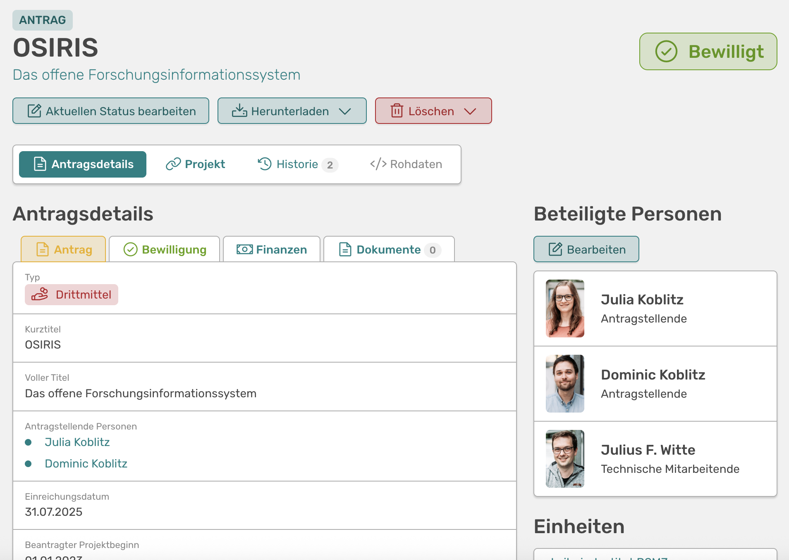
/// caption
Übersicht über einen Projektantrag in OSIRIS. Die verschiedenen Phasen, Finanzen und Dokumente sind hier zu sehen.
///

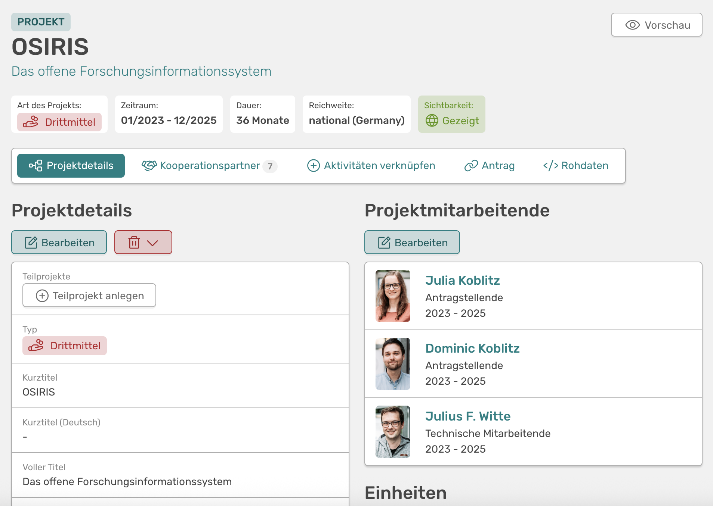
/// caption
Übersicht über ein Projekt in OSIRIS. Neben den gezeigten Details kann man auch Kooperationspartner und verknüpfte Aktivitäten anzeigen lassen.
///

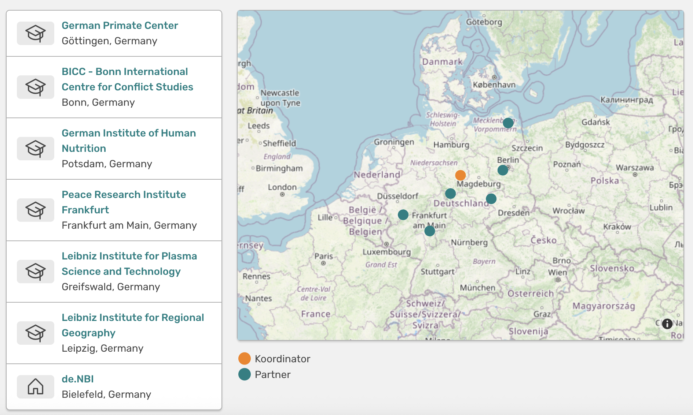
/// caption
Kooperationspartner eines Projektes. Links ist die Liste mit Partnern, rechts ist eine Übersichtskarte. Das eigene Institut wird dort automatisch eingetragen, solange es richtig konfiguriert ist.
///

---

## 📊 **Reporting-Funktionen**

- **Analyse und Visualisierung**
    
    Metriken können direkt aus den Aktivitäten gezogen werden. Dafür bereitet OSIRIS eine Reihe von Visualisierung auf einem Dashboard auf. 
    

- **Quartals-zentriert**
    
    OSIRIS erfasst Aktivitäten und organisiert sie nach Quartalen und Jahren, ideal für verschiedene Berichtsabfragen. Außerdem gibt es die Seite “Mein Jahr”, über die Forschende einmal im Quartal aufgefordert werden, ihre vergangenen Aktivitäten zu überprüfen, ggf. zu ergänzen und zum Schluss zu bestätigen, dass alles in Ordnung ist. Dies wiederum wird im Reporting-Dashboard angezeigt.

    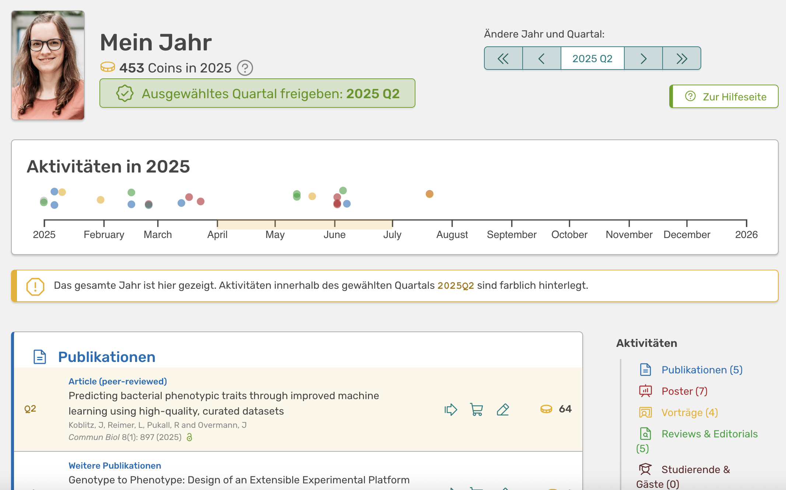
    /// caption
    Die Seite "Mein Jahr" mit der Möglichkeit, das gewählte Quartal freizugeben. Hier können Forschende ihre Aktivitäten überprüfen und bestätigen, dass alles in Ordnung ist.
    ///
    
- **Vielfältige Suchmöglichkeiten**
    
    Im Reiter “Alle Aktivitäten” gibt es viele vorgefertigte Filter, z.B. nach Aktivitäts-Kategorie, Organisationseinheit und Zeitraum. Außerdem gibt es auch eine erweiterte Suche, die es ermöglicht beinahe alle Datenfelder von OSIRIS zu durchsuchen. Auch komplizierte Abfragen und Kombinationen sind möglich. Mehr dazu findet ihr im Abschnitt Suchmöglichkeiten weiter unten. 
    

- **Export von Aktivitäten und Berichten**
    
    Es gibt eine Vielzahl an Möglichkeiten, um Aktivitäten aus OSIRIS zu exportieren. Beispielsweise können Daten aus den o.g. Suchmöglichkeiten direkt exportiert werden: als Word-Dokument, Excel-Sheet, CSV, JSON oder BibTeX (RIS und CERIF-XML in Planung). Ihr könnt auch einzelne Aktivitäten herunterladen oder gleich mehrere für den Download auswählen und gesammelt exportieren. Auch alle zu einem Projekt verknüpfte Aktivitäten lassen sich auf diese Weise gesammelt herunterladen. 
    
    Beim Export nach Word gibt es noch einen besonderen Kniff, denn Wissenschaftler:innen können ihren eigenen Namen im Export fett drucken lassen und für Berichterstatter:innen hebt OSIRIS einfach alle hervor, die mit dem Institut affiliiert sind.
    
    `Update v1.3.6`: Es gibt eine erste Version des **Berichte-Editors** mit dem mehrere Templates für verschiedene Berichtszwecke erstellt werden können.
    
    `Update v1.4.0`: In der erweiterten Suche lassen sich nun alle **Spalten auswählen**, die im Hintergrund gespeichert sind. Diese werden dann im Interface angezeigt und können als Excel exportiert werden.
    
    `Update v1.4.1`: **Pivot-Tabellen** (beta) bieten euch Tiefenanalyse für Aktivitäten, inklusive Filtern und verschiedene Visualisierungen
    
- **Dashboards und Visualisierungen**
    
    Wie viele Nutzende haben im vergangenen Quartal ihre Daten übermittelt? Wie oft waren Autor:innen eures Instituts Erst- oder Letztautor? Welche Abteilungen eures Instituts arbeiten besonders viel zusammen? Wie ist der Anteil an Open Access Gold bei euren Publikationen? Mit welchen Instituten der Welt habt ihr an Projekten zusammengearbeitet? All diese Fragen beantwortet euch OSIRIS mit hübschen Grafiken und Dashboards.
    
- **Logik-Checks**
    
    OSIRIS führt im Hintergrund eine ganze Reihe von Logik-Checks durch, die die meisten Fehler schon bei der Eingabe der Daten ausmerzen. Außerdem werden den Nutzenden Vorschläge basierend auf bereits vorhandenen Daten gemacht.
    
- **Erweiterte Integrationen** (z.B. IDA-Paktabfrage)
    
    Es gibt eine Schnittstelle zur IDA-Paktabfrage. Zuletzt hatten wir Formular 18 integriert, das jetzt aber weitestgehend weggefallen ist. Ob sich eine weitere Integration anderer IDA-Formulare lohnt, muss noch evaluiert werden.
    
- **Aggregationen**
        
    `v1.3.4`: Über die erweiterte Suche können die Aktivitäten nach einem beliebigen Feld aggregiert und damit aufsummiert werden.
    
    > “Es ist eine immense Arbeitserleichterung.*”
    - Dominic Koblitz, Controller, DSMZ*
    > 

---

## 🧩 Use Cases

Wofür und wie häufig wird das System verwendet? Welche Anwendungsfälle gibt es, insbesondere auch über die “klassische” CRIS-Aufgabe des Reportings hinaus? Was sind Nutzen und Mehrwert des Systems? Was kann man mit den Daten im System machen?

### Die eigene Forschung - OSIRIS für Forschende

Die Philosophie ist ganz einfach: wenn die Forschenden ihre Daten gern eintragen – weil es zum Beispiel einfach und schnell geht und sie die Daten sogar nachnutzen können – dann machen sie es auch. Mit diesem Prinzip fahren wir in der DSMZ sehr gut. 

Deshalb bietet OSIRIS viele Funktionen, die explizit auf die Bedürfnisse von Forschenden zugeschnitten sind (die Hauptentwicklerin ist schließlich Wissenschaftlerin und wir haben viele Fans, die uns gern Feedback geben). Das wichtigste Feature ist dabei die **eigene Profilseite**, auf der alle Daten aggregiert und visualisiert werden.

Dadurch haben Forschende mit OSIRIS einen besseren **Überblick über ihre eigene Forschung**. Außerdem können sie sich ihren eigenen CV oder ausgewählte Aktivitäten einfach herunterladen und beispielsweise in ihr eigenes Zitationsprogramm importieren oder im nächsten Antrag verwenden.

Durch **Notizen** und **Dateiupload** lässt sich OSIRIS auch nutzen, um seine Forschung im Detail zu verwalten. So kann ich beispielsweise in der Notizen den Titel eines Papers hinterlassen, dass ich im Review hatte. Das unterstützt mich dabei, meine eigenen Aktivitäten nachzuverfolgen, ohne dass ich mich durch meine Mails wühlen muss. Ich kann auch sowohl den ersten Draft als auch das fertige Manuskript eines Papers hochladen. 

Mit **Coins** und **Errungenschaften** kommt außerdem ein Belohnungssystem ins Spiel. Einige Forschende lieben es, Coins zu sammeln und freuen sich immer über neue Errungenschaften im Profil. Wer es nicht mag, muss es nicht einschalten, denn **standardmäßig ist dieses Feature deaktiviert**. Man hat auch die Möglichkeit, es nur für sich selbst zu aktivieren, wenn man nicht möchte das andere die Coins sehen. Coins werden übrigens dynamisch generiert und nicht in der Datenbank gespeichert. Wenn sie also ausgeschaltet sind, können sie von niemandem eingesehen werden, nicht mal von Admins.

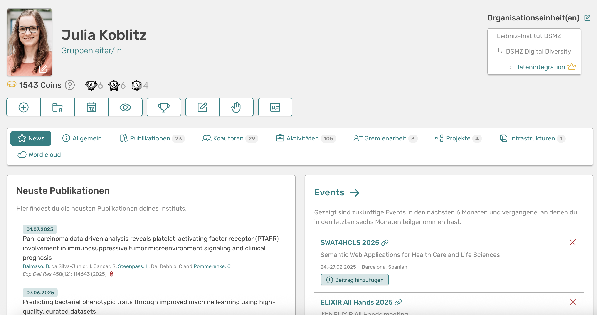

Die persönliche Profilseite bietet viele Funktionen und gibt einem immer einen Überblick über die eigene Forschung.

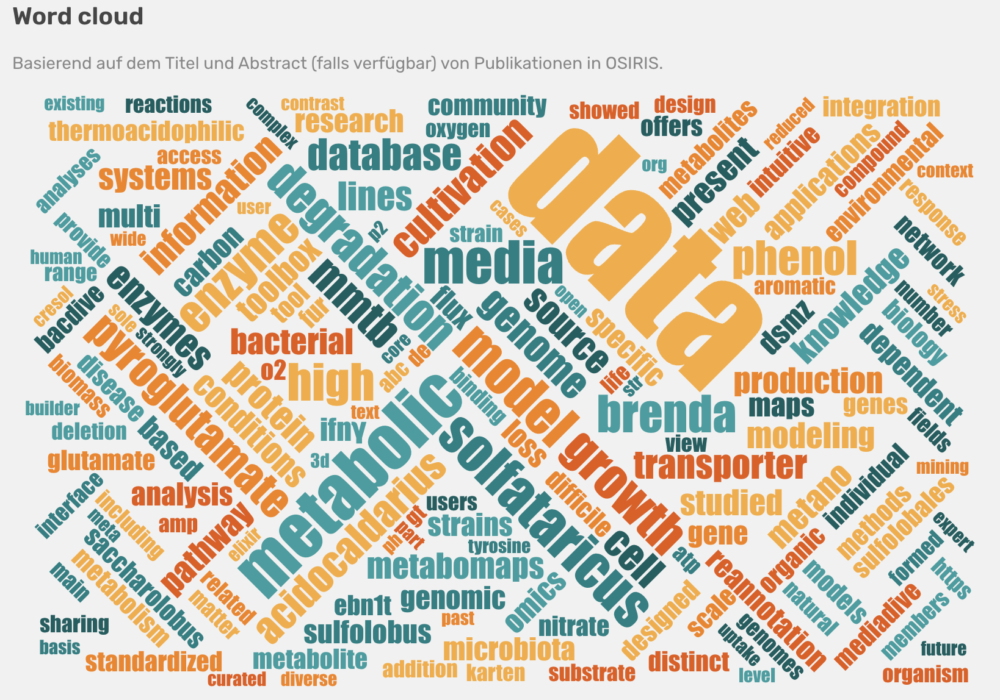

Viele zusätzliche Visualisierungen geben einem einen Überblick über die eigene Forschung. 

> “Mit OSIRIS wird die Pflege der Forschungsaktivitäten zur angenehmen Nebensache.*”
- Dr. Lorenz Reimer, Wissenschaftler, DSMZ*
> 

> “Bei OSIRIS macht es sogar richtig Spaß, seine Sachen einzutragen.*”
- Dr. Judith Boldt, Wissenschaftlerin, DSMZ*
> 

> “OSIRIS ermöglicht es mir den Überblick über all meine beruflichen Aktivitäten […] zu behalten und erstellt dazu noch hilfreiche Darstellungen meiner Einträge.*”
- Dr. Martinique Frentrup, Wissenschaftlerin, DSMZ*
> 

### Zahlen, Dashboards und formatierte Exporte - OSIRIS für Berichterstattende

Wie Berichterstattende Personen OSIRIS benutzen können, ist eigentlich schon sehr gut im Abschnitt Reporting-Funktionen dargestellt. Hier sei nur noch mal erwähnt, dass es in OSIRIS neben den klassischen Berichts-Dashboards auch noch eine Vielzahl weiterer Visualisierungen gibt, z.B. für einzelne Personen, Organisationseinheiten, Open Access und Kooperationen:

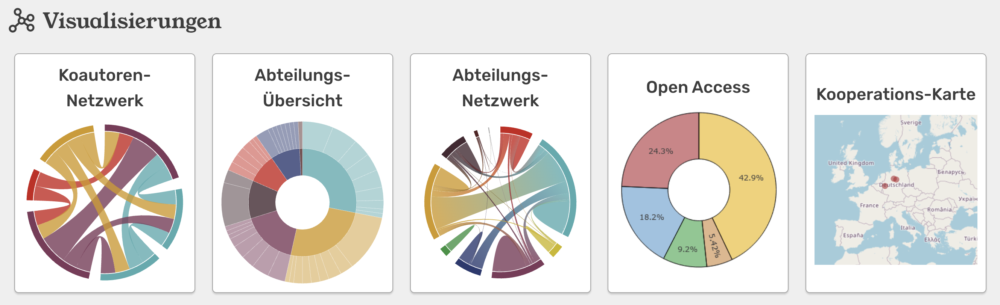

### Außensichtbarkeit unserer Forschung - OSIRIS für Institute

Einer der wichtigsten Aspekte eines CRIS ist die Außendarstellung. Wie repräsentieren wir unser Institut, wie zeigen wir unsere Forschung? OSIRIS unterstützt die Außendarstellung von ganzen Instituten, Organisationseinheiten, bis hin zu einzelnen Personen. Dabei gibt es drei grundlegende Konzepte.

1. **Low-Level:** Anbindung der eigenen Webseite über die REST-API
2. **Mid-Level:** Einbinden von vorgefertigten Datenpaketen über die Portfolio-API
3. **High-Level:** Komplette Nutzung von Portfolio als externes Forschungsportal (wird später dieses Jahr als Pilot für die DSMZ online gehen)

Portfolio ist ein Addon zu OSIRIS, das eine eigene Webseite auf Basis der Daten in eurem OSIRIS aufbaut. Ihr könnt es als zusätzliche Webseite sehen, die eure Forschung für die Öffentlichkeit aufbereitet. Portfolio befindet sich zurzeit in Entwicklung in Kooperation mit dem Leibniz-Institut DSMZ und soll im Laufe des Jahres an der DSMZ online gehen. Im Screenshot unten könnt ihr sehen, dass das Design von Portfolio sich nicht nach dem von OSIRIS richtet, sondern an eure eigene Webseite angeglichen werden kann.


/// caption
Portfolio ist ein Addon von OSIRIS, mit dem man seine Forschungsinformationen für die Außendarstellung des Instituts aufbereiten kann.
///

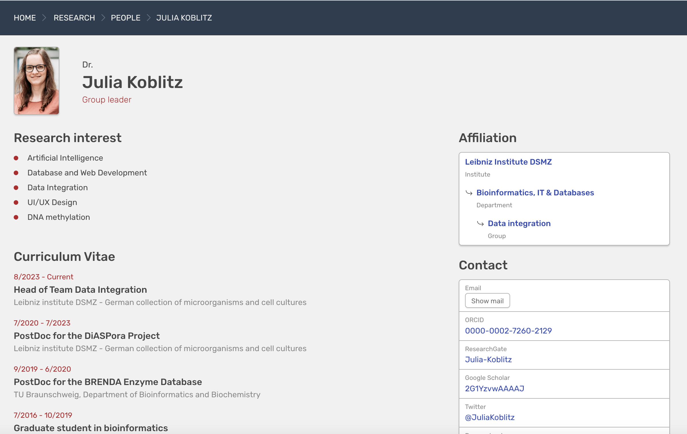

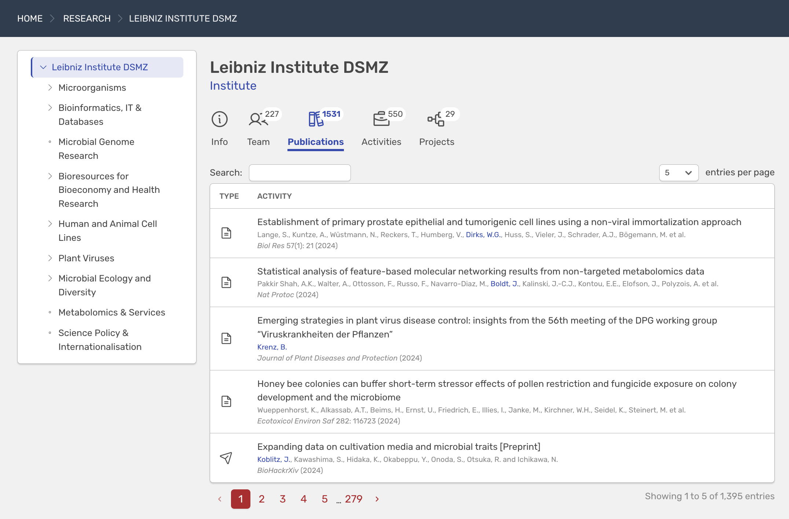
/// caption
Mit dem OSIRIS-Portfolio wird es möglich sein, fertige Widgets in eure Webseite zu integrieren oder gleich eine komplette Portfolio-Seite zu generieren. Was ihr hier seht ist nur der Prototyp.
///

---

## 🛡️ **Rollen- und Rechtemodell**

Wie detailliert ist das Rollen- und Rechtemodell? Wie viele Rollen gibt es (vielleicht mit Beispielen)? Auf welchen Ebenen können Berechtigungen festgelegt werden? Können Berechtigungen zwischen Nutzer*innen übertragen werden? Berücksichtigt das Rollen- und Rechtemodell auch Gruppen? Wie flexibel sind das Rollen- und Rechtemodell und die Möglichkeiten, Berechtigungen festzulegen?

Es gibt ein mittelkomplexes Rollen und Rechtemodell. Standardmäßig gibt es 5 Rollen: User (jeder ist ein User), Wissenschaftler:innen, Personalabteilung (PA), Editor (bei uns das Controlling), und Admin.

Zurzeit (Stand `v1.3.7`) gibt es 35 Rechte, die man beliebig auf die verschiedenen Rollen verteilen kann. Gibt man eine Rolle an “User”, so hat jeder Nutzende des Systems die Rechte. 

Einer Person können mehrere Rollen zugeteilt werden. Solange eine der Rollen das Recht hat, etwas zu tun, so hat der Nutzende das Recht.

### Übertragung der Profilpflege

Ein Nutzender kann die komplette Pflege seines Profils an eine andere Person übertragen. Diese Person könnte beispielsweise Assistent:in, Sekretär:in oder Projektmanager:in sein und hat danach vollen Zugriff auf das Profil.


/// caption
Das Rollen- und Rechtemanagement im Admin-Dashboard (neue Ansicht ab `v1.5.0`)
///

---

## 🖍️ **Qualitätssicherung**

Bietet das System Workflows zur Kontrolle bzw. Validierung und Bestätigung von Einträgen? Wie detailliert sind solche Workflows ausgearbeitet und für welche Daten sind sie verfügbar? Welche Kommentar- und Beanchrichtigungsfunktionen gibt es? Gibt es automatische Qualitätssicherungsprozesse wie z. B. kontrollierte Vokabulare beim Eintragen von Affiliationen (etwa mit einer ROR-Integration)?

**OSIRIS versucht Fehler schon beim Eintragen zu vermeiden und setzt auf das Mehraugenprinzip durch die Autor:innen, unterstützt aber noch keine umfangreichen Workflows.**

### Vermeidung von Fehlern durch das Interface

OSIRIS geht eher der Prämisse nach, **Fehler schon bei der Dateneingabe zu vermeiden**, als im Nachhinein Workflows über die Daten laufen zu lassen. Viele Textfelder schlagen beispielsweise mit Auto-Vervollständigung bereits eingetragene Werte vor, z.B. Konferenzen, Orte, und Autoren.  

Im Screenshot rechts sieht man zum Beispiel auch, wie **Journale standardisiert** hinzugefügt werden. Wenn man ein Journal einträgt, öffnet sich dieses Widget. Zuerst wird nur der obere Teil gezeigt, in dem alle bereits in OSIRIS vorhandenen Journale dargestellt werden. Falls das gesuchte Journal nicht dabei ist, kann man die Suche im Online-Katalog (OpenAlex) wiederholen und es werden mögliche Journale basierend auf der Suche vorgeschlagen. Beim Klick auf einen Haken wird nicht nur das Journal zu der Publikation hinzugefügt, sondern auch alle weiteren Informationen zu dem Journal gespeichert. Da es keinen Freitext an dieser Stelle gibt, können Journale gar nicht falsch eingetragen werden. Genauso ist es mit Lehrveranstaltungen, die ebenfalls zentral verwaltet und dann mit Aktivitäten assoziiert werden können.

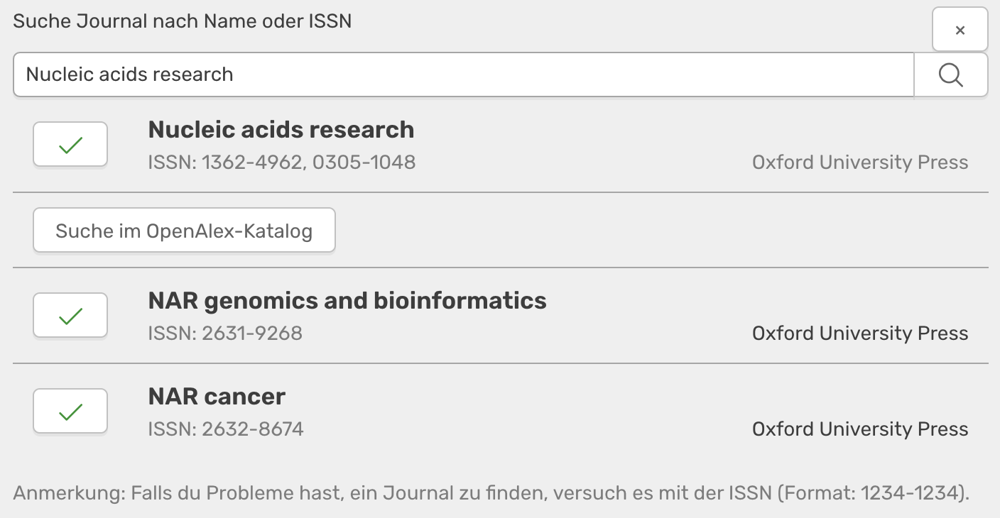
/// caption
Widget, das sich beim Klick auf oben gezeigtes Datenfeld öffnet. Hier kann in OSIRIS und im Online-Katalog nach vorhanden Journalen gesucht werden. Dadurch werden Fehler vermieden.
///

Außerdem gibt es noch **weitere Abfrage-Mechanismen**: man kann als Jahreszahl nicht 10 Jahre in die Zukunft oder vor 1900 gehen. Man kann Pflichtfelder nicht leer lassen. Man wird gewarnt, wenn man einen Datensatz hinzufügen will, ohne dass mit dem Institut affiliierte Personen in der Autorenliste sind (man kann es dennoch tun, um beispielsweise sein persönliches Profil zu pflegen, solche Aktivitäten werden aber z.B. fürs Reporting rausgefiltert).

### Kommentar- und Benachrichtigungsfunktionen

Es gibt zwei wesentlich Kommentarfunktionen: die Notiz und den Editor-Kommentar.

Die **Notiz** ist für jede Aktivität verfügbar. Sie versteckt sich hinter einer aufklappbaren Box (siehe Screenshot oben), am Ende des Formularfelds zum Hinzufügen und Bearbeiten einer Aktivität. Hier können Autor:innen Notizen für sich selbst oder Mitteilungen an Editoren hineinschreiben, die dann auf der Übersichtsseite einer Aktivität für diesen Personenkreis sichtbar ist. Wer genau diese Nachrichten außer den Autor:innen sehen kann, wird über die Rollen definiert.

Der **Editor-Kommentar** ist nur sichtbar, wenn man eine Aktivität bearbeitet, an der noch andere Autor:innen beteiligt sind. Hier kann man diesen anderen Personen einen Kommentar hinterlassen, der erklärt, was man genau geändert hat. 

Denn es gibt eine ganze Reihe von **Benachrichtigungen** in OSIRIS. Nutzende werden benachrichtigt, wenn:

- … es Handlungsbedarf oder Kenntnisnahme in Bezug auf Aktivitäten gibt. Darunter fällt zurzeit folgendes:
    - Eine neue Aktivität wurde für dich hinzugefügt
    - Eine deiner Aktivitäten wurde bearbeitet (dort bekommen Koautor:innen euren Editor-Kommentar zu sehen, siehe letzter Screenshot)
    - Eine Aktivität ist als “Online ahead of print” eingetragen und du wirst erinnert, diesen Status zu überprüfen
    - Eine Abschlussarbeit, die du betreust, ist abgelaufen, steht aber noch immer auf “in progress”
    - Du hast open-end Verlaufsdaten (z.B. Gremien- oder Editormitgliedschaften) und wirst gefragt, ob die noch aktuell sind.
    - Projekte von dir sind abgelaufen, aber noch nicht als “abgeschlossen” markiert.
    
    Ungelöste Warnungen zu Aktivitäten verhindern, dass das Quartal freigegeben werden kann.
    
- … es ein neues Update gibt, um sie zu informieren, was sich geändert hat.
- … ein Quartal vergangen ist und die Aktivitäten nun überprüft und bestätigt werden können.

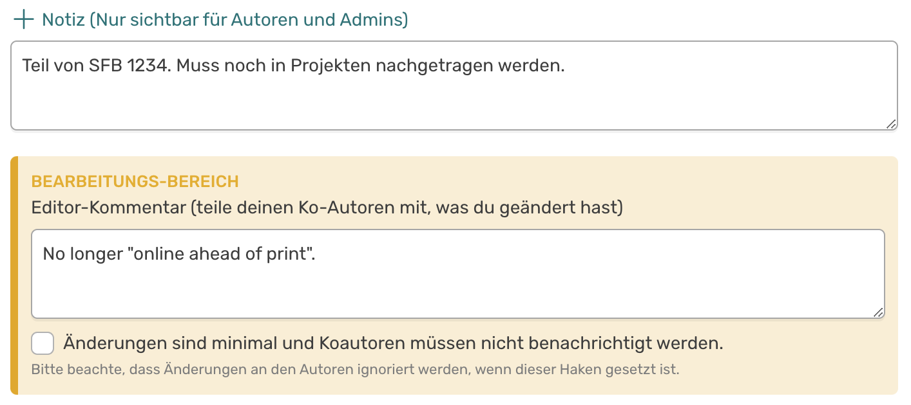

Kommentarfunktionen im Formular zur Bearbeitung einer Aktivität.

---

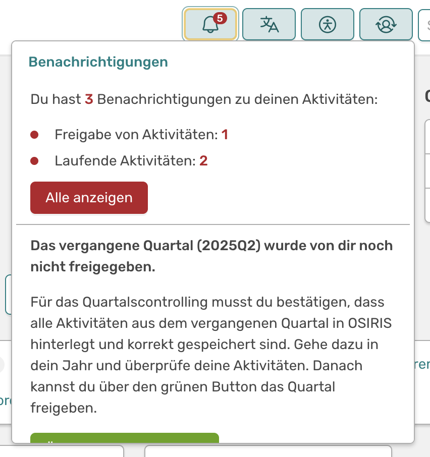{width=300}

Hinweise in der Persönlichen Profilseite auf neue Benachrichtigungen.

---

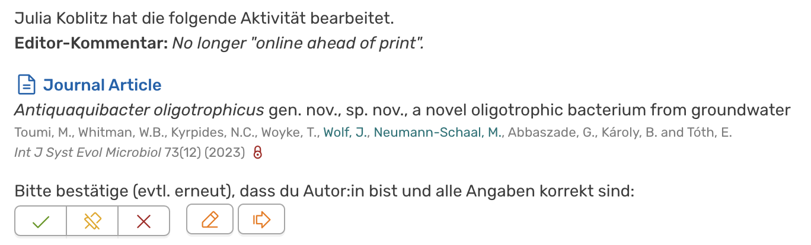

Benachrichtigung eines Nutzenden über eine Bearbeitung.

### Workflows?

Als “Workflow” kann man also in OSIRIS nur so etwas wie die **Queue** bezeichnen: hier wird regelmäßig aus Online-Quellen abgegriffen, ob es neue Publikationen für Eure Forschenden geben könnte. Doch auch das wird nicht einfach in die Datenbank eingepflegt, sondern den Forschenden zur Überprüfung zugespielt. 

⚠️ Wir haben Workflows auf dem Schirm und planen, sie in einem kommenden Release hinzuzufügen. Zurzeit unterstützt OSIRIS aber keine mehrstufigen Workflows, wie ihr sie zum Beispiel in GRIS findet.

---

## ↔️ **Schnittstellen**

**OSIRIS bietet eine Vielzahl von Schnittstellen zu internen und externen Systemen.**

- **Interne Systeme**
    - Die Nutzerverwaltung kann über LDAP erfolgen. Es werden Nutzende mit dem Active Directory synchronisiert, die Authentifizierung funktioniert ebenfalls darüber.
- **Quellen für Datenimport**
    - Schnittstelle zu CrossRef, DataCite und OpenAlex, um DOI-basierte Importe von Aktivitäten zu ermöglichen. Da nicht alle dieser Quellen alle Daten haben, wurden sie alle hinzugefügt und werden nacheinander abgegrast, sobald eine Nutzende Person eine DOI eingibt.
        - Über die Schnittstellen werden sehr viele Daten abgegriffen und es können anhand von Förderkennziffern sogar Projekte und Publikationen automatisch verknüpft werden. Es wird also empfohlen, Literatur nicht manuell einzupflegen, sondern stets über die DOI)
    - Schnittstelle zu Pubmed, um Literatur der biomedizinischen Forschung mittels PubMed-ID zu importieren.
    - Schnittstelle zu OpenAlex, um automatisierten Import in eine “Queue” zu ermöglichen.
    - Schnittstelle zu OpenAlex und DOAJ, um standardisiert Journale zu erfassen.
    - Schnittstelle zu ROR, um Institute für die Projektkooperationen hinzuzufügen.
- **Exportschnittstellen**
    - Es gibt eine Schnittstelle zur IDA-Paktabfrage (siehe oben im Abschnitt Reporting)
    - Es gibt eine API, um Daten entweder standardisiert oder fertig formatiert auf die Webseite zu Exportieren
        `v1.3.2`: Eine API-Dokumentation wurde hinzugefügt, genau wie API-Keys und mehr Filtermechanismen. Push-Möglichkeiten fehlen noch.
        
    - Mit OSIRIS Portfolio gibt es außerdem eine Möglichkeit, eine komplette Forschungswebseite aus OSIRIS zu generieren. Sprecht uns gern an, um mehr darüber zu erfahren oder schaut hier: https://osiris-app.de/portfolio
    - Es gibt jede Menge verschiedene Download-Formate (siehe oben im Abschnitt Reporting)
    

---

## 🧾 Unterstützung persistenter Identifikatoren (PIDs)

**OSIRIS nutzt wo möglich und sinnvoll PIDs um Aktivitäten, Personen und Institute genau zu identifizieren.**

- **PIDs bei Aktivitäten**
    
    Wie bereits im Abschnitt Schnittstellen erörtert nutzt OSIRIS DOIs und Pubmed-IDs für Aktivitäten (müssen nicht unbedingt Publikationen sein, bei Zenodo z.B. bekommt man auch DOIs für Poster, Präsentation, Code, usw.). 
    
- **PIDs bei Personen**
    
    Personen können ihre Google-Scholar-ID angeben, um einen (dank furchtbarer Standardisierung seitens Google eher schlechten) Import ihrer Publikationen zu machen. 
    
    ⚠️ OSIRIS unterstützt ORCID bislang nur zur Nutzersuche.
    
- **PIDs bei Institutionen**
    
    OSIRIS unterstützt die OpenAlex-ID für Institutionen, um Altdaten zu exportieren und die Queue zu füttern.
    
    OSIRIS unterstützt die ROR-ID und fragt darüber Details über Kooperationspartner in Projekten ab.
    

---

## 🔍 **Suchfunktion**

Welche Möglichkeiten der Suche gibt es? Wird zwischen einfacher und erweiterter Suche unterschieden? Wie stark kann in der erweiterten Suche differenziert werden? Kann mit Operatoren (UND, ODER, NICHT) gesucht werden? Gibt es auch eine Volltextsuche (wenn auch Volltexte in das System aufgenommen werden)? Können Suchanfragen gespeichert werden?

**OSIRIS bietet eine einfache und schnelle Suche und eine sehr ausgefeilte Experten-Suche.**

### Die einfache Suche in Alle Aktivitäten

Es gibt in OSIRIS mehrere Suchfunktionen. Die vermutlich am häufigsten genutzte ist die in der Seite “Alle Aktivitäten”. Diese Tabelle unterstützt auf einer Seite eine Volltextsuche über einen einzigen Suchschlitz und auf der anderen Seite bietet sie folgende vorgefertigte Filtermöglichkeiten:

- Nach Typ der Aktivität
- Nach Organisationseinheit
- Nach Zeitraum
- Weiteres (Online ahead of print)

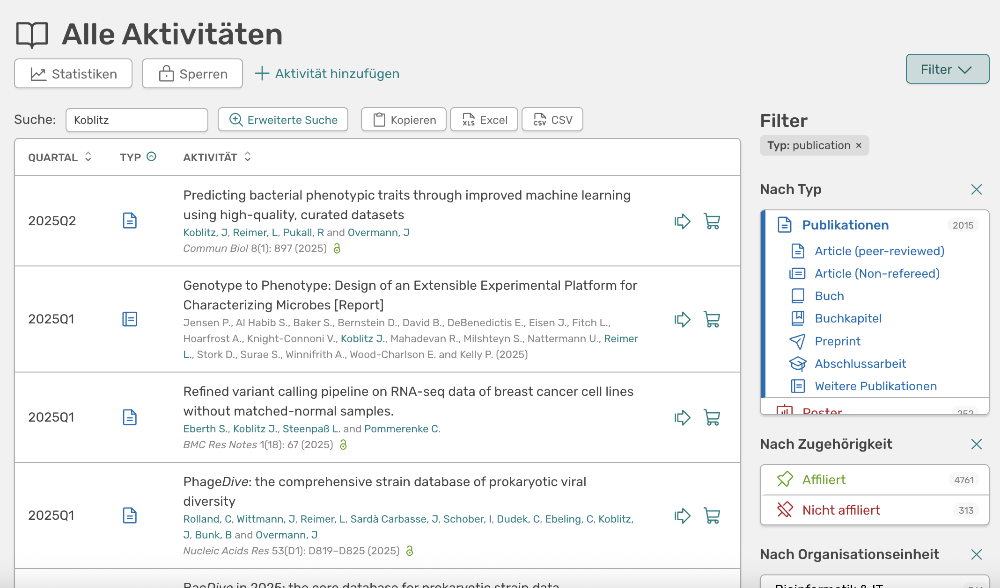

### Die Erweiterte Suche

Für diejenigen, denen die einfachen Suchmöglichkeiten nicht ausreichen, gibt es die erweiterte Suche. Hier können komplexe Abfragen gebaut werden, die auch mit UND/ODER verschachtelt und gruppiert werden kann. Jedes Feld unterstützt entsprechende Operationen (gleich, enthält, beginnt mit, endet mit, größer als, usw.)

Außerdem kann man sich den Filterstring speichern und die Abfrage erzeugt einen eindeutigen Link, den man sich abspeichern oder mit Kolleg:innen teilen kann. 

`Update v1.3.4`: Viele Verbesserungen an der Suche wurden hinzugefügt, wie zum Beispiel Aggregationen, ein Expertenmodus, indem ihr eure eigenen MongoDB-Abfragen schreiben könnt und das Speichern von häufig verwendeten Suchen. 

`Update v1.4.0`: In der erweiterten Suche lassen sich nun alle **Spalten auswählen**, die im Hintergrund gespeichert sind. Diese werden dann im Interface angezeigt und können als Excel exportiert werden.

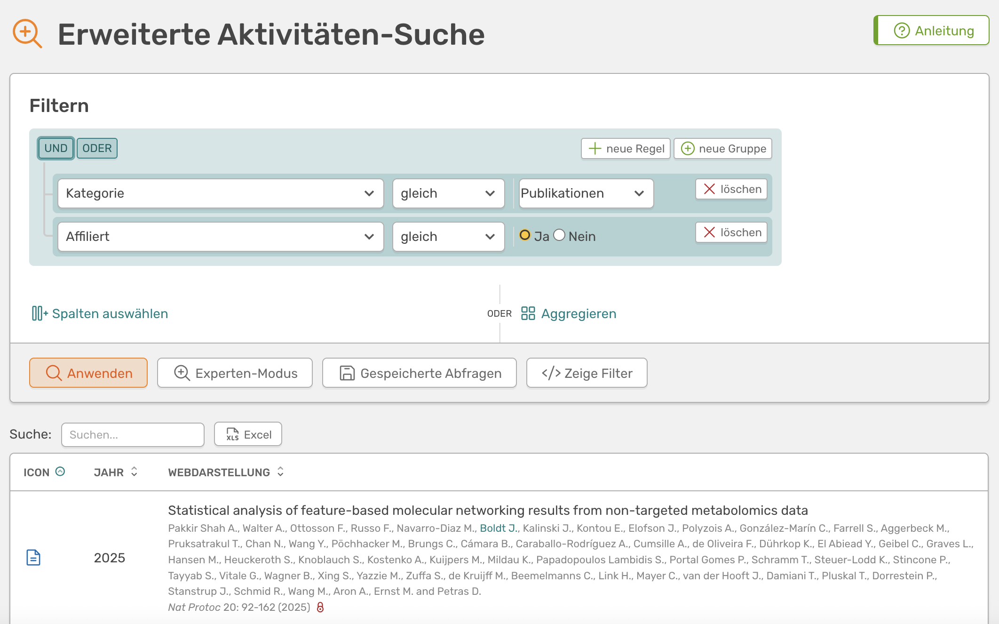

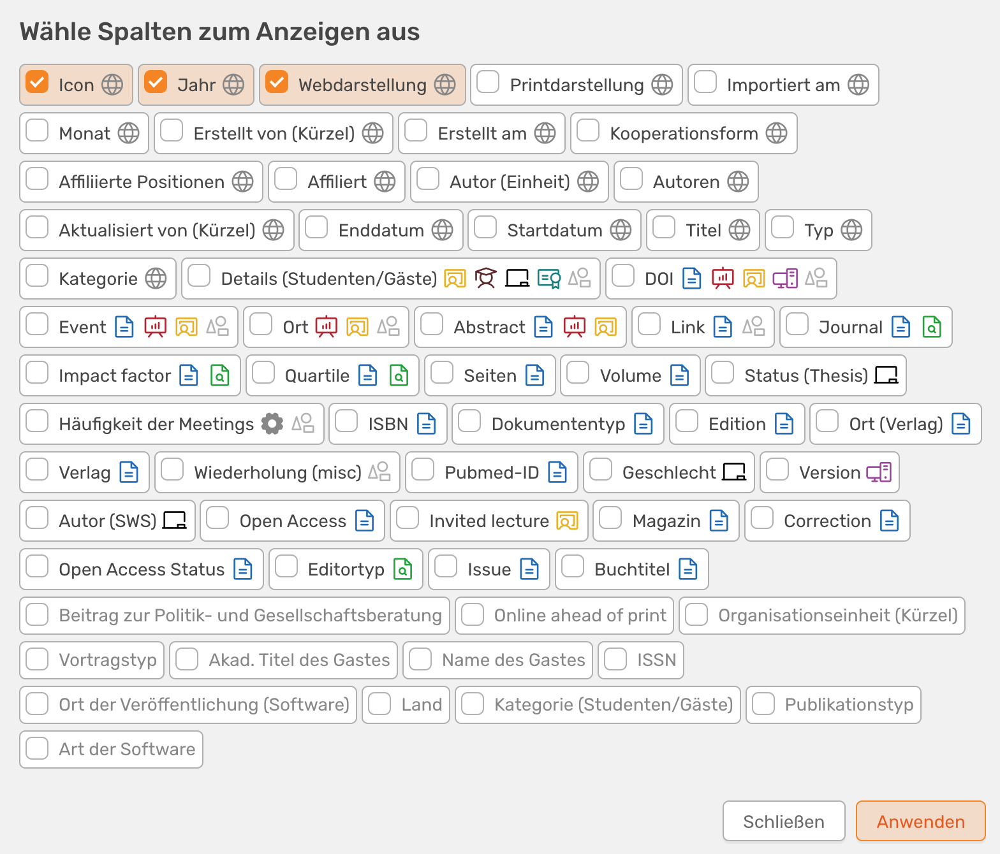

Ab v1.4.0 können Spalten zur Anzeige in der Suche ausgewählt werden. Das Interface unterstützt euch dabei und zeigt, welche Spalten ihr bei welchen Aktivitätstypen verwendet und welche gar nicht befüllt sind (ausgegraut).

---

## 🪄 **Anpassbarkeit / Customization**

Welche Möglichkeiten gibt es für das Institut, Anpassungen an den Datentypen, Formularen und Strukturen vorzunehmen? Können neue Datentypen angelegt und bestehende geändert werden? Lassen sich Pflichtfelder definieren? Können Workflows erstellt und angepasst werden? Lässt sich das Reporting anpassen bzw. konfigurieren? Welche Anpassungsmöglichkeiten am Design gibt es?

**OSIRIS bietet viele Konfigurationsmöglichkeiten, von denen sich so gut wie alle direkt über das Nutzerinterface und ohne Programmierkenntnisse durchführen lassen.**

Jede Konfiguration der Inhalte (wir sprechen hier nicht von Server-Konfiguration) lässt sich über das Admin-Panel vornehmen. Dort hat per Default nur der bei der Installation festgelegte Admin Zugang, dieser kann aber anderen ebenfalls Zugriff gewähren.

### Grundlegende Einstellungen

Neben dem Startjahr von OSIRIS kann natürlich auch das Institut angepasst werden. Dazu können einige Infos, wie zum Beispiel das Kürzel, Name, Ort und ROR-ID angegeben werden. Außerdem kann man natürlich auch ein Logo hochladen, dass dann oben rechts erscheint.

### Organisationseinheiten

Mit `v1.3.0` wurden Organisationseinheiten (OE) komplett umstrukturiert. Vorher gab es nur “Abteilungen”, jetzt kann man theoretisch das gesamte Organigramm abbilden (siehe Screenshot). Dabei kann eine Person Mitglied von mehreren OEs sein und eine OE von mehreren Personen geleitet werden. Es gibt dadurch viele Möglichkeiten, Daten zu aggregieren und zu visualisieren. Falls ihr das alles nicht braucht, reicht es alle Mitarbeitenden nur zum Institut hinzuzufügen.

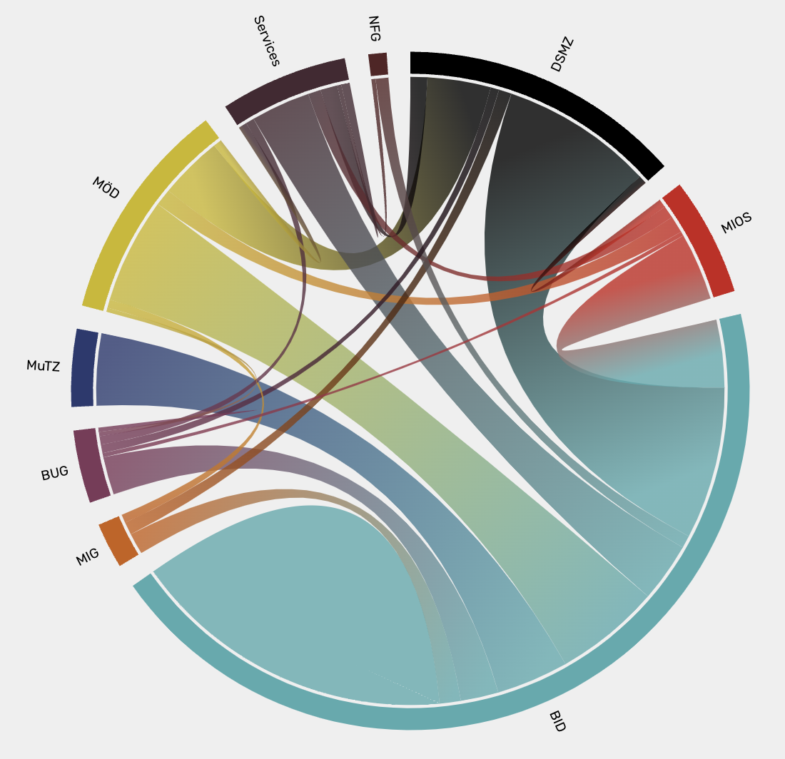

Ein Chord-Diagramm zeigt die Zusammenarbeit einer Abteilung (in diesem Fall BID) mit den anderen Abteilungen. Dabei werden Publikationen aus 5 Jahren berücksichtigt.

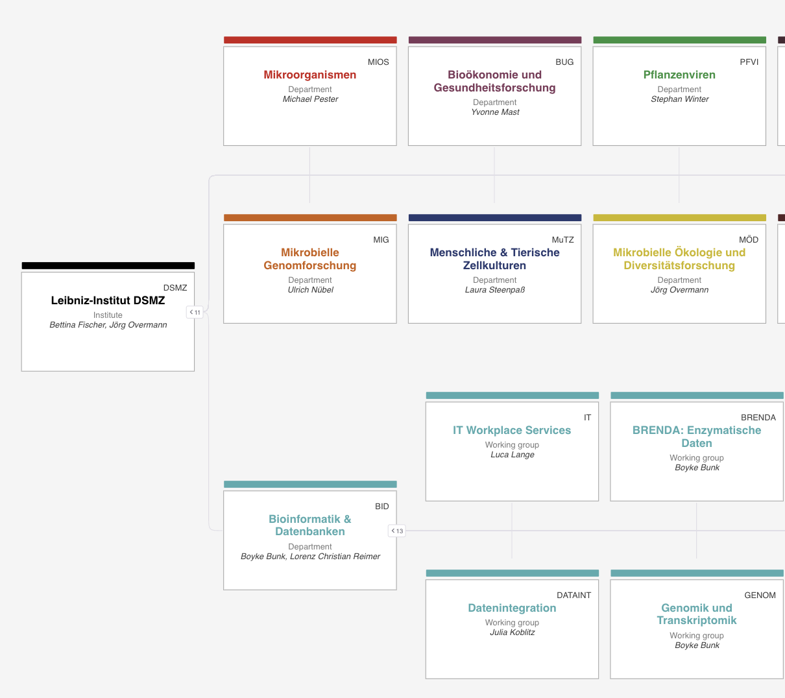

Ein Ausschnitt der Organigramm-Ansicht von OSIRIS. Arbeitsgruppen lassen sich bei Bedarf auf- und zuklappen.

### Aktivitäten-Typen konfigurieren

Aktivitäten werden in OSIRIS zweistufig eingeordnet: es gibt Kategorien und Typen. Um es kurz zu sagen, Kategorien gruppieren Aktivitätstypen. Aktivitäten werden zu Typen zugeordnet. Also so ungefähr:

> Kategorien > Typen > Aktivitäten

OSIRIS kommt mit einigen Standard-Aktivitäten (s.o.). Diese könnt ihr aber komplett verändern. Ihr produziert keine Software? Löscht die Kategorie. Ihr braucht weitere Typen bei Vorträgen? Workshops? Podiumsdiskussionen? Round Tables? Fügt sie hinzu.

In dem Screenshot rechts kann man sehen, welche Einstellungsmöglichkeiten es zu einem Aktivitätstyp gibt. Man kann definieren, welches die überordnete Kategorie ist, was bedeutet, dass Typen auch in andere Kategorien verschoben werden können. 

Dann kann man **grundlegende Einstellungen** treffen. Die ID ist notwendig und muss einzigartig sein. Das Icon kann aus einer (Open Source) Bibliothek mit mehr als 7000 Icons ausgewählt werden. Name und Beschreibung kann sowohl auf deutsch als auch auf englisch definiert werden. Die Beschreibung ist für eure Nutzer:innen sichtbar, sobald sie einen Aktivitätstyp auswählen. Hier könnt ihr also detailliert definieren, was dort alles reingehört. 

Als nächstes kommt ein Kernfeature von OSIRIS: die **Module**. Zurzeit gibt es in OSIRIS 54 Module, d.h. 54 verschiedene Formularfelder, aus denen ihr eurer Formular für die Aktivitäten zusammenbauen könnt. Mit Drag & Drop könnt ihr die Reihenfolge der Felder anpassen und mit Doppelklick könnt ihr bestimmen, ob ein Feld zum Pflichtfeld machen. Mehr dazu (inklusive eine Liste aller Module mit Beispielen) findet ihr [hier](https://osiris-app.de/customize#module-list). 

Mit den **Templates** wird festgelegt, wie die Aktivitäten dargestellt werden. Dabei wird zwischen Print (z.B. für Word-Export) und der Webansicht unterschieden. In der Webansicht gibt es jeweils einen Titel und einen Untertitel. Die Templates unterstützen HTML, verschiedene Bausteine und sogar Default-Werte. Mehr dazu findet ihr in der [Dokumentation](https://osiris-app.de/customize#templates).

Mit den **Coins** könnt ihr definieren, wie viele Coins eure Nutzenden für die Aktivität bekommen. Das ergibt natprlich nur Sinn, wenn ihr die Coins aktiviert habt. Dabei könnt ihr auch wieder Bausteine verwenden, genauer gesagt `{if}`, um mit Impact Faktoren zu rechnen und `{sws}`, um mit Semesterwochenstunden zu rechnen.

Zuletzt könnt ihr einen Typ **deaktivieren**. Natürlich lassen sich Typen auch löschen, aber nur, wenn keine Aktivitäten damit verknüpft sind. Wenn man aber eine in der Vergangenheit genutzte Aktivität in Zukunft nicht mehr aufnehmen will, ohne vorhandene Datensätze zu löschen, kann man den Typ hier deaktivieren. Es ist dann nicht mehr möglich, neue Aktivitäten mit diesem Typ anzulegen.

`Update v1.3.1`: Ihr könnt im Admin-Bereich nun komplett eigene Felder konfigurieren. Es ist auch möglich eigene Listen anzulegen, die dann zur Auswahl stehen, und Default-Werte anzugeben.

`Update v1.5.0`: Ihr könnt jetzt auch bereits existierende Vokabulare anpassen, wie zum Beispiel die Zugangstypen von Infrastrukturen, die Liste möglicher Förderer von Projekten oder den Eventtyp. Diese Einstellung findet ihr im Admin-Bereich unter Inhalte > Vokabular.

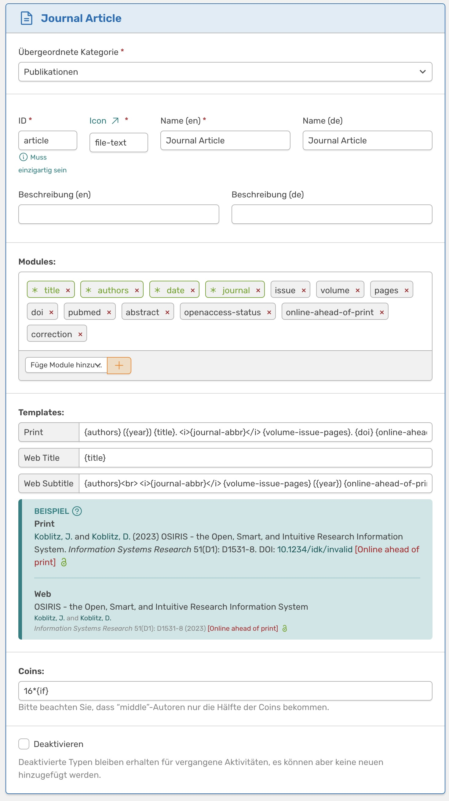

### Projekte

Ab `v1.5.0` lassen sich Projekte und Projektanträge vollständig konfigurieren. Es ist möglich, eigene Projekttypen anzulegen und festzulegen, ob für einen Projekttyp vorher ein Antrag angelegt werden muss oder ob der Projekttyp direkt angelegt werden kann. Für jede Antragsphase und für die Projekte können dabei jeweils unterschiedliche Formularfelder verwendet werden, inkl. Custom Fields.

### Personen

Ab `v1.5.0` lassen sich Personendaten ebenfalls konfigurieren. Bei der Verwendung von LDAP können einzelne Felder auch direkt mit diesem synchronisiert werden und können dann in OSIRIS selbst nicht mehr bearbeitet werden. Es ist auch möglich, eine Liste von möglichen Positionen zu setzen und Schlagwörter zu definieren.

### Infrastrukturen

Ab `v1.5.0` lassen sich Infrastrukturen ebenfalls konfigurieren. Die einzelnen Datenfelder lassen sich ein oder ausschalten, benutzerdefinierte Felder (Custom Fields) werden unterstützt und es ist möglich, Vokabulare wie die Kategorie und den Art des Zugangs anzupassen.

### Rollen und Rechte

Rollen und Rechte lassen sich ebenfalls konfigurieren, siehe Abschnitt “Rollen und Rechtemodell”.

### Funktionen

Da jedes Institut andere Bedürfnisse und Use Cases hat, können auch einzelne Features von OSIRIS ein- bzw. ausgeschaltet werden. Die Coins und Errungenschaften können beispielsweise global ausgeschaltet werden (Nutzende können sie auch immer einzeln für sich ausschalten). Addons für Gastanmeldung und Berichterstattung, Projekte, Konzepte, all dies lässt sich ggf. deaktivieren. 

Außerdem ist geplant, dass kommende Features standardmäßig ausgeschaltet sind, sodass sie bei einem Update nicht unerwünschte Funktionen ins System bringen. Sie müssen dann aktiv eingeschaltet werden.

Ein Ausschnitt auf den Funktionen, die innerhalb von OSIRIS ein- und ausgeschaltet werden können.

### Impressum, Datenschutz und Links im Footer

Ab `v1.5.0` lassen sich der Text von Impressum und Datenschutzerklärung, die im Footer zu finden sind, komplett selbst definieren. Außerdem ist es möglich, dem Footer weitere Links zum Beispiel zu Betriebsvereinbarungen hinzuzufügen.

---

## 🧱 **Erweiterbarkeit**

**OSIRIS ist nach Open Source-Prinzipien erweiterbar.**

Da OSIRIS komplett quell-offen ist, kann es problemlos erweitert werden. Idealerweise wird dabei nach Open Source-Prinzipien gearbeitet und der neue Code wird dem Hauptzweig und damit der Öffentlichkeit zur Verfügung gestellt.

Es gibt folgende optionale Zusatzmodule (ebenfalls Open Source):

- `in Entwicklung` Das **Gästeformular**, ein extra Web-Tool, über das man Gäste am Institut anmelden kann. Es kann auch auf einem anderen Server laufen, falls euer OSIRIS von außen nicht erreichbar ist.
- Das **OSIRIS-Portfolio**, über das eine repräsentative externe Webseite aus den in OSIRIS gepflegten Daten generiert wird (siehe Abschnitt Use Cases)

---

## 📡 **Updatezyklen**

Wie häufig und in welchem Umfang gibt es Systemupdates? Müssen die Updates übernommen werden, oder ist das (teilweise) optional? Wie laufen die Updateprozesse ab? Welchen Einfluss haben Nutzer*innen auf die allgemeine Weiterentwicklung des Systems?

**OSIRIS wird regelmäßig mit größeren und kleineren Updates bespielt.**

Bugfixes werden immer schnellstmöglich eingespielt. Wenn ihr OSIRIS selbst hostet und allein wartet, könnt ihr die Updates natürlich auch nach eurem Belieben einspielen. Falls ihr Services von OSIRIS Solutions in Anspruch nehmt, werden Updates ebenfalls mit euch abgestimmt. 

Wie man OSIRIS aktualisiert erfahrt ihr [im OSIRIS-Wiki](https://wiki.osiris-app.de/technical/update/).

---

## 🔧 Wartung und Support


**OSIRIS setzt auf eine Open Source Community, es gibt aber auch eine kommerzielle Lösung für Support.**

OSIRIS verfügt über mehrere Supportstufen. Das Programm selbst ist Open Source und kostenlos (siehe Abschnitt Kosten und Lizenzmodell). Wenn ihr es selbst bei euch installiert, wartet und hostet habt ihr trotzdem die Möglichkeit, **Community-Support** in Anspruch zu nehmen. Dazu erstellt man ein Ticket auf [GitHub](https://github.com/OSIRIS-Solutions/osiris) und in der Regel wird relativ schnell (innerhalb weniger Tage) darauf reagiert. Ob und wann ein größeres Ticket bearbeitet wird, hängt natürlich von Entwickler-Kapazitäten und Entwicklungszeit ab, das kann man also pauschal nicht sagen. Ich kann aber versichern, dass gemeldete Bugs (vor allem systemkritische) sehr schnell bearbeitet werden.

Außerdem gibt es für OSIRIS weiteren kostenpflichtigen Support durch die Firma `OSIRIS Solutions GmbH`. Zurzeit wird u.a. Unterstützung zu folgenden Themen angeboten:

- Hosting
- Ersteinrichtung
- Schulungen
- Altdatenimport
- Weiterentwicklung

Mehr Informationen findet ihr hier: [**https://osiris-solutions.de/**](https://osiris-solutions.de/).

---

## ⚙️ Technische Anforderungen

Wie und wo wird das System gehostet? Gibt es hier unterschiedliche Modelle, aus denen gewählt werden kann? Wenn das Institut das System hostet (oder hosten kann), welche technischen Anforderungen muss der Server erfüllen? Welche weitere technische Infrastruktur ist erforderlich?

OSIRIS benötigt eine Virtuelle Maschine mit einem Webserver, z.B. Apache2 oder nginx, auf dem ihr MongoDB installieren müsst. Es lässt sich sogar unter Windows und mit Docker installieren. Für genaue Details und umfangreiche Installationsanleitungen, schaut bitte in die [Installationsanweisungen](https://osiris-app.de/install).

OSIRIS Solutions kann auch das Hosting für euch übernehmen. Für mehr Informationen, sprecht uns bitte direkt an.

---

## 💶 Kosten und Lizenzmodell

### Die Lizenz

OSIRIS ist Open Source Software und kostenlos. Es wird in Zukunft zahlungspflichtige Services zu der Software geben, aber die Software selbst wird **niemals** Lizenzkosten haben.

- Falls es euch interessiert, ist hier die gesamte Lizenz zu finden.
    
    ```markdown
    **Copyright (c) 2022 Julia Koblitz**
    
    Permission is hereby granted, free of charge, to any person obtaining a copy
    of this software and associated documentation files (the "Software"), to deal
    in the Software without restriction, including without limitation the rights
    to use, copy, modify, merge, publish, distribute, sublicense, and/or sell
    copies of the Software, and to permit persons to whom the Software is
    furnished to do so, subject to the following conditions:
    
    The above copyright notice and this permission notice shall be included in all
    copies or substantial portions of the Software.
    
    THE SOFTWARE IS PROVIDED "AS IS", WITHOUT WARRANTY OF ANY KIND, EXPRESS OR
    IMPLIED, INCLUDING BUT NOT LIMITED TO THE WARRANTIES OF MERCHANTABILITY,
    FITNESS FOR A PARTICULAR PURPOSE AND NONINFRINGEMENT. IN NO EVENT SHALL THE
    AUTHORS OR COPYRIGHT HOLDERS BE LIABLE FOR ANY CLAIM, DAMAGES OR OTHER
    LIABILITY, WHETHER IN AN ACTION OF CONTRACT, TORT OR OTHERWISE, ARISING FROM,
    OUT OF OR IN CONNECTION WITH THE SOFTWARE OR THE USE OR OTHER DEALINGS IN THE
    SOFTWARE.
    ```
    

### Kosten und Personal

Auch Open Source Software kostet natürlich was. Keine Lizenzen, aber Server müssen bereitgestellt und Personal bezahlt werden. Die Wartung und Betreuung macht sich schließlich nicht allein.

Erfahrungswerte: an der DSMZ gibt es 2 Personen, die sich mit OSIRIS beschäftigen: Dominic (Controller), der als Editor mit den Daten arbeitet, quartalsweise Abfragen macht und neue Mitarbeitende schult. Julia (Wissenschaftlerin i. d. Bioinformatik), die OSIRIS neben ihrer eigentlichen Arbeit als AG-Leiterin wartet und weiterentwickelt. Nach meiner Schätzung sind das weniger als 0.5 VZÄ. 

### Zusätzlicher Service

Falls euch das trotzdem zu viel ist oder ihr nicht sicher seid, wie ihr das am besten angehen sollt, kann die Firma [OSIRIS Solutions](https://osiris-solutions.de/) euch dabei unterstützen. Wir haben mittlerweile einige Institute bei ihrem Einführungsprozess begleitet. 

---

## 👥 **User-Community**

Es gibt eine deutschsprachige OSIRIS Community, die sich alle zwei Monate trifft. Außerdem gibt es regelmäßig Newsletter zu neuen Inhalten und Updates. Falls ihr gern mehr erfahren wollt oder mal bei uns reinschnuppern wollt, könnt ihr euch hier im OSIRIS-Wiki weiter informieren: https://wiki.osiris-app.de/topics/community/

---

## ⚠️ Nachteile und Verbesserungsbedarf

Ich habe alle (mir bekannten!) Lücken und Nachteile schon in den vorherigen Abschnitten abgedeckt und sie immer mit dem Ausrufezeichen markiert: ⚠️ 

