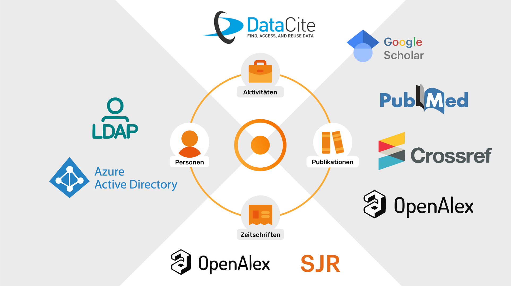
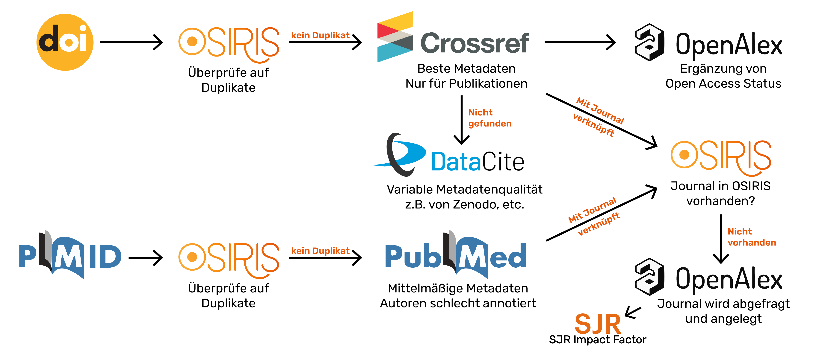

---
tags:
  - Schnittstellen
  - Aktivitäten
  - Import
---

# Schnittstellen in OSIRIS

In OSIRIS gibt es verschiedene Schnittstellen, die es ermöglichen, Daten zu importieren und zu exportieren. Diese Schnittstellen sind wichtig, um Daten aus anderen Systemen zu integrieren oder um Daten für externe Anwendungen bereitzustellen. Hier sind die wichtigsten Standard-Schnittstellen im Überblick:

## Eine Aktivität mittels PID importieren

Es werden zurzeit zwei PIDs (Persistent Identifier) unterstützt: DOI (Digital Object Identifier) und Pubmed ID. Diese PIDs können verwendet werden, um Publikationen und andere Forschungsaktivitäten in OSIRIS zu importieren. Der Import erfolgt auf der Seite "Aktivität hinzufügen", indem man in die Suchleiste die PID eingibt. OSIRIS sucht dann nach der entsprechenden Aktivität und importiert die Daten automatisch. Dabei passiert im Hintergrund folgendes:

### Import via DOI

1. In OSIRIS wird die DOI auf mögliche Duplikate geprüft.
2. Falls kein Duplikat gefunden wird, wird die DOI aufgelöst und die Daten der Publikation werden aus dem DOI-Resolver abgerufen. Dabei wird CrossRef als erstes abgefragt. Falls CrossRef keine Daten liefert, wird die DOI bei DataCite abgefragt.
3. Falls es sich um einen Beitrag in einem Journal handelt, werden zusätzlich die folgenden Schritte durchgeführt:
   - Die Publikation wird anhand der DOI bei OpenAlex abgerufen, um den OpenAccess-Status zu ermitteln.
   - Es wird geprüft, ob das Journal bereits in OSIRIS vorhanden ist. Dazu wird die ISSN verwendet.
   - Falls das Journal nicht vorhanden ist, wird es aus OpenAlex importiert. Der Nutzende bekommt eine Vorschlagliste mit den Journalen, die in OpenAlex gefunden wurden, und kann das passende Journal auswählen, das dann automatisch angelegt wird.
   - Ggf. wird das Journal auch über die OSIRIS-API mit dem [Impact Faktor](impact.md) ergänzt, sofern dieser verfügbar ist.
4. Die Daten werden in das Formular eingetragen und der Nutzer kann die Daten noch anpassen, bevor die Aktivität gespeichert wird.

## Präsentation über Schnittstellen

Am 11. Juni 2025 hat Julia eine Präsentation über die Schnittstellen und Standards in OSIRIS gehalten. Diese Präsentation gibt einen Überblick über die verschiedenen Schnittstellen und deren Funktionsweise und zeigt auch zu diesem Zeitpunkt verfügbare Standards auf, wie beispielsweise dem (KDSF 2.0)[kdsf.md].

[Hier geht's zur Präsentation!](../assets/documents/OSIRIS Schnittstellen.pdf){.md-button}