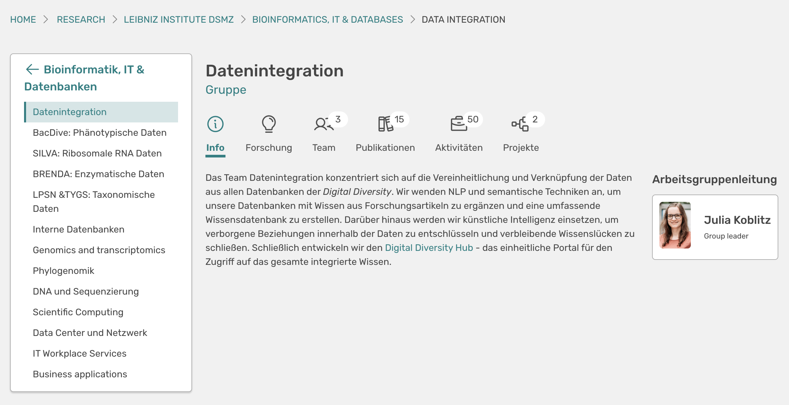
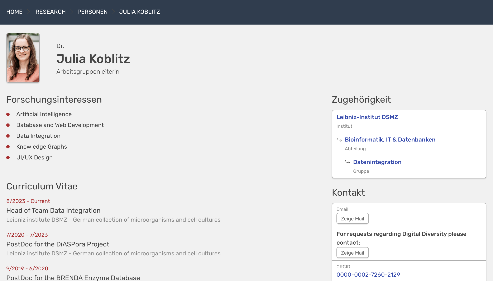

# Portfolio

!!! warning "Seite im Aufbau"
    Diese Seite befindet sich noch im Aufbau. Wir bitten um Geduld.

## Was ist OSIRIS Portfolio?

OSIRIS Portfolio ist eine Erweiterung, mit der ihr eure Forschung nach außen darstellen könnt. Portfolio bietet eigene Seiten für jede eurer Organisationseinheiten, vom Institut über die Abteilungen und Gruppen bis hin zu einzelnen Personen, die mit Portfolio eine wunderschöne Profilseite bekommen. Präsentiert werden dabei all eure Errungenschaften, von Publikationen über Drittmittelprojekte bis hin zu Forschungsaktivitäten.

## Wie Portfolio aufgebaut ist

Im Hintergrund greift Portfolio auf eure OSIRIS-Instanz zu, d.h. ihr stellt die Informationen dar, die ihr in OSIRIS verwaltet. Aus Sicherheitsgründen liefert OSIRIS dabei nur das aus, was nach außen sichtbar sein soll. In OSIRIS könnt ihr direkt einstellen, was ihr sehen wollt und was nicht. Portfolio zeigt dann nur das, was ihr freigegeben habt.

Im Zentrum von OSIRIS stehen die **Organisationseinheiten** eurer Einrichtung. Diese werden ebenfalls in OSIRIS abgebildet und gepflegt. Auf der Startseite zeigt Portfolio das gesamte Institut mit allen Organisationseinheiten. Nutzende Personen können sich dabei durch eure Organisationsstruktur klicken. Portfolio zeigt die zugehörigen Personen, Projekte, Publikationen und Forschungsaktivitäten, aber auch Forschungsinteressen können direkt in OSIRIS gepflegt werden. Hier seht ihr einen Screenshot von OSIRIS Portfolio:

///caption
Übersicht über das Kernelement von OSIRIS Portfolio: gezeigt ist die Startseite der Arbeitsgruppe Datenintegration
///

## Was Portfolio für euch leistet

**:material-atom: Präsentation eurer Forschung**

Portfolio bietet euch die Möglichkeit, eure Forschung nach außen zu tragen. Zeigt eure Publikationen, Projekte und Forschungsaktivitäten.

**:material-school: Professionelle Profile**

Jede Organisationseinheit, jede Person und jedes Projekt bekommt eine eigene Profilseite, die ihr individuell gestalten könnt.

**:material-bank: Übersicht über eure Einrichtung**

Portfolio zeigt eure gesamte Einrichtung auf einen Blick. Nutzende Personen können sich durch eure Organisationsstruktur klicken.

**:material-sync: Automatische Aktualisierung**

Portfolio greift auf eure OSIRIS-Instanz zu und zeigt immer die aktuellsten Informationen.

**:material-brush: Individuelle Gestaltung**

Portfolio lässt sich individuell an euer Corporate Design anpassen.

**:material-lock-open: Datenschutzkonform**

Portfolio zeigt nur das, was ihr freigegeben habt. Aus Sicherheitsgründen liefert OSIRIS nur das aus, was nach außen sichtbar sein soll. Jede Person kann selbst entscheiden, was sie preisgeben möchte.

## Zugeschnitten auf euch

Portfolio ist sehr flexibel aufgebaut. Ihr könnt die Inhalte selbst konfigurieren und natürlich auch das Design nach euren Ansprüchen anpassen. Header und Footer sind komplett austauschbar, fügt hier einfach die Elemente eurer Webseite ein. Nutzende werden nicht merken, dass sie eure Webseite verlassen haben.

Auch Farben, Schriftart und Design von Portfolio selbst sind anpassbar. 

///caption
Übersicht über eine auf das Corporate Design der DSMZ angepasste Personen-Seite.
///

## Wie ihr Portfolio nutzen könnt

Portfolio ist eine Erweiterung von OSIRIS und kann von euch genutzt werden, wenn ihr bereits OSIRIS einsetzt. Wenn ihr OSIRIS noch nicht nutzt, könnt ihr Portfolio zusammen mit OSIRIS einführen. Wir helfen euch gerne dabei, OSIRIS und Portfolio in eurer Einrichtung zu etablieren.

Portfolio ist ein Open-Source-Projekt und kann von euch selbst gehostet werden. Wir bieten euch aber auch an, Portfolio als Software-as-a-Service zu nutzen. In diesem Fall kümmern wir uns um die Installation und Wartung von Portfolio und ihr könnt euch auf eure Forschung konzentrieren.

Wenn ihr Portfolio nutzen möchtet, [sprecht uns einfach an](http://osiris-solutions.de/contact). Wir beraten euch gerne und zeigen euch, wie Portfolio in eurer Einrichtung eingesetzt werden kann.
