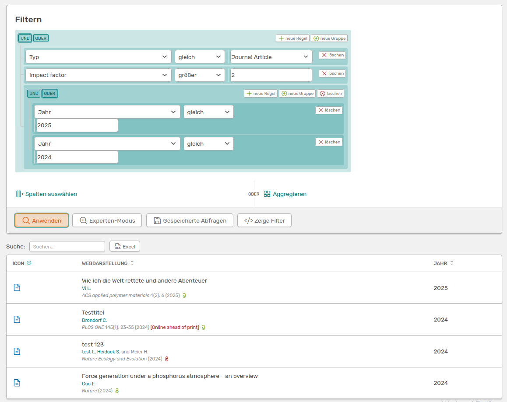
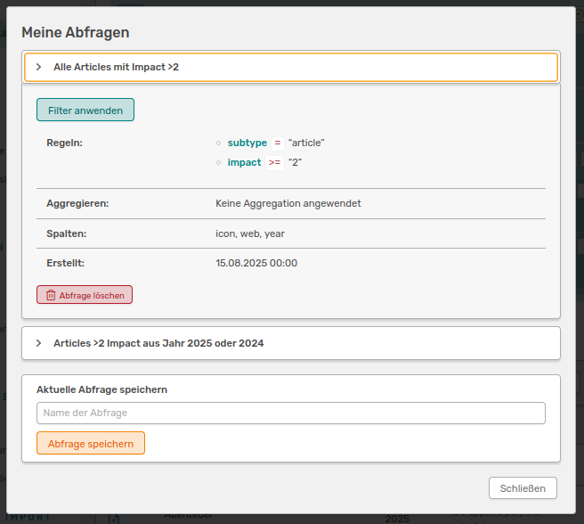
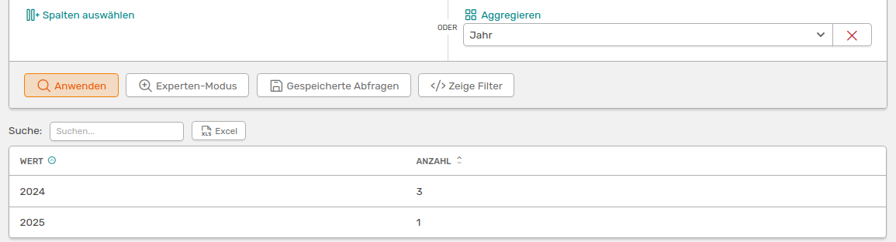

# Erweiterte Aktivitäten-Suche

Du kannst die Seite **Alle Aktivitäten** mit dem Suchbalken oben links schnell und einfach durchsuchen. Reicht eine einfache Suche nicht aus, kannst du eine **erweiterte Suche** durchführen, die du direkt neben dem Suchbalken findest.


## Suche mit Operatoren

Die erweiterte Suche in OSIRIS bietet dir eine Vielzahl an Möglichkeiten die Einträge in der Datenbank zu filtern. Dabei kannst du mit dem Button **neue Regel** weitere Kriterien hinzufügen. Über die **UND/ODER** Schaltflächen oberhalb des Kategorie-Feldes, kannst du die Abhängigkeit deiner Suchfelder bestimmen. Möchtest du eine Kombination aus UND/ODER anwenden, kannst du mit dem Button **neue Gruppe** oben rechts weitere Felder hinzufügen und eine neue Abhängigkeit erstellen. 

 
///caption
**Beispiel einer erweiterten Suche:**: Diese Suche zeigt dir alle Aktivitäten an, die ein Journal Article sind UND einen Impact Factor größer als 2 haben UND im Jahr 2025 ODER 2024 veröffentlicht wurden.
///

Du kannst jedes Suchfeld über den *löschen* Button rechts daneben aus deiner Suche entfernen. 

Über die Funktion **Spalten auswählen** kannst du der Ergebnistabelle deiner Suche beliebig viele Spalten hinzufügen oder welche entfernen. Wenn du auf den Button klickst, öffnet sich ein Widget, welches dir alle verfügbaren Spalten anzeigt und die du mit einem Klick auswählen kannst. Nicht verfügbare Spalten sind ausgegraut.


///caption
Das Spalte hinzufügen-Widget ermöglicht es dir belieblige Spalten deiner Ergebnistabelle hinzuzufügen.
///


///caption
So sieht deine Tabelle aus, wenn du die Spalten "Journal" und "Impact Factor" im Widget hinzugefügt hast.
///

## Suchanfragen speichern

Du kannst deine aktuelle Suche mit dem Button **Gespeicherte Abfragen** speichern und immer wieder verwenden. Es öffnet sich ein Widget, welches bereits gespeicherte Suchen anzeigt und indem du deiner aktuellen Suche einen Namen geben kannst. Nachdem du die Suche gespeichert hast, musst du die Seite neu laden, bevor du deine Suche in den gespeicherten Abfragen wiederfinden kannst. 


///caption
Im "Gespeicherte Abfragen"-Widget siehst du all deine gespeicherten Suchen und kannst deiner aktuell zu speichernden Suche einen Namen geben. Mit einem Klick auf eine gespeicherte Suche kannst du die Infos einsehen und die Suche löschen.
///

## Aggregieren einer Suche

Neben der "Spalte auswählen" Funktion findest du den **Aggregieren** Button. Mithilfe dieser Funktion kannst du dir eine Übersichtstabelle über die Anzahl der Einträge in deiner Ergebnistabelle erstellen lassen. Aggregierst du zum Beispiel nach Jahr, zeigt dir die Tabelle die Anzahl der Journal Article pro Jahr an. Die Aggregations-Tabelle ist abhängig von deiner aktuellen Suche.


///caption
Hier aggregierst du die oben gezeigte Suche nach "Jahr". Die Tabelle zeigt dir die Anzahl der Einträge pro Jahr an.
///


## Suche kopieren und weiter verwenden

Über den Button **Zeige Filter** wird dir der MongoDB Code für deinen Filter angezeigt. Diesen Code kannst du nutzen, um deine Suche mit anderen zu teilen oder um ihn selbst weiterzuverwenden. Du kannst den Code beispielsweise nutzen, um in der **Berichte-Vorlage** Funktion die Aktivitäten zu filtern. Hier siehst du zum Beispiel den Code für die oben durchgeführte Suche. 

```bash
{"$and":[{"subtype":"article"},{"impact":{"$gt":2}},{"$or":[{"year":2025},{"year":2024}]}]}
```

## Experten-Modus

Neben dem orangen "Anwenden" Button findest du den *Experten-Modus*. Hier kannst du deine eigenen MongoDB-Befehle eingeben, um OSIRIS zu durchsuchen.