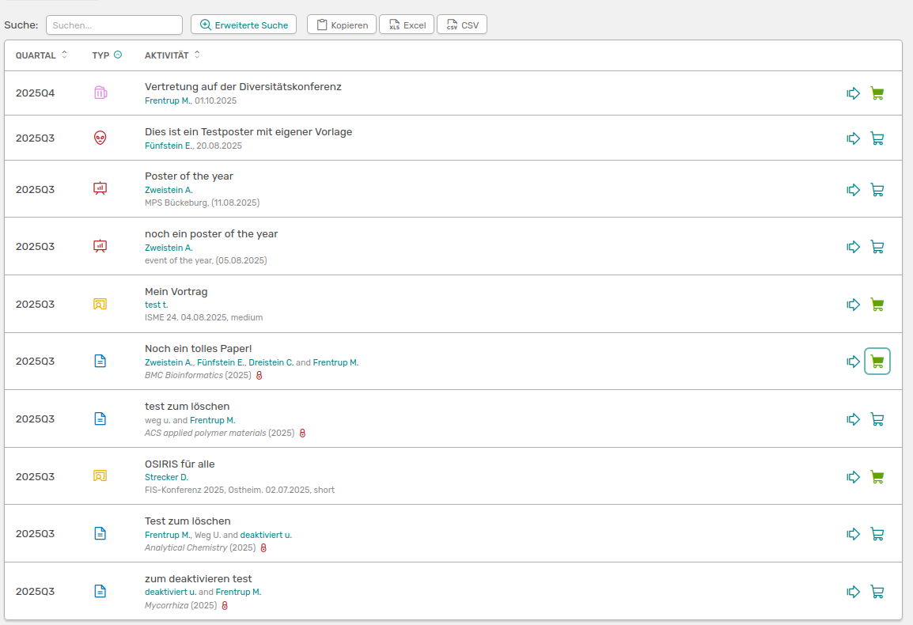

# Download collection

If you do not want to use the [advanced search](/users/activities/advanced-search/) option to create a customised list of activities, you can use the shopping cart on the **All Activities** page to add entries to it.

///caption
List of all activities with selected entries that have been added to the shopping cart
///

On the left of your menu, the number of selected entries is displayed in orange next to the link to the **Cart**.  

Once you have selected all entries, they will be displayed under **Shopping trolley**. Here you have various options for downloading the list.

///caption
View of the shopping cart with different download options
///

You can choose here whether your name, all names of affiliates or no name should be highlighted in the exported view. You also have the option to download the list in **Bibtex** format. To remove entries, simply click the cross to the right of the activity.