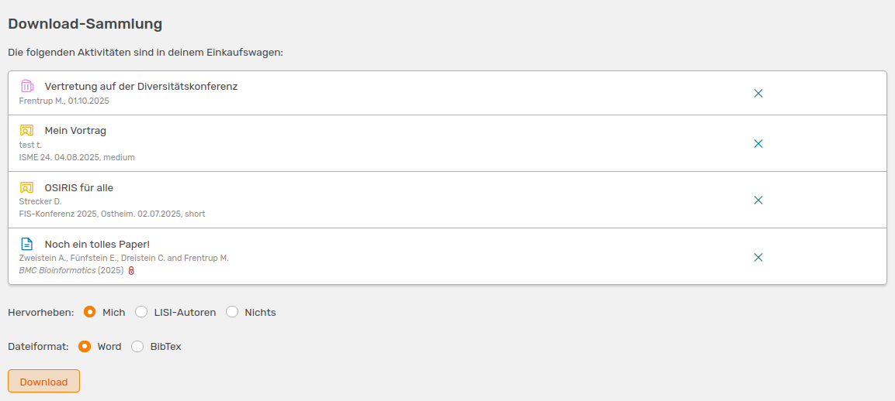

# Download-Sammlung

Wenn du nicht die Option der [erweiterten Suche](/users/activities/advanced-search/) zum Erstellen einer individuellen Liste der Aktivitäten nutzen möchtest, kannst du auf der Seite **Alle Aktivitäten** den Einkaufswagen nutzen, um Einträge diesem hinzuzufügen.

///caption
Liste aller Aktivitäten mit ausgewählten Einträgen, die dem Einkaufswagen hinzugefügt wurden
///

Links in deinem Menü wird dir die Anzahl ausgewählter Einträge in orange neben dem Link zum **Einkaufswagen** angezeigt.  

Wenn du alle Einträge ausgewählt hast, werden dir diese unter **Einkaufswagen** angezeigt. Hier hast du verschiedene Möglichkeiten die Liste herunterzuladen.

///caption
Ansicht des Einkaufswagens mit unterschiedlichen Download-Optionen
///

Du kannst hier wählen, ob dein Name, alle Namen von affilierten Personen oder kein Name bei der exportierten Ansicht hervorgehoben werden soll. Zudem hast du hier die Option die Liste in **Bibtex**-Format zu downloaden. Um Einträge zu entfernen, kannst du einfach das Kreuz rechts neben der Aktivität klicken. 