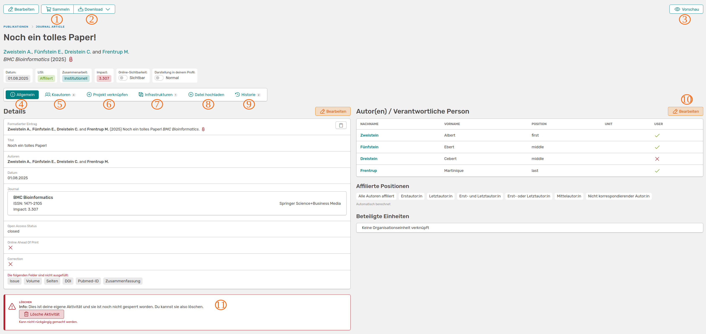
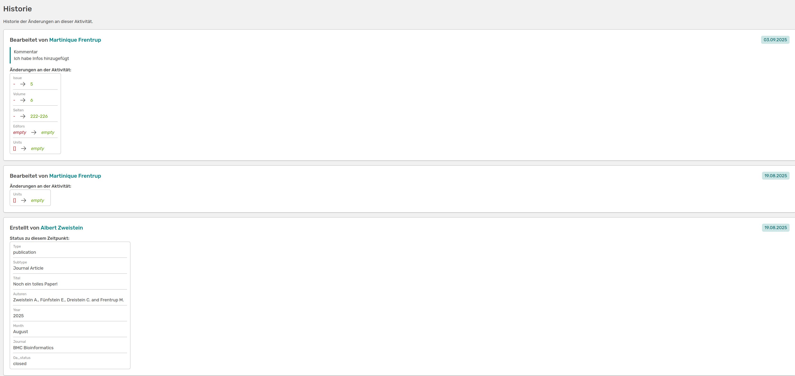
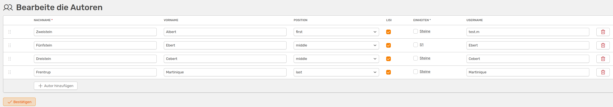

# Erweiterte Ansicht der Aktivitäten

In der erweiterten Ansicht einer Aktivität kannst du alle Details einsehen, die Aktivität bearbeiten, sperren oder sogar löschen (falls du die Rechte dazu hast).

///caption
Die erweiterte Ansicht einer Aktivität
///

Neben dem Titel und den Autoren siehst du darunter erste Informationen zum Eintrag. Hier wird dir das Datum angezeigt, ob mindestens ein Autor mit eurem Institut affiliiert ist und ob die Autoren alle aus eurem Institut sind (Institutionell), mit anderen Wissenschaftler:innen kooperiert und führend (Kooperativ (Führend)) oder beitragend (Kooperativ (Beitragend)) waren. In der Zeile hast du auch die Möglichkeit die Sichtbarkeit dieser Aktivität im Portfolio auszustellen. Falls du die Aktivität sichtbar lässt, kannst du diese hervorheben lassen, indem du den Button daneben anklickst.  

Im Folgenden werden alle wichtigen Buttons auf dieser Seite näher erklärt:

1. Sammeln: Über diesen Button kannst du die Aktivität deinem [Einkaufswagen](https://wiki.osiris-app.de/users/activities/cart/) hinzufügen
2. Download: Dieser Button bietet dir das *Word* oder *BibTex*-Format zum Download an. Zudem kannst du anpassen, welche Autoren hervorgehoben werden
3. Vorschau: Eine Vorschau wie diese Aktivität extern im Portfolio aussehen wird
4. Allgemein: Hier siehst du alle eingetragenen Details zu der Aktivität und die Felder, die vom Urheber nicht ausgefüllt wurden
5. Koautoren: Eine Grafik über deine Koautoren und die Organisationseinheiten, zu denen sie gehören
6. Projekt verknüpfen: Es öffnet sich ein Widget über das du bestehende Projekte mit dieser Aktivität verknüpfen kannst. Falls die Aktivität schon mit einem verknüpft ist, wird es dir hier angezeigt

     
    ///caption
    Widget, um Projekte mit der Aktivität zu verknüpfen
    ///

7. Infrastrukturen: Hier kannst du bestehende Infrastrukturen mit der Aktivität verknüpfen
8. Datei hochladen: Es öffnet sich ein Widget, welches dir den Upload von relevanten Unterlagen erlaubt. Hast du eine Datei hochgeladen, wechselt der Button zu **Dateien** und du findest hier deine Dokumente und kannst weitere hinzufügen
9. Historie: Hier werden alle Änderungen, die an der Aktivität vorgenommen wurden, aufgelistet.

    
    ///caption
    Auflistung der Änderungen, zusammen mit Kommentaren, der Person, die die Änderungen vorgenommen hat, und das Datum
    ///

10. Autoren: In der Auflistung siehst du, welche der Autoren die Aktivität schon bestätigt haben. Wenn Änderungen an der Aktivität vorgenommen werden, muss die Aktivität erneut von den Autoren bestätigt werden. Du kannst die Autorenliste hier auch bearbeiten

    
    ///caption
    Hier kannst du der Aktivität Autoren hinzufügen, die Reihenfolge ändern oder auch Autoren entfernen
    ///

11. Aktivität löschen: Ob du die Aktivität löschen kannst hängt davon ab, ob dir das Recht zugeteilt wurde. Wenn die Aktivität gesperrt wurde, können nur noch Editoren oder Admins Aktivitäten bearbeiten oder löschen

Wenn dir das Recht zugeteilt wurde, kannst du neben der Historie noch einen weiteren Button sehen, der dich zu den Rohdaten führt. Standardmäßig sehen diesen nur die Administratoren und Editoren.