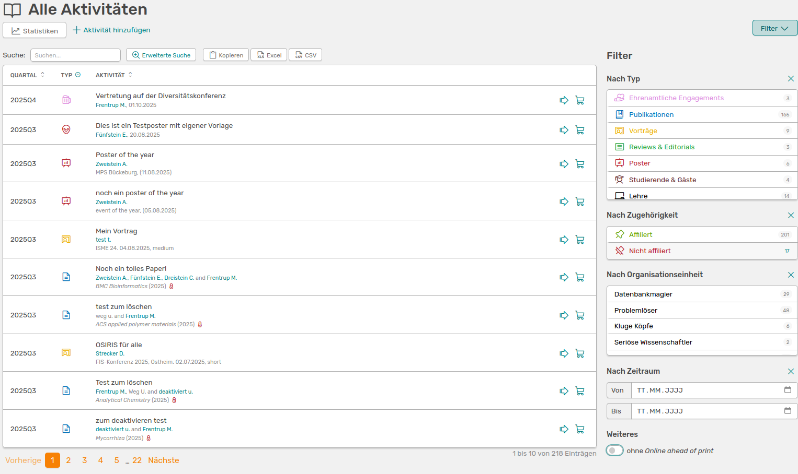

# Alle Aktivitäten

Wenn du links im Menü **Alle Aktivitäten** auswählst, siehst du einen Überblick über alle Einträge in OSIRIS.

///caption
Die Seite **Alle Aktivitäten** mit der Übersicht über alle Einträge in OSIRIS
///

Auf dieser Seite werden dir rechts einfache Möglichkeiten angeboten, um die Einträge zu filtern. Zudem kannst du über die obere Leiste der Tabelle die Einträge nach *Quartal*, *Typ* oder auch alphabetisch mit einem Klick auf *Aktivität* sortieren. Um die Tabelle zu exportieren, kannst du zwischen *Excel* und *csv*-Format wählen, oder die Tabelle einfach *kopieren*.  

Um eine individuellere Auflistung der Einträge zu erstellen, kannst du die [erweiterte Suche](https://wiki.osiris-app.de/users/activities/advanced-search/) nutzen.  

Neben jeder Aktivität findest du einen Pfeil, der dich zur [erweiterten Ansicht](https://wiki.osiris-app.de/users/activities/expanded_view/) des Eintrags führt. Wenn du ohne die erweiterte Suche eine Liste an Einträgen zum Exportieren erstellen möchtest, kannst du das Symbol des [Einkaufswagens](https://wiki.osiris-app.de/users/activities/cart/) rechts neben dem Pfeil nutzen.  

Oben links siehst du den Button, der dich zu den [Statistiken](https://wiki.osiris-app.de/users/reporting/statistics/) führt. Hier kannst du verschiedene Tabellen zu den Einträgen in einem bestimmten Reportzeitraum in OSIRIS finden.  

Wenn du die Rolle des **Admins** oder **Editors** hast oder dir das Recht zugeteilt wurde, Aktivitäten zu sperren, findest du den Button hierfür direkt neben dem Statistik-Button. Wenn dir der Button nicht angezeigt wird, wurde dir dieses Recht nicht freigegeben. 

