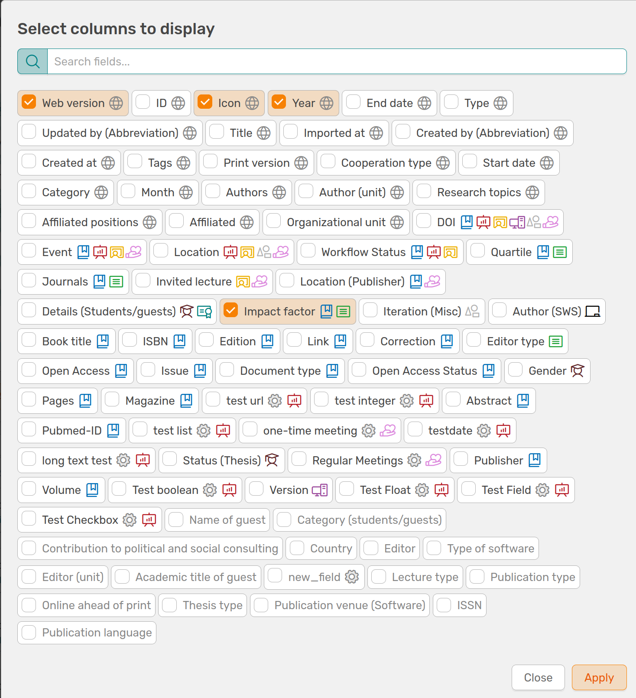
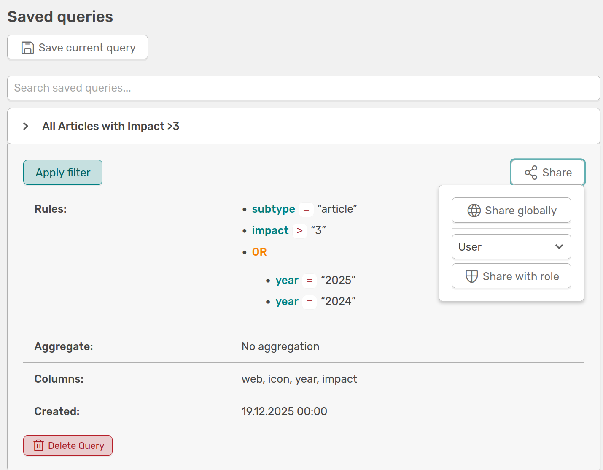

# Advanced search functions

<!-- md:version 1.7.0 -->


[:simple-youtube: To the video](https://youtu.be/cKuugdRF-k8){.md-button}

OSIRIS offers you the option of an **advanced search** on the following pages:

- All activities
- Proposals
- Projects
- Journals
- Events
- Users

You can find the search pages by clicking on the magnifying glass with the plus sign next to the respective menu item. The basic functions are the same for every search and are explained below as an example for the **All activities** page.

## Searching with operators

The advanced search in OSIRIS offers you a variety of options for filtering entries in the database. You can add further criteria using the **Add Rule** button. Use the **AND/OR** buttons above the category field to determine the dependency of your search fields. If you want to use a combination of AND/OR, you can add additional fields and create a new dependency using the **Add Group** button at the top right. 


///caption
**Example of an advanced search:**: This search will show you all activities that are a Journal Article AND have an Impact Factor greater than 2 AND were published in 2025 OR 2024.
///

You can remove any search field from your search using the *delete* button to the right of it.

You can use the **Select columns** function to add or remove as many columns as you like to the results table of your search. If you click on the button, a widget opens which shows you all available columns and which you can select with a click. Columns that are not available are greyed out. Since version 1.7.0, you can also search the columns.


///caption
This widget allows you to add any columns to your results table. With the search function (v.1.7.0), you can search directly for the desired column and select it with a click to add it to your results table.
///

## Save search queries

You can save your current search using the **Saved Queries** button so that you can use it again. A widget will open showing previously saved searches, where you can give your current search a name. After saving the search, you will need to reload the page before you can find your search in the saved queries. 


///caption
In the “Saved queries” widget, you can see all your saved searches and give your current search a name to save it. By clicking on a saved search, you can view the information, share the search with others (v.1.7.0), or delete it.
///

Since version 1.7.0, you can share saved queries with other OSIRIS users. There are two options for doing this:

- Global: You share the query with all users 
- Role: You can select a specific role with which you want to share your query

Sharing the query cannot be edited or undone. 
If the share option is not displayed, you have not been granted the right to do so. Please contact your administration.


///caption
You will be shown whether and how you have shared your query with other users.
///

## Aggregate a search

Next to the "Select column" function you will find the **Aggregate** button. You can use this function to create an overview table of the number of entries in your results table. If you aggregate by year, for example, the table will show you the number of journal articles per year. The aggregation table depends on your current search.


///caption
Here you aggregate the search shown above by "Year". The table shows you the number of entries per year.
///


## Copy search and continue using it

The **Show Filter** button displays the MongoDB code for your current query. You can use this code to reuse your search. For example, you can use the code to filter activities in the **Report Template** function. Here, for example, you can see the code for the search performed above. 

```bash
{"$and":[{"subtype":"article"},{"impact":{"$gt":2}},{"$or":[{"year":2025},{"year":2024}]}]}
```

## Expert mode

Next to the orange "Apply" button you will find the *Expert mode*. Here you can enter your own MongoDB commands to search OSIRIS.