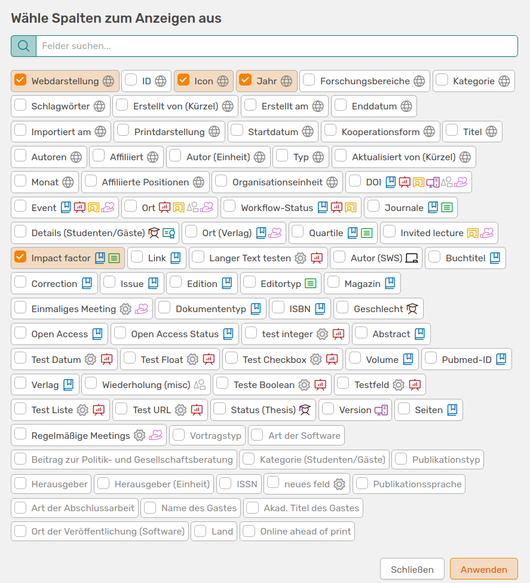
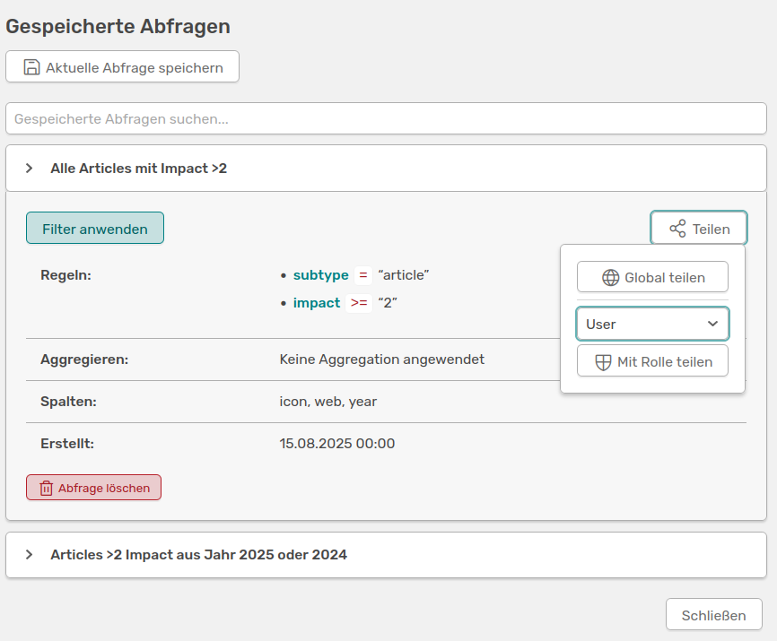
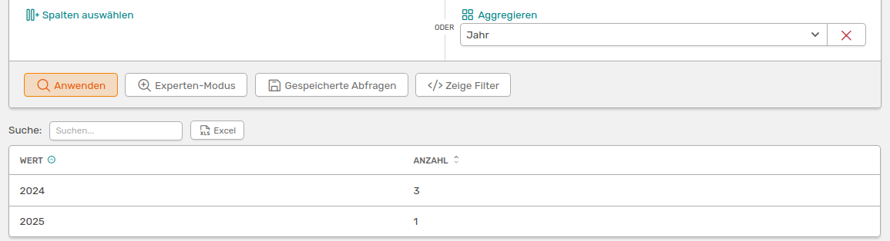

# Erweiterte Suchfunktionen

<!-- md:version 1.7.0 -->


[:simple-youtube: Zum Video](https://youtu.be/cKuugdRF-k8){.md-button}

OSIRIS bietet dir die Möglichkeit einer **erweiterten Suche** auf folgenden Seiten:

- Alle Aktivitäten
- Anträge
- Projekte
- Journale
- Events
- Personen

Du findest die Suchseiten, indem du auf die Lupe mit dem Plus neben dem jeweiligen Menü-Punkt klickst. Die Grundfunktionen sind bei jeder Suche gleich und werden im Folgenden für die Seite **Alle Aktivitäten** erklärt.

## Suche mit Operatoren

Die erweiterte Suche in OSIRIS bietet dir eine Vielzahl an Möglichkeiten die Einträge in der Datenbank zu filtern. Dabei kannst du mit dem Button **neue Regel** weitere Kriterien hinzufügen. Über die **UND/ODER** Schaltflächen oberhalb des Kategorie-Feldes, kannst du die Abhängigkeit deiner Suchfelder bestimmen. Möchtest du eine Kombination aus UND/ODER anwenden, kannst du mit dem Button **neue Gruppe** oben rechts weitere Felder hinzufügen und eine neue Abhängigkeit erstellen. 

 
///caption
**Beispiel einer erweiterten Suche:**: Diese Suche zeigt dir alle Aktivitäten an, die ein Journal Article sind UND einen Impact Factor größer als 2 haben UND im Jahr 2025 ODER 2024 veröffentlicht wurden.
///

Du kannst jedes Suchfeld über den *löschen* Button rechts daneben aus deiner Suche entfernen. 

Über die Funktion **Spalten auswählen** kannst du der Ergebnistabelle deiner Suche beliebig viele Spalten hinzufügen oder auch welche entfernen. Wenn du auf den Button klickst, öffnet sich ein Widget, welches dir alle verfügbaren Spalten anzeigt und die du mit einem Klick auswählen kannst. Nicht verfügbare Spalten sind ausgegraut. Seit Version 1.7.0 kannst du die Spalten auch durchsuchen.


///caption
Dieses Widget ermöglicht es dir beliebige Spalten deiner Ergebnistabelle hinzuzufügen. Mit der Such-Funktion (v.1.7.0) kannst du direkt nach der gewünschten Spalte suchen und diese mit einem Klick auswählen, damit sie deiner Ergebnistabelle hinzugefügt wird.
///

## Suchanfragen speichern

Du kannst deine aktuelle Suche mit dem Button **Gespeicherte Abfragen** speichern, um sie erneut zu verwenden. Es öffnet sich ein Widget, welches bereits gespeicherte Suchen anzeigt, und in dem du deiner aktuellen Suche einen Namen geben kannst. Nachdem du die Suche gespeichert hast, musst du die Seite neu laden, bevor du deine Suche in den gespeicherten Abfragen wiederfindest. 


///caption
Im "Gespeicherte Abfragen"-Widget siehst du all deine gespeicherten Suchen und kannst deiner aktuell zu speichernden Suche einen Namen geben. Mit einem Klick auf eine gespeicherte Suche kannst du die Infos einsehen, die Suche mit anderen teilen (v.1.7.0) oder löschen.
///

Seit Version 1.7.0 kannst du gespeicherte Abfragen mit anderen OSIRIS-Nutzenden teilen. Hierbei hast du zwei Möglichkeiten:

- Global: Du teilst die Abfrage mit allen Nutzenden 
- Rolle: Du kannst eine bestimmte Rolle auswählen, mit der du deine erstellte Abfrage teilen möchtest

Das Teilen der Abfrage kann nicht bearbeitet oder rückgängig gemacht werden. 
Wenn dir die Option des Teilens nicht angezeigt wird, wurde dir das Recht dazu nicht zugeteilt. Bitte kontaktiere deine Administration.


///caption
Es wird dir angezeigt, ob und wie du deine Abfrage mit anderen Nutzenden geteilt hast
///


## Aggregieren einer Suche

Neben der "Spalte auswählen" Funktion findest du den **Aggregieren** Button. Mithilfe dieser Funktion kannst du dir eine Übersichtstabelle über die Anzahl der Einträge in deiner Ergebnistabelle erstellen lassen. Aggregierst du zum Beispiel nach Jahr, zeigt dir die Tabelle die Anzahl der Journal Article pro Jahr an. Die Aggregations-Tabelle ist abhängig von deiner aktuellen Suche.


///caption
Hier aggregierst du die oben gezeigte Suche nach "Jahr". Die Tabelle zeigt dir die Anzahl der Einträge pro Jahr an.
///


## Suche kopieren und weiter verwenden

Über den Button **Zeige Filter** wird dir der MongoDB Code für deine aktuelle Abfrage angezeigt. Diesen Code kannst du nutzen, um deine Suche weiterzuverwenden. Du kannst den Code beispielsweise nutzen, um in der **Berichte-Vorlage** Funktion die Aktivitäten zu filtern. Hier siehst du zum Beispiel den Code für die oben durchgeführte Suche. 

```bash
{"$and":[{"subtype":"article"},{"impact":{"$gt":2}},{"$or":[{"year":2025},{"year":2024}]}]}
```

## Experten-Modus

Neben dem orangen "Anwenden" Button findest du den *Experten-Modus*. Hier kannst du deine eigenen MongoDB-Befehle eingeben, um OSIRIS zu durchsuchen.

