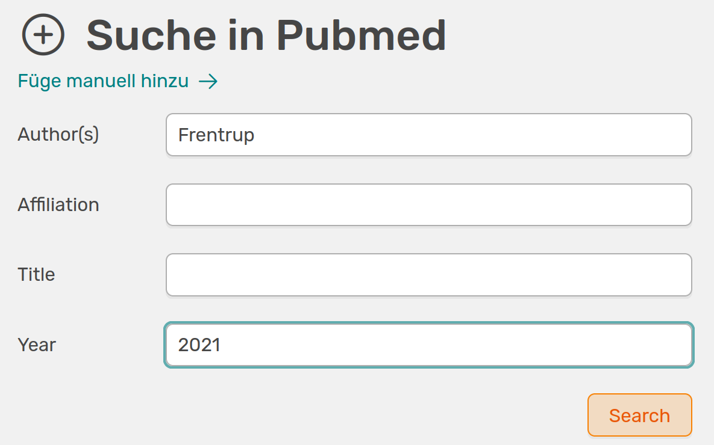
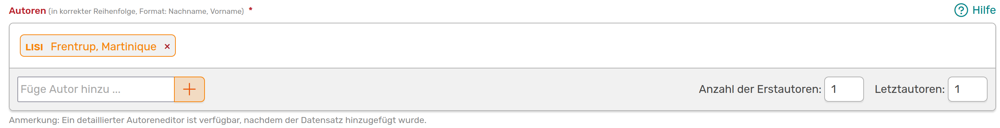
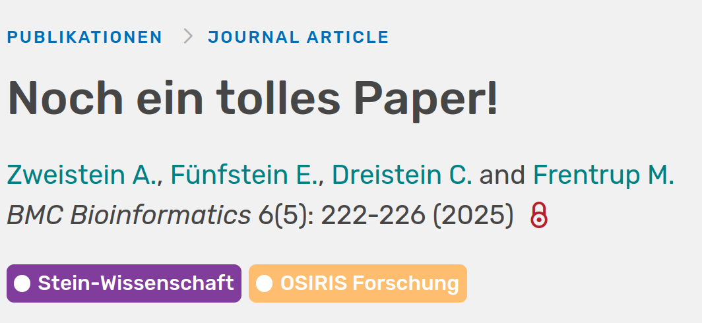
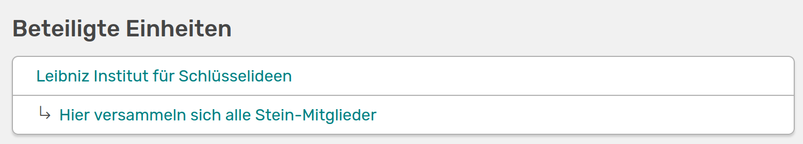

# Inhalte erstellen

OSIRIS bietet dir die Möglichkeit all deine wissenschaftlichen Aktivitäten zu dokumentieren und mit Forschungsbereichen, Organisationseinheiten oder auch Projekten zu verknüpfen. Auf deiner [Profilseite](https://wiki.osiris-app.de/users/profile/start/) findest du links einen Button, mit dem du direkt zur **Füge Aktivität hinzu** Seite gelangst. Im Menü-Bereich links wird dir der Button auch in Orange angezeigt. 

///caption
Die Seite **Füge Aktivität hinzu** mit den aufgelisteten Aktivitäts-Kategorien in OSIRIS
///

Um eine Aktivität in OSIRIS hinzuzufügen hast du verschiedene Möglichkeiten, die im Folgenden erläutert werden.

## Inhalte über Suche in Pubmed hinzufügen

Du kannst **Publikationen** über eine Suche in Pubmed hinzufügen. Dafür kannst du auf der Seite verschiedene Suchparameter verwenden.

///caption
Suchparameter um Pubmed nach Publikationen zu durchsuchen
///

Wenn du die Suche durchführst werden dir anschließend alle gefundenen Publikationen aufgelistet. Du kannst sie über das :heavy_plus_sign: in das *Aktivitäten hinzufügen* Formular übertragen. Bitte kontrolliere hier noch einmal genau alle übernommenen Werte. Vergiss zudem nicht, die affilierten Personen über einen Doppelklick zu markieren.  
Falls bei der Suche Einträge dabei sind, die schon in OSIRIS hinterlegt sind, wird dies durch eine rote Umrandung und der Flagge **Duplikat** markiert. 

## Inhalte über DOI hinzufügen

Wenn du eine DOI (Digital Object Identifier) für deine Publikation hast, kannst du diese direkt in den Suchbalken eingeben. OSIRIS füllt das Formular dann automatisch aus. Auch hier gilt: Bitte überprüfe die Werte und markiere die affilierten Autoren.  
Falls die zugehörige Publikation schon in OSIRIS hinterlegt ist, wird dir auch hier eine Warnung bezüglich eines Duplikats angezeigt.

///caption
Warnung vor einem Duplikat bei der DOI-Suche
///

## Inhalte manuell hinzufügen

Du kannst all deine Aktivitäten natürlich auch manuell in OSIRIS eintragen. Dafür stehen dir mehrere Aktivitäts-Kategorien mit verschiedenen Aktivitäts-Typen zur Verfügung. Nachdem du den passenden Typen von Aktivität gewählt hast, erscheint ein Formular, welches von dir auszufüllen ist. Pflichtfelder werden hier immer mit einem roten Stern markiert.  
Die Formulare sind abhängig von der Aktivität, die du gewählt hast und können durch die Administration angepasst werden.  

## Titel formatieren

///caption
Feld, um den Titel zu formatieren
///

Achte beim Titel darauf, dass Rechtschreibung und Formatierung mit der Originalarbeit übereinstimmen. Unterstützt werden dabei folgende Formatierungen: kursiv, unterstrichen, hochgestellt und tiefgestellt. Außerdem gibt es Shortcuts für die gängigsten griechischen Sonderzeichen.

## Autoren hinzufügen

Dein Name wird automatisch beim Erstellen einer neuen Aktivität in der Autoren-Liste als affiliert geführt.  

///caption
Autoren-Feld, um weitere Namen hinzuzufügen
///

Über das **Füge Autor hinzu** Feld kannst du weitere Namen hinzufügen. Wenn diese Namen in OSIRIS hinterlegt sind, werden sie dir über ein Dropdown-Menü angezeigt. Wenn du mehrere Namen hinzugefügt hast, kannst du die Reihenfolge per Drag & Drop ändern. Zudem ist es auch hier wichtig alle affilierten Autoren dementsprechend per Doppelklick zu markieren. Affilierte Autoren werden markiert und das Kürzel des Instituts erscheint vor dem Namen. Wenn du Autoren wieder entfernen möchtest, musst du einfach nur auf das rote Kreuz hinter dem Namen klicken.
:warning: Wenn Autoren zwar Beschäftigte deines Instituts sind, es aber zum Zeitpunkt der Aktivität nicht waren, dürfen sie nicht entsprechend markiert werden.

## Forschungsbereiche verknüpfen

Am Ende des Formulars werden die verfügbaren Forschungsbereiche angezeigt (falls diese Funktion aktiviert ist). Mit einem Klick kannst du deine Aktivität mit einem oder mehreren Bereichen verknüpfen. Dies kann im Nachhinein noch angepasst werden. Die Verknüpfung wird in der bestehenden Aktivität entsprechend angezeigt.

///caption
Aktivität mit den verknüpften Forschungsbereichen
///

## Organisationseinheiten verknüpfen

Wenn die Aktivität in den Zeitraum fällt, in dem du einer [Organisationseinheit](https://wiki.osiris-app.de/users/units/) zugeordnet bist, wird diese automatisch mit dieser verknüpft. Die Verknüpfung wird dir im unteren Bereich der erweiterten Aktivitäts-Ansicht angezeigt.

///caption
Verknüpfung der Aktivität mit einer Organisationseinheit
///

## Notiz hinzufügen

Unter den Forschungsbereichen hast du noch die Option eine Notiz für deine Co-Autoren und/oder für die Administration zu hinterlassen. Diese Notiz wird in der erstellten Aktivität nur für die betroffenen Personen angezeigt.
