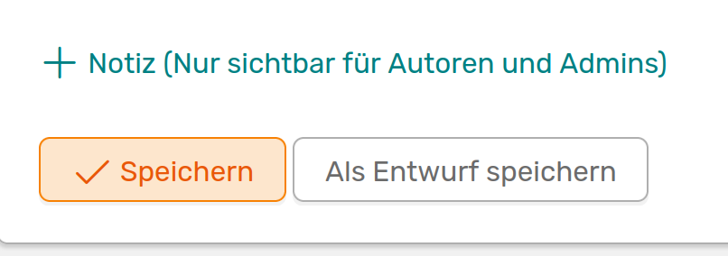
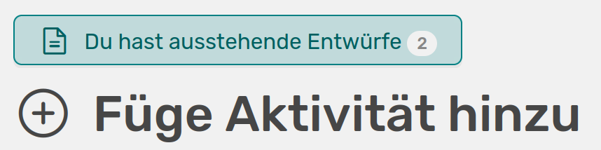
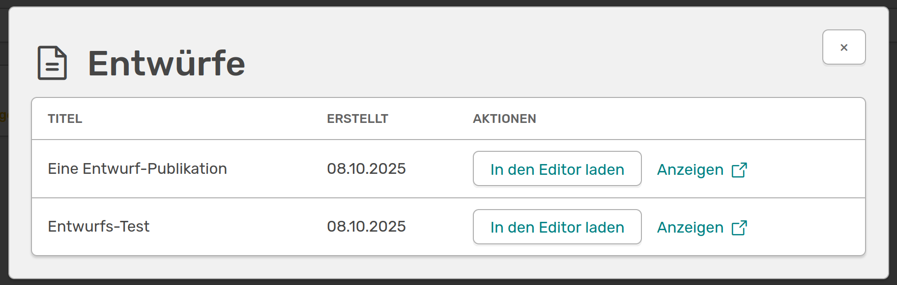

# Entwürfe

<!-- md:version 1.6.0 -->
<!-- md:feature -->

OSIRIS bietet dir die Möglichkeit, Entwürfe für deine Einträge zu speichern. Wenn du eine neue Aktivität hinzufügst, befindet sich neben dem *Speichern* Button im Formular jetzt auch ein **Als Entwurf speichern** Button.  
Falls dir der Button nicht angezeigt wird, kontaktiere bitte deine Administration. Diese kann die Funktion freischalten.

///caption
Button am Ende eines Formulars um Entwürfe zu speichern
///

Wenn du eine Aktivität als Entwurf speicherst, werden deine Co-Autoren nicht darüber informiert. Du kannst hier also noch in Ruhe Änderungen vornehmen. Erst wenn du den Entwurf als Aktivität speicherst werden deine Co-Autoren benachrichtigt.  
Du findest all deine Entwürfe oben links auf der **Aktivität hinzufügen** Seite.

///caption
Auf der Aktivitäten hinzufügen Seite findest du oben links ein Button zu deinen bestehenden Entwürfen
///

Wenn du auf den Button klickst werden dir all deine Entwürfe angezeigt.

///caption
Anzeige all deiner Entwürfe
///

Hier kannst du dir deine Entwürfe entweder anzeigen lassen oder direkt in den Editor wechseln, um deinen Eintrag zu vervollständigen.
