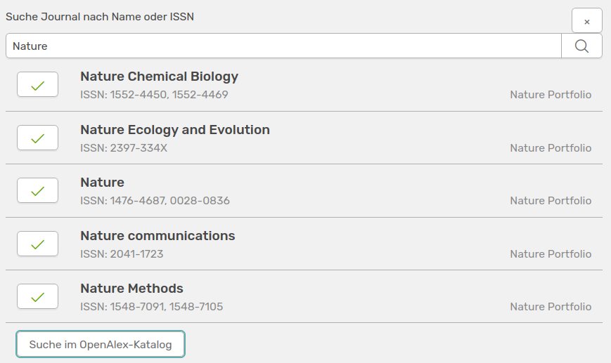

# Inhalte bearbeiten

Nachdem du die Aktivität erstellt hast, kannst du sie, solange sie noch nicht gesperrt wurde, bearbeiten. 

## Autoren bearbeiten

Über den Autoren-Editor kannst du weitere Einstellungen zu den Autor:innen vornehmen. 

///caption
Der Autoren-Editor um weitere Einstellungen vorzunehmen
///

Über die Punkte links kannst du die Reihenfolge der Namen per Drag & Drop ändern. Die Position der Autor:innen kannst du über ein Dropdown-Menü separat einstellen. Sowohl die Affiliation zum Institut als auch zu der Organisationseinheit kannst du hier pro Namen bestimmen. Du kannst natürlich auch weitere Namen der Liste hinzufügen oder welche über das Tonnen-Symbol rechts entfernen. Hierbei ist der Nachname ein Pflichtfeld, der Vorname kann optional weggelassen werden.  
Im oben gezeigten Beispiel ist zu sehen, dass man nicht dem Institut zugehörig sein muss, um die Aktivitäten mit dem Nutzerprofil zu verknüpfen. Der zweite Autor in der Liste ist einem Nutzerkonto zugeordnet, war aber zum Zeitpunkt der Arbeit nicht mit dem Institut affiliert. Die Aktivität ist mit dem Account verknüpft und wird in seinem Profil dargestellt, er wird jedoch im Report nicht als affilierter Autor markiert und bekommt für die Aktivität keine Coins. Zudem kannst du auch Autor:innen hinzufügen, die kein Nutzerkonto in OSIRIS haben.

## Journal bearbeiten

Journale sind bei **Journalartikeln** und **Reviews & Editorials** relevant.

Aus Gründen der Standardisierung kann ein Journal nicht als Freitext-Feld eingetragen werden. Stattdessen ist folgendes Modul zu finden:

///caption
Feld bei Journals und Reviews & Editorials um das Journal anzugeben
///

Wenn du auf das Feld klickst, kannst du nach einem Journal anhand des Namens oder bevorzugt per ISSN-Nummer suchen. Wenn es mehrere Journals zu der verwendeten Suche gibt, werden diese aufgelistet und du kannst eines davon anhand des grünen Hakens deiner Aktivität hinzufügen.

///caption
Suche nach einem Journal 
///

Wird dein gesuchtes Journal nicht gefunden, kannst du mit dem unteren Button zusätzlich den [OpenAlex-Katalog](https://openalex.org/) durchsuchen. 