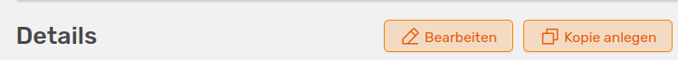

# Erweiterte Funktionen

## Dateien hochladen

Du kannst zu jeder Aktivität in OSIRIS wichtige Dokumente hinterlegen. Dafür gehst du in der [erweiterten Ansicht](/users/activities/expanded_view/) der Aktivität auf **Datei hochladen** und gelangst zu folgendem Widget:

///caption
Widget um eine Datei für eine Aktivität hochzuladen und schon vorhandene herunterzuladen und zu löschen
///

Falls dieser Aktivität schon Dateien hinzugefügt wurden, wird dir der Button als **Dateien** mit der Anzahl der hinterlegten Dokumente angezeigt. Wenn du auf den Button klickst, werden die vorhandenen Dateien angezeigt. Rechts befindet sich ein Button zum Hochladen weiterer Dateien, der dich zum Widget führt.  
Unter **Alle Dateien** werden alle hochgeladenen Dokumente angezeigt, die du hier auch runterladen und löschen kannst.  
Unter **Füge Dateien hinzu** kannst du neue Dokumente hochladen, indem du auf **Hänge eine Datei an** klickst. Diese dürfen eine Maximalgröße von 16 MB nicht überschreiten und sollten sich nach Möglichkeit in einem Standardformat befinden. Gute Beispiele sind PDF (bevorzugt), PPTX, XLSX, DOCX. Nachdem du die Datei ausgewählt hast, musst du nur noch auf **Upload** gehen um sie final hochzuladen.

## Editor-Kommentare

Wenn eine Aktivität bearbeitet wird, bietet OSIRIS die Möglichkeit einen Kommentar bezüglich der Änderungen an alle Ko-Autor:innen zu hinterlassen.

///caption
Möglichkeit, eine Änderung an der Aktivität für die anderen Autor:innen zu kommentieren
///

Dieses Feld taucht nur auf, wenn du eine bestehende Aktivität bearbeitest. Falls du der Meinung bist, dass deine Änderungen zu minimal sind, um eine Kontrolle durch die Ko-autor:innen erforderlich zu machen, kannst du unten im Feld den entsprechenden Haken setzen.

///caption
So sehen deine Ko-Autor:innen die Änderung mit deinem Kommentar
///

Wenn deine Ko-Autor:innen benachrichtigt werden, bekommen sie eine Meldung in denen deine Änderungen und dein Kommentar gezeigt werden. In dieser Meldung können sie bestätigen, ob die Zuordnung stimmt, ob sie noch nicht affiliert waren als die Aktivität stattfand, oder auch die Autorenschaft ablehnen. Mit dem Stift-Button können sie die Aktivität selbst bearbeiten, der Pfeil-Button führt zur erweiterten Ansicht der Aktivität.

## Aktivität kopieren

OSIRIS bietet dir für bestimmte Typen von Aktivitäten die Möglichkeit Kopien zu erstellen und so sich wiederholende Aktivitäten mit leichten Änderungen (zum Beispiel Datum oder Event) schnell zu erstellen. Das Kopieren ist für alle Aktivität-Typen möglich bis auf Publikationen. 

///caption
Button in der erweiterten Aktivitäts-Ansicht, um eine Kopie der Aktivität zu erstellen
///

Diese Funktion ist besonders nützlich, wenn du zum Beispiel Vorträge oder Poster auf mehreren Konferenzen vorträgst. So musst du nur noch Datum und/oder Ort anpassen und die Aktivität nicht komplett neu erstellen.