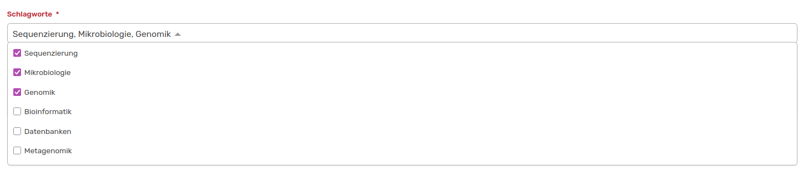

# Verschlagwortung von Einträgen

Um Einträge in OSIRIS besser kategorisieren und leichter thematisch finden zu können, kannst du Aktivitäten, Events und Projekte mit Schlagwörtern verlinken. Diese Funktion muss von der Administration eingeschaltet werden. Zudem werden die Schlagwörter durch die Administration vorgegeben. Sollte dir also ein Wort fehlen, kontaktiere bitte eure Admins. Weitere Erklärungen dazu findest du [hier](https://wiki.osiris-app.de/admins/content/keywords/).  

Um eine **Aktivität** mit Schlagwörtern zu versehen, muss die Administration dem Formular des jeweiligen Aktivitäts-Typen das Datenfeld **Schlagwörter** über den [Formular-Builder](http://127.0.0.1:8000/admins/content/activities/#formular-builder) hinzufügen. 

///caption
So sieht das Datenfeld **Schlagwörter** im Aktivitäts-Formular aus
///

Das Datenfeld Schlagwörter erscheint als Dropdown-Menü im Aktivitäts-Formular, aus dem der Nutzende beliebig viele Wörter auswählen kann. Diese werden dann mit einem Komma getrennt in der ausgefüllten Aktivitäts-Ansicht aufgeführt.  

Unter [Alle Aktivitäten](https://wiki.osiris-app.de/users/activities/) kannst du die Aktivitäten jetzt auch nach diesen Schlagwörtern filtern.

Du kannst auch **Events** mit Schlagwörtern verknüpfen. Wenn du ein neues Event hinzufügst, findest du das Dropdown-Menü mit den vorhandenen Schlagwörtern unter den Forschungsbereichen und kannst mehrere, zutreffende Wörter auswählen. Auch hier steht dir wie bei den Aktivitäten eine Filterung nach Schlagwörtern zur Verfügung. 

Um **Projekte** mit Schlagwörtern zu verknüpfen, muss die Administration das Feld *Schlagworte* zu den verschiedenen Phasen des Projekts hinzufügen. Dies ist unter **Inhalte &#8594 Projekte** möglich. Hier kann der jeweilige Typ an Projekt ausgewählt und bearbeitet werden. Die Auswahl der optionalen Felder befindet sich auf der zweiten Seite der Projekt-Einstellungen.