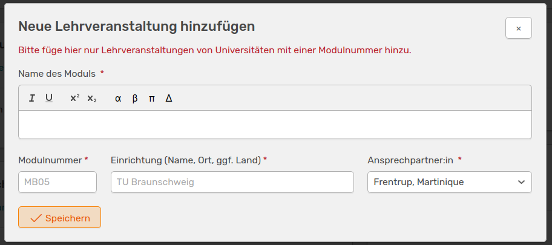
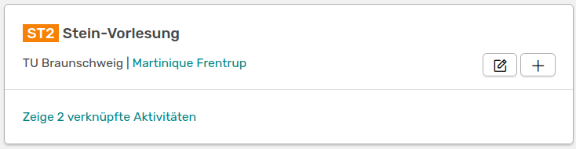
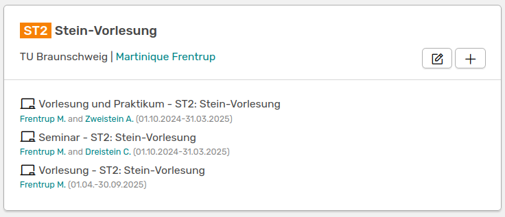

# Lehrveranstaltungen

Unter **Lehrmodule** kannst du Module erstellen, die es dir ermöglichen mehrere Aktivitäten des Typs **Lehre** zusammenzufassen. Bevor du eine Lehre-Aktivität hinzufügen kannst, muss das passende Modul erstellt werden. Falls du die Funktion nicht im linken Menü findest, muss diese von eurer Administration unter Einstellungen &#8594 Funktionen aktiviert werden. 

## Lehrmodul hinzufügen

Standardmäßig kann jede Rolle eine Lehrveranstaltung in OSIRIS hinzufügen. Dafür wählst du im Menü links **Lehrmodule** aus und gehst auf **Neue Lehrveranstaltung anlegen**. Folgendes Widget erscheint:

///caption
Das Widget um eine neue Lehrveranstaltung anzulegen
///

Hier kannst du den Namen, die Modulnummer, die Einrichtung und die verantwortliche Person eingeben. Nachdem du gespeichert hast, wird dein neu angelegtes Modul schon in der Liste angezeigt.

///caption
Dein neu erstelltes Lernmodul
///

## Aktivität verknüpfen

Um eine Aktivität des Typs **Lehre** einem Modul hinzuzufügen, gibt es zwei Möglichkeiten. Du kannst einfach auf das :heavy_plus_sign: in der Tafel deines Lernmoduls gehen und gelangst so zu der *Aktivitäten hinzufügen* Seite. Hier wurde automatisch schon der Typ *Lehre* und das passende Modul ausgewählt. Alternativ kannst du über die [Aktivität hinzufügen](https://wiki.osiris-app.de/users/creating-content/) Seite gehen und den Typ *Lehre* auswählen. Hier musst du nach deinem Modul über den Namen oder die Modulnummer suchen.

///caption
Formular, um eine Lehre-Aktivität hinzuzufügen
///

Neben dem Modul musst du weitere Parameter angeben:

- **Lehr-Kategorie:** Hier kannst du die Art deiner Lehr-Aktivität auswählen. Du hast die Wahl zwischen *Vorlesung*, *Praktikum*, *Seminar* oder verschiedenen Kombinationen aus diesen
- **Betreuer:in mit SWS:** Gib hier eine oder mehrere Personen an, die diese Lehr-Aktivität betreuen. Wichtig ist die Angabe der *Semesterwochenstunden* und ob die Person mit eurem Institut affiliert ist
- **Zeitspanne:** Hier kannst du die Daten für dein Modul eingeben. Falls es nur einen Tag dauert, kannst du das letzte Feld leer lassen. Zudem hast du links daneben eine Auswahl an Semestern, die du zum leichteren Ausfüllen der Zeitspanne anklicken kannst

Auch Lehrveranstaltungen können mit [Forschungsbereichen](https://wiki.osiris-app.de/users/topics/) verknüpft werden. Die zur Auswahl stehenden Bereiche findest du unten im Formular.  

Du kannst einem Modul mehrere Lehr-Aktivitäten hinzufügen. Die Anzahl der verknüpften Aktivitäten wird dir auf der Lehrmodul-Tafel angezeigt (siehe oben). Diese kannst du dir mit einem Klick auf die Anzahl in Kurzform anzeigen lassen.

///caption
Modul-Tafel mit den verknüpften Lehr-Aktivitäten
///

:warning: Ein Modul kann nur gelöscht werden, wenn noch keine Verknüpfungen bestehen.

