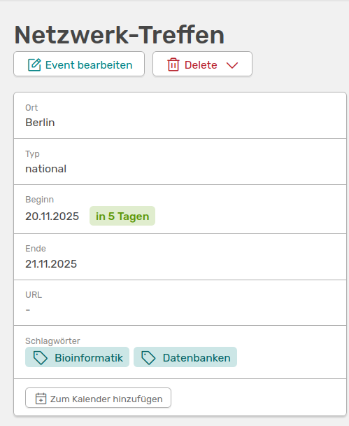
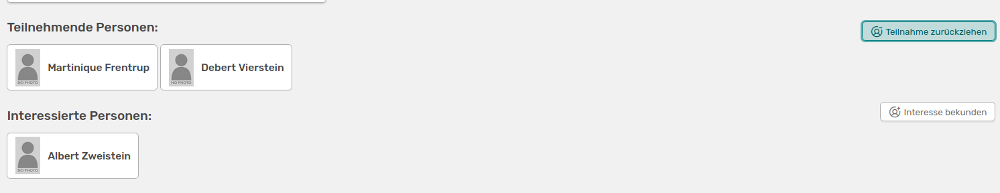
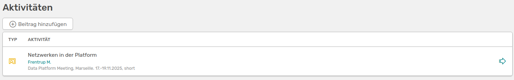

---
tags:
- Events
---

# Events in OSIRIS

OSIRIS kann zur zentralen Verwaltung von anstehenden Konferenzen, Kongressen oder sonstigen Events genutzt werden. Events sind eine Funktion, die von der Administration aktiviert werden muss. Falls du keinen Reiter für Events links im Menü findest und/oder keine Rechte hast, neue Events hinzuzufügen, kontaktiere bitte eure Administration.

## Neues Event erstellen

Um ein neues Event zu erstellen, kannst du entweder oben links das Dropdown-Menü für **Aktivität hinzufügen** nutzen, oder die Events-Seite links im Menü wählen und auf **:heavy_plus_sign: Event hinzufügen** klicken.

Es öffnet sich ein Formular, in dem du folgende Angaben machen musst:

- Kurztitel des Events
- Typ: Zur Auswahl stehen Lokal, National oder International. Die Auswahl kann über das [Vokabular](https://wiki.osiris-app.de/admins/content/vocabulary/) angepasst werden
- Datum des Events
- Ort des Events

///caption
Formular um ein Event in OSIRIS hinzuzufügen
///

Du kannst hier auch weitere Angaben machen und zum Beispiel einen längeren Titel angeben oder eine URL zum Event hinterlegen.

Wenn [Forschungsbereiche](https://wiki.osiris-app.de/users/topics/) oder [Schlagwörter](https://wiki.osiris-app.de/users/content/keywords/) in eurer Instanz aktiviert sind, kannst du im unteren Bereich des Formulars dein Event mit vorhandenen verknüpfen.

///caption
Falls aktiviert, kannst du dein Event auch mit Forschungsbereichen oder Schlagwörtern verknüpfen
///

///caption
So sieht dein erstelltes Event aus
///

Wie du siehst, kannst du dein Event natürlich noch bearbeiten oder auch wieder löschen. Rechts neben der hier zu sehenden Anzeige befindet sich die von dir angegebene Beschreibung, bzw. der längere Titel des Events. 

## Teilnahme an Events

Allen Nutzenden von OSIRIS werden die eingetragenen Events rechts auf der Startseite angezeigt. Über die Buttons **Interessiert** und **Teilnehmer** kann jeder User über einen Klick seine Teilnahme oder sein Interesse an der Veranstaltung festhalten.

///caption
So werden die eingetragenen Events in OSIRIS auf der Startseite eines jeden Users angezeigt
///

An der Zahl auf den Buttons siehst du, wie viele Nutzende ihre Teilnahme oder Interesse schon eingetragen haben. Wenn du auf den Eintrag zur Veranstaltung gehst, werden dir auch die Namen der Personen angezeigt.

///caption
Auf der Seite des Events siehst du welche Personen aus deiner Einrichtung sich noch dafür interessieren oder sogar teilnehmen
///

## Event mit einer Aktivität verknüpfen

Im unteren Bereich der Event-Seite hast du die Möglichkeit, das Event mit Aktivitäten zu verknüpfen.

///caption
Hier kannst du dem Event eine Aktivität hinzufügen
///

Mit einem Klick auf **:heavy_plus_sign: Beitrag hinzufügen** wirst du direkt zur [Aktivität hinzufügen](https://wiki.osiris-app.de/users/content/create_content/) Seite weitergeleitet. Hier ist der Aktivitäts-Typ *Vortrag* vorausgewählt und schon passend für das Event ausgefüllt. 