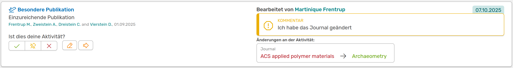
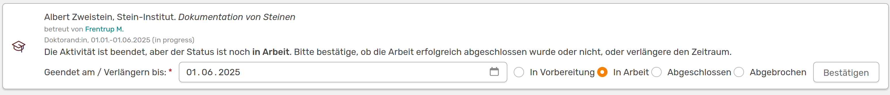

# Warnungen und Mitteilungen

In OSIRIS gibt es verschiedene Meldungen, die du als Nutzende:r bekommen kannst. Sie zeigen dir an, wo eine Handlung von dir erforderlich ist. Ob du aktuell eine Mitteilung hast, siehst du auf deinem Profil oben rechts am Klingel-Symbol. Mit einem Klick siehst du in einem extra Fenster alle Mitteilungen mit einem Direktlink zu den jeweiligen Seiten.

///caption
Anzeige der aktuellen Meldungen 
///

## Überprüfung von Autorenschaften

Manchmal fügen andere Wissenschaftler:innen oder Mitglieder des Institutes wissenschaftliche Aktivitäten hinzu, an denen du ebenfalls beteiligt warst. Das System versucht, diese automatisch zuzuordnen, weshalb du folglich eine Meldung erhältst, mit der du die Autorenschaft bestätigen kannst. Achte hier darauf, ob du wirklich der **Aktivität zugehörig** bist und ob dein **Name korrekt geschrieben** und mit dem Institut affiliert ist.  

Die Bestätigung der Aktivität kann erneut angefragt werden, wenn die Aktivität durch andere Personen geändert wurde, sei es Korrektur von Rechtschreibfehlern oder die Hinterlegung eines Dokuments. 

///caption
Eine Änderung an der Aktivität muss von dir erneut bestätigt werden. Rechts siehst du die vorgenommene Änderung und den Kommentar der bearbeitenden Person (falls vorhanden)
///

Unter der Frage, ob dies deine Aktivität ist, befinden sich fünf Buttons:

- grüner Haken: Hiermit kannst du die Aktivität bestätigen, wenn du zu dem Zeitpunkt mit dem Institut affiliert warst
- Pin: Hiermit bestätigst du, dass es sich zwar um deine Aktivität handelt, du aber während des Zeitpunkts nicht mit dem Institut affiliert warst
- rotes Kreuz: Du lehnst die Aktivität und somit die Autorenschaft ab      
- Stift: Bringt dich zu der Seite, auf der du die Aktivität bearbeiten kannst
- Pfeil: Bringt dich zu der erweiterten Ansicht der Aktivität

## Online ahead of print

**Online ahead of print** bedeutet, dass die Publikation bereits online verfügbar ist, die eigentliche Publikation in einem Issue jedoch noch aussteht. Als Beispiel kann man das NAR Database Issue nennen, bei dem Publikationen bereits im September oder Oktober online verfügbar sind, obwohl das Issue erst im darauffolgenden Januar erscheint.

Diese Publikationen können in den Berichterstattungen nicht berücksichtigt werden. Sie werden in OSIRIS aufgenommen, um sie nicht aus den Augen zu verlieren und weil sie bereits erbrachte Leistungen darstellen. OSIRIS fragt bei solchen Fällen regelmäßig ab, ob die Publikation nun veröffentlicht wurde. Denn erst dann kann sie in der Berichterstattung berücksichtigt werden.  

Die **bibliografischen Daten** müssen dazu erneut überprüft werden. Dabei muss der Haken bei *Epub* entfernt werden und in der Regel wird auch das Veröffentlichungsdatum angepasst. Des Weiteren passiert es auch, dass sich an den bibliografischen Daten selbst noch etwas ändert, wie zum Beispiel die Seitenzahl. Deshalb überprüft bitte sorgfältig, ob alle Daten stimmen.

## Studenten-Abschluss

Um sicherzustellen, dass bei Abschlussarbeiten immer der korrekte Status und das korrekte Abschlussdatum angegeben ist, gibt OSIRIS eine Warnung aus, sollten sich diese Arbeiten noch immer "in Progress" befinden, obwohl das Abschlussdatum in der Vergangenheit befindet.

///caption
Warnung zur Überprüfung des Status der Abschlussarbeit
///

Bitte überprüfe, ob die Arbeit bereits abgeschlossen wurde. Ist dies der Fall, kannst du den Status entsprechend anpassen und das Enddatum angeben. Sollte sich die Abschlussarbeit noch immer "in Progress" befinden, kannst du das Datum der Arbeit einfach verlängern. OSIRIS wird dich zu gegebener Zeit erneut fragen, ob die Arbeit erfolgreich abgeschlossen wurde.

## Quartal freigeben

Wenn diese Funktion von der Administration aktiviert wurde, fordert dich OSIRIS am Ende jedes Quartals dazu auf, deine Aktivitäten zu überprüfen und das Quartal für das Controlling freizugeben. Mehr Informationen zu den Quartalsberichten findest du [hier](https://wiki.osiris-app.de/users/reporting/quarterly-reporting/) und [hier](https://wiki.osiris-app.de/users/profile/scientist_view/).

## Aktivitäten ohne Enddatum

Wenn ihr Mitglied in **Gremien, Editorial Boards** oder dergleichen seid, erinnert euch OSIRIS jedes Quartal daran, dass diese Aktivität besteht und bittet euch um eine Bestätigung. Klickt ihr auf **ja**, so werdet ihr erst im nächsten Quartal wieder an diese Aktivität erinnert. Klickt ihr auf **nein**, so werdet ihr auf die Bearbeitungsseite der Aktivität weitergeleitet, auf der ihr das Enddatum festlegen könnt.