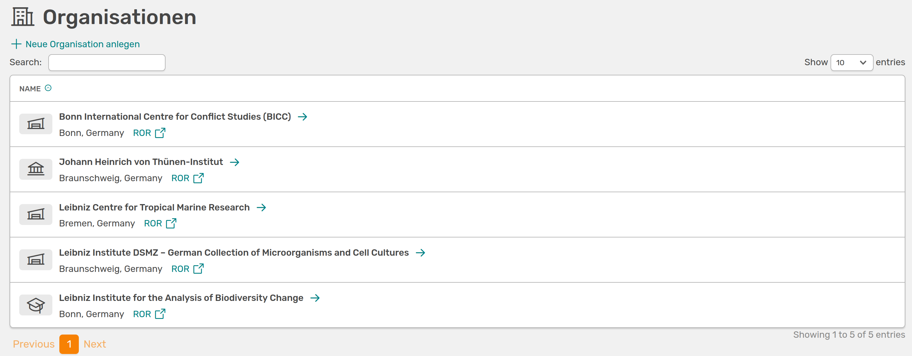
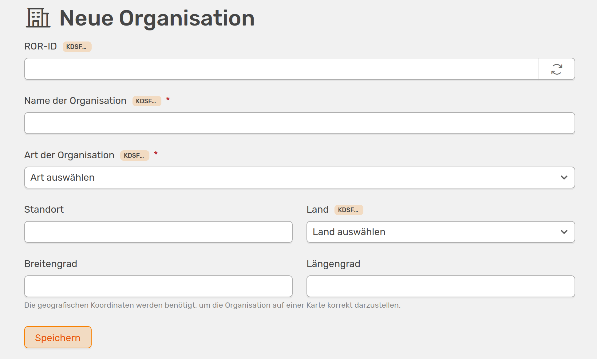

# Organisations in OSIRIS

Under **People &#8594 Organisations** you can store partner institutes or other institutions in OSIRIS and link them to content in OSIRIS.  

///caption
Overview of all added organisations
///

## Add new organisation

You can create a new organisation in OSIRIS via **Create new organisation**. If this button is not displayed, you do not have the rights for this action - please contact the administration.

///caption
You can create a new organisation here
///

You can enter the organisation manually or using the ROR ID ([Research Organisation Registry](https://ror.org/)). You can simply search for the institute on the ROR page and copy the link into OSIRIS. OSIRIS will then fill in all subjects automatically. If you cannot find the organisation you want to add in the ROR directory, you can also add it manually. This requires the name, country and type of organisation, with a drop-down menu suggesting options for the type. To be able to display the organisation on the cooperation map, you can also enter the exact coordinates here.  

If you create a new [infrastructure](/users/infrastructures/) and select **Collaborative infrastructure**, you can also add further organisations here using a simple search field in OSIRIS. If you add an organisation here, it will automatically be listed on the organisations page.  

## Links

Stored organisations are mainly used to display [projects](/users/projects/) and [infrastructures](/users/infrastructures/) and to correctly specify the cooperation partners. For both infrastructures and applications, you can search directly for the organisation or use the ROR ID.  
All links are listed on the organisation's OSIRIS page. Here you can also edit the organisation afterwards.

