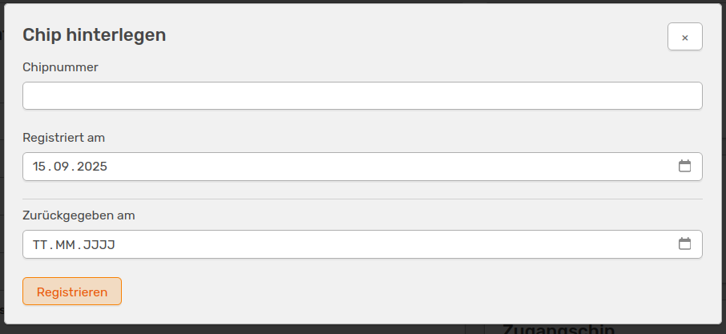

# Manage guests

<!-- md:beta -->

Every user can enter a guest in OSIRIS by default. The entry should always be made by the supervisor. Every newly registered guest receives an ID, which you can find at the top left of the form to be filled in. In principle, only guests that you have created yourself are visible to you. However, this can be changed by the administrator by assigning rights.

## Register guests

If you select **Guests** in the menu on the left, you can open the form for a new registration by clicking the **Register new guest** button at the top.

///caption
Form for registering a new guest in OSIRIS
///

When registering a guest, you must specify the duration of the stay, which you can also extend later. If you are not looking after the guest yourself, you can select another person to do so here. You must also specify the purpose of the stay and the funding. You can choose from a number of options in the drop-down menu. For financing, you can also select *Other* and then enter an individual value.  
In addition to the mandatory information, you can enter further options for the guest in the following section.

///caption
Optional information that you can enter for guests
///

Here you can enter the guest's name, contact information or school/university/company.

## Extend or cancel stay

People who have created the guest and/or who have been specified as the supervisor can extend or cancel the guest's stay.

///caption
The guest's stay can be cancelled with one click - this can also be cancelled again afterwards. The stay can also be extended
///

## Deposit documents and chip

If you have the rights to view and edit *guest documents*, you can link another person to the guest in addition to the carer.

///caption
Further options that can be specified for the guest. This is only possible if you have the rights for the guest documents
///

You can also store documents here and enter a chip number if access chips are issued to guests at your institution.

///caption
Storing a chip number
///

Here you can also specify when the guest was registered and when the chip was returned.

