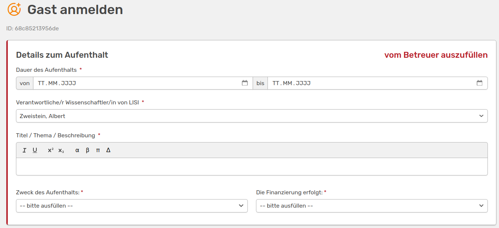
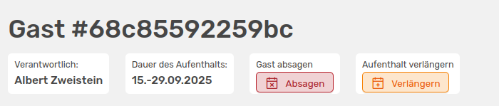
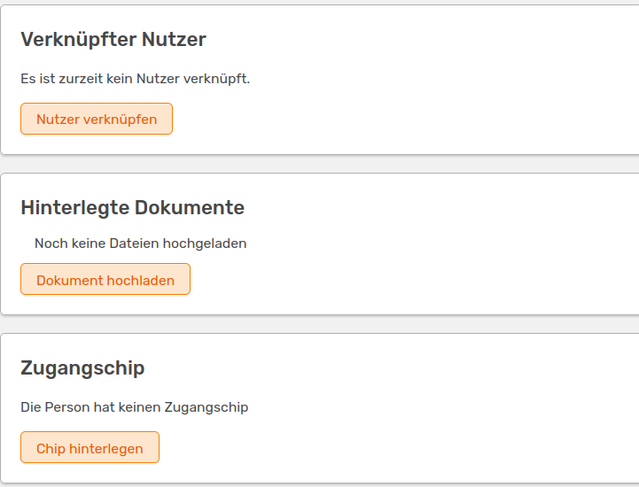

# Gäste verwalten

<!-- md:beta -->

Jede:r Nutzende:r kann in OSIRIS per Grundeinstellung einen Gast eintragen. Die Eintragung sollte immer durch den Betreuer erfolgen. Jeder neu registrierte Gast bekommt eine ID, die ihr oben links über dem auszufüllenden Formular findet. Grundsätzlich sind nur die Gäste für dich sichtbar, die du selbst angelegt hast. Dies kann aber durch die Administration über die Rechtevergabe geändert werden. 

## Gäste anmelden

Wenn du links im Menü **Gäste** auswählst, kannst du oben über den Button **Neuen Gast anmelden** das Formular für eine neue Registrierung öffnen.

///caption
Formular, um einen neuen Gast in OSIRIS zu hinterlegen
///

Bei der Anmeldung eines Gastes musst du die Dauer des Aufenthaltes angeben, die du später auch noch verlängern kannst. Wenn du den Gast nicht selbst betreust, kannst du hier eine andere Person dafür auswählen. Zudem musst du den Zweck des Aufenthalts und die Finanzierung angeben. Dafür stehen dir im Dropdown-Menü Möglichkeiten zur Auswahl. Bei der Finanzierung kannst du auch *Weiteres* auswählen und dann einen individuellen Wert angeben.  
Neben den Pflichtangaben kannst du im folgenden Abschnitt noch weitere Optionen zum Gast angeben.

///caption
Optionale Angaben, die du für Gäste angeben kannst
///

Hier kannst du den Namen, Kontaktinformationen oder auch die Schule/Universität/Firma des Gastes angeben. 

## Aufenthalt verlängern oder absagen

Personen, die den Gast angelegt haben und/oder die als Betreuer:in angegeben wurden, können den Aufenthalt des Gastes verlängern oder auch absagen.

///caption
Der Aufenthaltes des Gastes kann mit einem Klick abgesagt werden - dies kann danach auch wieder zurückgezogen werden. Zudem kann der Aufenthalt verlängert werden
///

## Dokumente und Chip hinterlegen

Falls du die Rechte zur Ansicht und Bearbeitung von *Gästedokumenten* hast, kannst du neben dem Betreuer noch eine weitere Person mit dem Gast vernetzen.

///caption
Weitere Optionen, die für den Gast angegeben werden können. Dies ist nur möglich, wenn du die Rechte für die Gästedokumente hast
///

Zudem kannst du hier Dokumente hinterlegen und eine Chipnummer angeben, falls in eurem Institut Zugangs-Chips an Gäste ausgegeben werden.

///caption
Hinterlegung einer Chipnummer
///

Hier kannst du auch angeben, wann der Gast registriert wurde und wann der Chip zurückgegeben wurde. 

