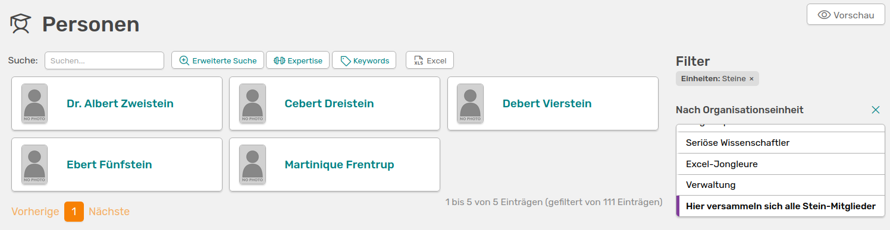
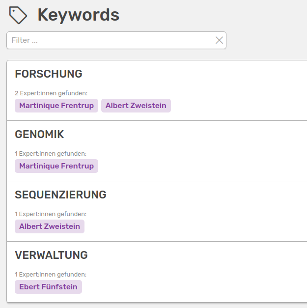

# Personen in OSIRIS

OSIRIS kann nicht nur dafür genutzt werden, um einen Überblick über alle Aktivitäten im Institut zu behalten, sondern auch um Mitarbeitende zu verwalten und Abteilungen zu organisieren.  
Unter **Personen** könnt ihr das gesamte, in OSIRIS registrierte Kollegium einsehen und mit verschiedenen Hilfsmitteln durchsuchen. Du kannst selbst beeinflussen mit welchen **Schlagwörtern** oder **Expertisen** du in OSIRIS gefunden werden kannst, indem du dein [Profil](/users/profile/start/#profil-bearbeiten) entsprechend bearbeitest.  

## Filter nach Organisationseinheiten

Rechts neben den aufgelisteten Profilen findest du die Möglichkeit, das Kollegium nach [Organisationseinheiten](/users/people/units/) zu durchsuchen. Klickst du auf eine verfügbare Organisationseinheit, werden dir alle Profile in OSIRIS angezeigt, die dieser zugehörig sind.

///caption
Anwendung des Organisationseinheiten-Filters
///

## Filter nach Schlagwörtern

Wenn eure Administration Schlagwörter definiert hat, könnt ihr diese zur Suche von Profilen nutzen. Dafür müssen allerdings die Nutzenden diese auch in ihrem Profil verwenden. Für die Suche mit Schlagwörtern habt ihr zwei Optionen: Rechts neben den Profilen findet ihr unter dem Organisationseinheiten-Filter einen weiteren für die Schlagwörter. Weiterhin könnt ihr neben dem Suchbalken oberhalb der Profile einen Button für Schlagwörter finden. Auf dieser Seite findet ihr alle vorhandenen Schlagwörter mit den Personen, die diese in ihrem Profil angegeben haben.

///caption
Die Personensuche anhand von Schlagwörtern
///

Durch einen Klick auf einen Namen gelangt ihr zu dem Profil der Person. Falls euch Schlagwörter in OSIRIS fehlen, kontaktiert bitte eure Administration.

## Filter nach Expertisen

Bei den Expertisen gibt es keine von der Administration vorgegebene Liste, jede Person kann eine neue Expertise hinzufügen. Wenn du auf den Button **Expertise** klickst, findest du eine Auflistung aller Begriffe, die von Nutzenden verwendet wurden und die dazugehörigen Namen. Auch hier gelangst du durch einen Klick auf den Namen auf das entsprechende Profil. Du kannst die Expertisen auch nach einem bestimmten Begriff durchsuchen.

## Erweiterte Suche

Wie bei den Aktivitäten kannst du auch bei den Personen eine **erweiterte Suche** zum Filtern nutzen. Du kannst verschiedene Suchkriterien wie Vor-/Nachname, Raum oder Schlagwörter mit den Operatoren **UND**/**ODER** anwenden, um das Kollegium zu durchsuchen. 

///caption
Die erweiterte Personensuche mit zwei Suchkriterien
///

## Export

Du kannst dir eine Liste des Kollegiums im Excel-Format exportieren lassen, indem du auf den **Excel** Button rechts neben dem Schlagwörter-Button gehst. Die zu exportierende Liste kannst du mithilfe der rechts verfügbaren Filter reduzieren. 