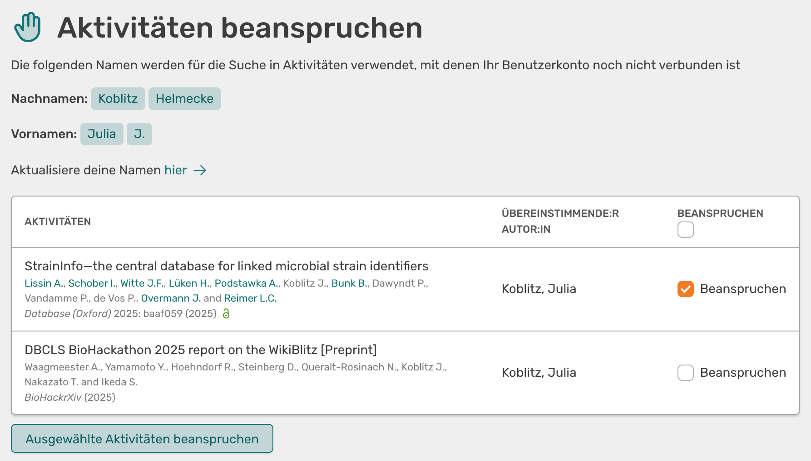

# Claim activities

## In the activity overview

If you find an activity in OSIRIS that should be assigned to you, but you are not listed as an author or contributor, you can claim it. To do this, go to the overview page of the activity, where you will find a table with all authors in the general information on the right-hand side.

If you are not yet assigned to the activity, you will see the **Claim** button next to authors who are not linked to any users. If you click on it, a dropdown will open explaining what exactly happens when you claim the activity. Click on **Claim** again to assign your user profile to the author and the activity will appear in your activity overview. The author's name is also linked to your user name so that future activities can be automatically assigned to you.

///caption
Claim activity via the button next to the author's name
///

## About your profile

You can also claim activities via your profile. To do this, go to your start page and click on the :material-hand-back-left: **Claim activities**.

On the following page you will find a list of all the activities you can claim. They will be searched for using all the names stored in your profile. Please note that only matches are shown where the author is not yet linked to a user profile.

///caption
List of activities that you can claim
///

Next to each activity you will find a checkbox. At the top of the table there is also an option to tick all the boxes at once. Once you have selected the desired activities, click on the **Claim selected activities** button to assign the activities to your profile.